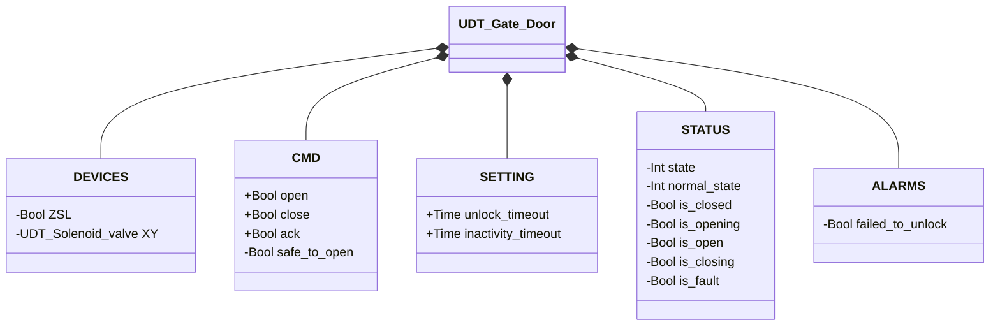
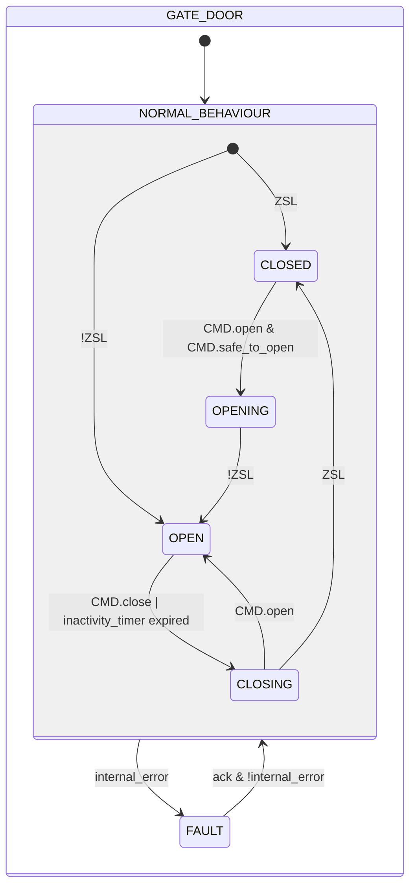

# Gate Leaf — Electric Lock

## Overview

**Level 2.** Unlike other devices in the library: the PLC never moves the leaf. The physical opening is performed by hand by the operator; the PLC can only grant or deny permission, commanding the retaining solenoid valve (`XY`) to unlock. Closing is analogous — the PLC commands the solenoid valve to re-lock, but completion depends entirely on the operator physically closing the leaf again, with no time limit imposed by the logic.

**Safety constraint:** the actual safety function (preventing unlocking when it isn't safe to open) must be implemented via electrical wiring (e.g. a safety relay or a contact wired in series with the solenoid valve's power supply), not entrusted to PLC logic alone. `CMD.safe_to_open` in this block is a coordination/HMI-level permission, not the safety barrier — the latter must work independently of any fault or blockage in the program.

It doesn't use the `manual_mode`/`manual`/`auto` arbitration common to the rest of the library — `CMD.open`/`CMD.close` are direct commands, and `XY.CMD.auto` is driven by the internal state of its own state machine (leaf position), not by a separate manual/automatic source.

---

## Interface

### Composition

| Tag | Type | Role |
|-----|------|------|
| `XY` | Solenoid Valve (Level 1) | Retaining solenoid valve — energize-to-unlock logic |

### Data Structure



`+` = writable by DCS/HMI, `-` = read-only.

### Control Signals

| Signal | Type | Direction | Description |
|--------|------|-----------|-------------|
| `DEVICES.ZSL` | Bool | IN | Leaf physically closed **and** solenoid valve actively engaged (combined signal: the PLC cannot distinguish "closed but unlocked" from "open") |
| `DEVICES.XY` | UDT_Solenoid_valve | OUT | Retaining solenoid valve (energized = unlocked) — commanded, its own status is not read back by this block |
| `CMD.open` | Bool | IN | Operator request to unlock/open |
| `CMD.close` | Bool | IN | Operator request to re-lock early, before the inactivity timer expires |
| `CMD.safe_to_open` | Bool | IN | Coordination-level permission — a necessary but not sufficient condition, see safety constraint above |
| `CMD.ack` | Bool | IN | Acknowledges alarms and resets from FAULT |

### Settings

| Setting | Default | Description |
|-----------|---------|-------------|
| `SETTING.unlock_timeout` | T#5s | Maximum time allowed for unlock confirmation |
| `SETTING.inactivity_timeout` | T#3M | Maximum time open before automatic re-closing |

---

## Behavior

### Operation

`CMD.open` during `CLOSING` returns directly to `OPEN`, without passing back through `OPENING` or re-evaluating `CMD.safe_to_open` — the leaf was never actually re-locked (`ZSL` never went back TRUE), so no new permission is being granted, only a not-yet-completed re-closing is being cancelled.

On re-entry from `FAULT`, the entry condition re-evaluates the same `ZSL` sensor — the same mechanism as the first scan. With a single combined signal, re-entry can only distinguish `CLOSED` from `OPEN`, never an intermediate condition.

In `FAULT`, `XY` is deliberately energized (unlocked): a PLC fault must never trap an operator behind a locked door. The real safety barrier is the electrical interlock upstream of `XY`, not this functional block.

### Alarms

[`AD-E01`](../index.md#access-device-alarms) — `CMD.open` accepted (state `OPENING`), `ZSL` not released within `unlock_timeout`. No timeout alarm on re-locking (`CLOSING`): the indefinite wait is normal behavior, since completion depends on the operator's physical action and not on the PLC.

### State Diagram



```Pascal
internal_error := failed_to_unlock;
```

| State | `XY` | Description |
|-------|------|-------------|
| CLOSED | FALSE | Leaf closed and locked, confirmed by `ZSL` |
| OPENING | TRUE | Unlock commanded, not yet confirmed |
| OPEN | TRUE | Unlock confirmed — the physical position beyond this point is known only to the operator |
| CLOSING | FALSE | Re-lock commanded, waiting for the operator to physically close the leaf again — no deadline, this is normal wait |
| FAULT | TRUE | Fault — deliberately unlocks (see above) |

### Timer

| Timer | State in which it's active | Threshold (setting) |
|-------|------------------------|---------------------|
| `unlock_timer` | `OPENING` | `SETTING.unlock_timeout` |
| `inactivity_timer` | `OPEN` | `SETTING.inactivity_timeout` |
