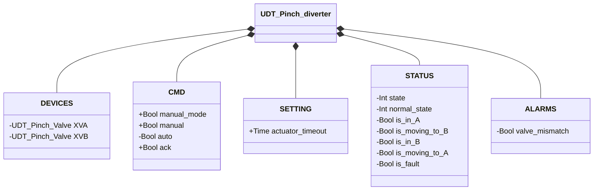
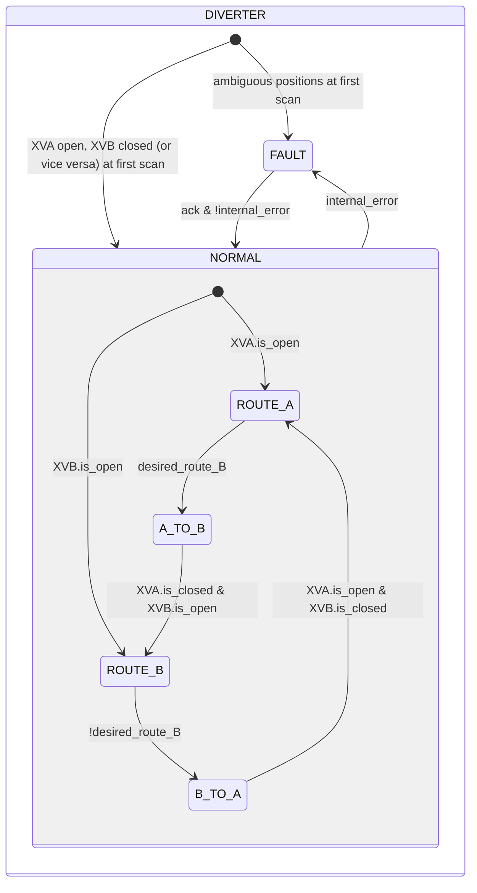

# Pinch-Type Diverter

## Overview

**Level 3 — composite.** The pinch-type diverter routes material flow between two lines (A and B) by embedding two instances of Pinch Valve (Level 2), `XVA` and `XVB`. Only one line is open at a time. The diverter has no physical sensors of its own — the routing state is derived entirely from the position feedback of the two sub-valves.

---

## Interface

### Composition

| Tag | Type | Direction | Role |
|-----|------|-----------|-------|
| `XVA` | Pinch Valve (Level 2) | IN/OUT | Toward path A |
| `XVB` | Pinch Valve (Level 2) | IN/OUT | Toward path B |

Both are IN/OUT: the diverter writes `CMD.auto`/`CMD.ack`/`SETTING.actuator_timeout` to each and reads back `STATUS.is_open`/`is_closed`/`is_fault` to determine its own state. A single manual/automatic decision (`manual_mode`/`manual`/`auto`, resolved into `desired_route_B`: FALSE = routing to A, TRUE = routing to B) establishes which valve should be open; the other is always commanded closed — the two instances never arbitrate on their own. See [Pinch Valve](../../valves/pinch/index.md) for the sub-valve details.

### Data Structure



`+` = writable by DCS/HMI, `-` = read-only.

### Control Signals

| Signal | Type | Direction | Description |
|---------|------|-----------|-------------|
| `DEVICES.XVA` | UDT_Pinch_Valve | IN/OUT | Sub-valve toward path A |
| `DEVICES.XVB` | UDT_Pinch_Valve | IN/OUT | Sub-valve toward path B |
| `CMD.manual_mode` | Bool | IN | TRUE = HMI manual mode |
| `CMD.manual` | Bool | IN | Path selection in manual mode (TRUE = path B) |
| `CMD.auto` | Bool | IN | Path selection in automatic mode |
| `CMD.ack` | Bool | IN | Alarm acknowledgment — forwarded to both sub-valves |

`CMD.ack` is propagated to both `XVA.CMD.ack` and `XVB.CMD.ack` on every scan.

### Settings

| Parameter | Default | Description |
|-----------|---------|-------------|
| `SETTING.actuator_timeout` | T#2s | Forwarded to `XVA.SETTING.actuator_timeout` and `XVB.SETTING.actuator_timeout` |

---

## Behavior

### Operation

On return from `FAULT`, the block rereads the state of the two sub-valves to determine the stable route — the same mechanism as the first scan.

### Alarms

- [`DIV-E01`](../index.md#diverter-alarms) — the current stable state (`ROUTE_A`/`ROUTE_B`) is not confirmed by `XVA.STATUS.is_open`/`XVB.STATUS.is_open`
- A fault on `XVA` or `XVB` contributes to `internal_error` (transition to `FAULT`) but does not generate an ID of its own at this level — see [Valve Alarms](../../valves/index.md#valve-alarms)

### State Diagram



```Pascal
internal_error := valve_mismatch OR XVA.is_fault OR XVB.is_fault;
```

| State | `XVA` (commanded) | `XVB` (commanded) | Description |
|-------|--------------------|--------------------|-------------|
| ROUTE_A | open | closed | Routing to A established |
| A_TO_B | closed | open | Transition from A to B |
| ROUTE_B | closed | open | Routing to B established |
| B_TO_A | open | closed | Transition from B to A |
| FAULT | closed | closed | Fault; no explicit open command on either valve (fail-safe) |
