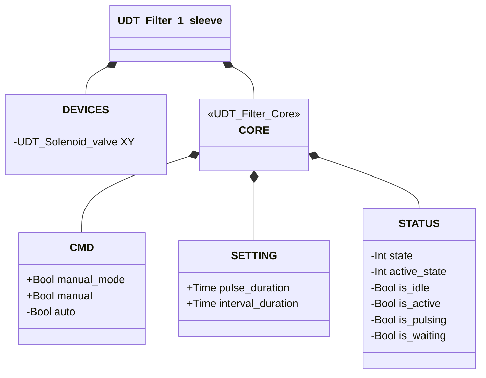
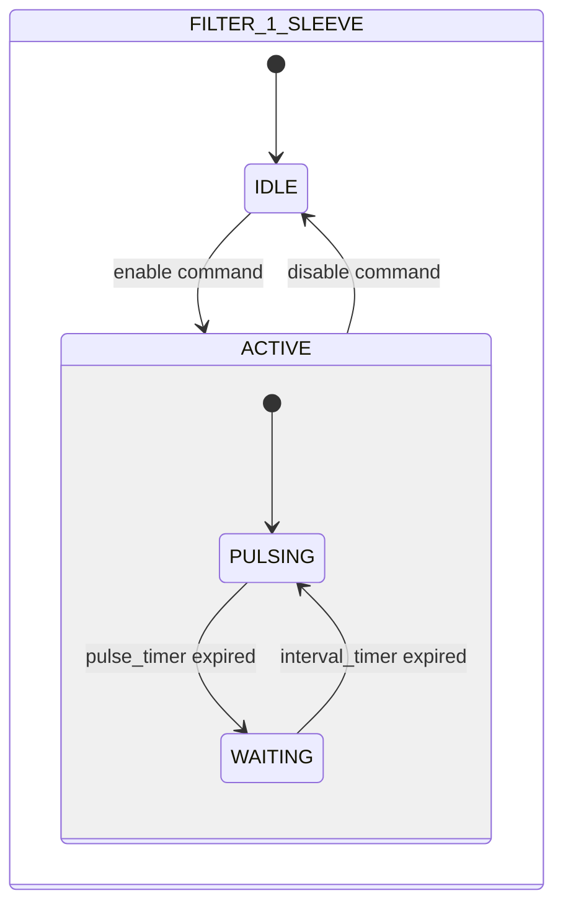

# Filter Cleaner — 1 Sleeve

## Overview

**Level 2.** The 1-sleeve filter cleaner generates periodic compressed-air pulses through a single Electrovalve (Level 1, `XY`) to remove dust that has accumulated on a filter sleeve. There is no position feedback — the system is open-loop.

No alarms of its own — `UDT_Filter_1_sleeve` does not include an `ALARMS` struct: there is no sensor to base a fault detection on.

---

## Interface

### Composition

| Tag | Type | Role |
|-----|------|------|
| `XY` | Electrovalve (Level 1) | Cleaning pulse |

### Data Structure



`+` = writable by DCS/HMI, `-` = read-only. `CORE` is the contract shared by both filter
variants — see [Filters — Overview](../index.md#core).

### Control Signals

| Signal | Type | Direction | Description |
|---------|------|-----------|-------------|
| `DEVICES.XY` | UDT_Solenoid_valve | OUT | Cleaning-pulse electrovalve — commanded, its own state is not read back by this block |
| `CORE.CMD.manual_mode` | Bool | IN | TRUE = manual mode |
| `CORE.CMD.manual` | Bool | IN | Enable in manual mode |
| `CORE.CMD.auto` | Bool | IN | Enable in automatic mode |

### Settings

| Parameter | Default | Description |
|-----------|---------|-------------|
| `CORE.SETTING.pulse_duration` | T#500ms | Duration of each cleaning pulse |
| `CORE.SETTING.interval_duration` | T#3s | Wait time between successive pulses |

---

## Behavior

### Operation

When enabled, the cycle always starts with an immediate cleaning pulse, then alternates between pulse and wait indefinitely.

**IDLE** — The filter is inactive. `XY` is de-energized. When an enable command arrives (manual or automatic), the state transitions to ACTIVE with `active_state = PULSING`.

**ACTIVE / PULSING** — `XY` is energized for the whole pulse duration (`pulse_duration`). On expiry of the pulse timer, the internal state moves to WAITING.

**ACTIVE / WAITING** — The filter is active but paused between one pulse and the next. `XY` is de-energized. The interval timer (`interval_duration`) is running. On expiry, the internal state returns to PULSING.

The PULSING → WAITING → PULSING cycle repeats as long as the command stays active. Disabling the command at any point returns the filter to IDLE.

In **manual mode** (`manual_mode = TRUE`), the command comes from `CMD.manual`. In **automatic mode**, from `CMD.auto`.

### State Diagram



```Pascal
desired_command := (CORE.CMD.manual_mode AND CORE.CMD.manual) OR (NOT CORE.CMD.manual_mode AND CORE.CMD.auto);
```

| State | Sub-state | `XY` | Description |
|-------|-------------|------|-------------|
| IDLE | — | FALSE | Filter inactive |
| ACTIVE | PULSING | TRUE | Cleaning pulse active; `pulse_timer` running |
| ACTIVE | WAITING | FALSE | Paused between pulses; `interval_timer` running |

| State | Int value |
|---|---|
| IDLE | 1 |
| ACTIVE | 2 |
| ACTIVE.WAITING | 2 |
| ACTIVE.PULSING | 1 |

### Timer

| Timer | State in which it is active | Threshold (parameter) |
|-------|------------------------|---------------------|
| `interval_timer` | ACTIVE/WAITING | `CORE.SETTING.interval_duration` |
| `pulse_timer` | ACTIVE/PULSING | `CORE.SETTING.pulse_duration` |
