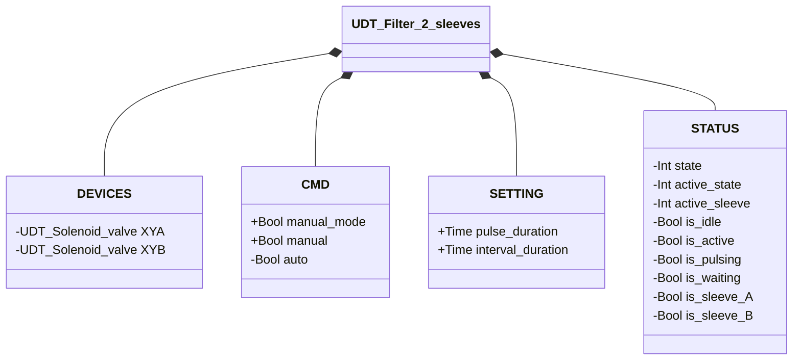
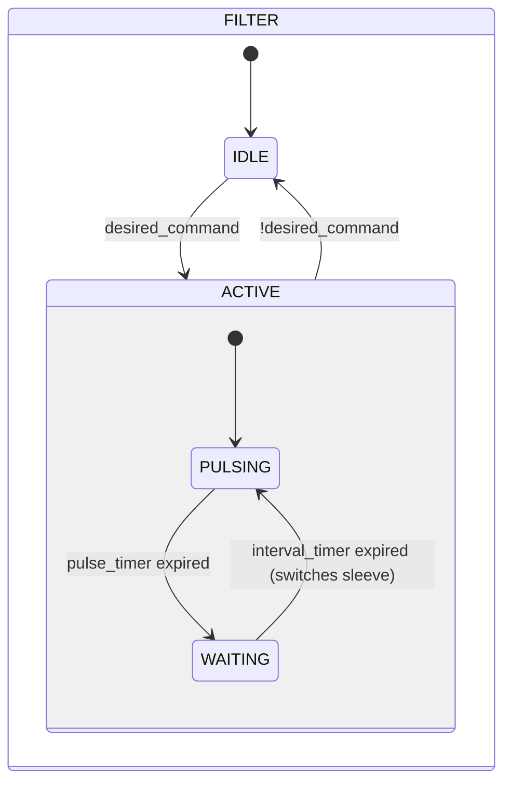

# Filter Cleaner — 2 Sleeves

## Overview

**Level 2.** The 2-sleeve filter cleaner generates alternating pulses of compressed air through two Solenoid Valves (Level 1, `XYA`/`XYB`) to clean a double-sleeve filter. The sleeves are pulsed in sequence — never simultaneously — to minimize the pressure drop in the accumulator and ensure effective cleaning of each sleeve. There is no position feedback — the system is open-loop.

No alarms of its own — no feedback sensor available on which to base fault detection.

---

## Interface

### Composition

| Tag | Type | Role |
|-----|------|------|
| `XYA` | Solenoid Valve (Level 1) | Sleeve A pulse |
| `XYB` | Solenoid Valve (Level 1) | Sleeve B pulse |

### Data Structure



`+` = writable by DCS/HMI, `-` = read-only.

### Control Signals

| Signal | Type | Direction | Description |
|--------|------|-----------|-------------|
| `DEVICES.XYA` | UDT_Solenoid_valve | OUT | Sleeve A pulse solenoid valve — commanded, its own status is not read back by this block |
| `DEVICES.XYB` | UDT_Solenoid_valve | OUT | Sleeve B pulse solenoid valve — commanded, its own status is not read back by this block |
| `CMD.manual_mode` | Bool | IN | TRUE = manual mode |
| `CMD.manual` | Bool | IN | Enable in manual mode |
| `CMD.auto` | Bool | IN | Enable in automatic mode |

### Settings

| Setting | Default | Description |
|-----------|---------|-------------|
| `pulse_duration` | T#500ms | Duration of each air pulse per sleeve |
| `interval_duration` | T#3s | Wait time between pulses |

---

## Behavior

### Operation

When enabled, the system alternates between sleeves A and B in a continuous cycle:

1. **PULSING sleeve A** — `XYA` energized for `pulse_duration`
2. **WAITING** — both solenoid valves off for `interval_duration`
3. **PULSING sleeve B** — `XYB` energized for `pulse_duration`
4. **WAITING** — both solenoid valves off for `interval_duration`
5. Repeat from step 1

The active sleeve is tracked by `STATUS.is_sleeve_A`/`is_sleeve_B`. Removing the enable command at any time returns the system to **IDLE**.

In **manual mode** (`manual_mode = TRUE`), the operator enables cleaning via `manual`. In **automatic mode**, the command comes from the process via `auto`.

### State Diagram



```Pascal
desired_command := (CMD.manual_mode AND CMD.manual) OR (NOT CMD.manual_mode AND CMD.auto);
```

| State | `XYA` | `XYB` | Description |
|-------|-------|-------|-------------|
| IDLE | FALSE | FALSE | Standby, no cleaning |
| ACTIVE / PULSING (sleeve A) | TRUE | FALSE | Air pulse in sleeve A |
| ACTIVE / PULSING (sleeve B) | FALSE | TRUE | Air pulse in sleeve B |
| ACTIVE / WAITING | FALSE | FALSE | Interval between pulses |

| State | Int value |
|---|---|
| IDLE | 1 |
| ACTIVE | 2 |
| ACTIVE.PULSING | 1 |
| ACTIVE.WAITING | 2 |

### Timer

| Timer | Active in state | Threshold (setting) |
|-------|------------------------|---------------------|
| `pulse_timer` | ACTIVE/PULSING | `SETTING.pulse_duration` |
| `interval_timer` | ACTIVE/WAITING | `SETTING.interval_duration` |
