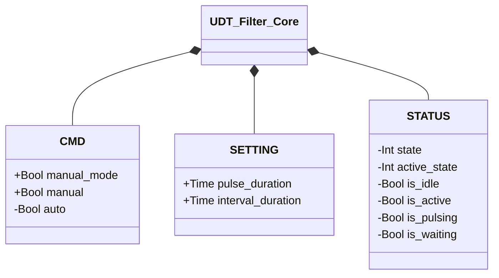

# Filters

Compressed-air pulse cleaning systems for filter sleeves.

The cleaning mechanism (wait/pulse alternation, timed by `interval_duration`/`pulse_duration`) is identical regardless of the number of sleeves: both variants share the same base state machine, with the only addition — in the multi-sleeve version — being a rotation counter (`active_sleeve`, advanced modulo the number of sleeves) to alternate which solenoid valve gets pulsed. The principle extends naturally to a larger number of sleeves.

## Core

`UDT_Filter_Core` holds the `CMD`/`STATUS`/`SETTING` contract shared by both variants,
embedded as a `CORE` field in `UDT_Filter_1_sleeve` and `UDT_Filter_2_sleeves` — identical
between the two. Only the multi-sleeve alternation (`active_sleeve`, `is_sleeve_A`,
`is_sleeve_B`) stays outside `CORE`, in its own sibling struct, `SLEEVE_STATUS`.

`+` = writable by DCS/HMI, `-` = read-only. A generically-typed `CORE` field lets the
[Transporter](../transporters/transporter/index.md) take an `FI` parameter without knowing
in advance whether it's a 1- or 2-sleeve filter: the composition root decides which concrete
FB fills it — the same dependency-injection mechanism used for valves, see [Valves —
Overview](../valves/index.md#core).

| Module | Description |
|--------|-------------|
| [Filter Cleaner — 1 Sleeve](1-sleeve/index.md) | Periodic pulse cycle with a single solenoid valve |
| [Filter Cleaner — 2 Sleeves](2-sleeves/index.md) | Alternating pulse sequence over two sleeves |
