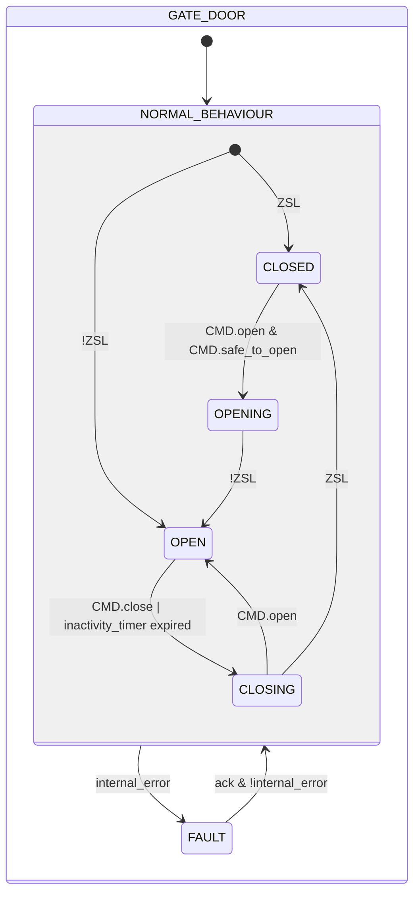
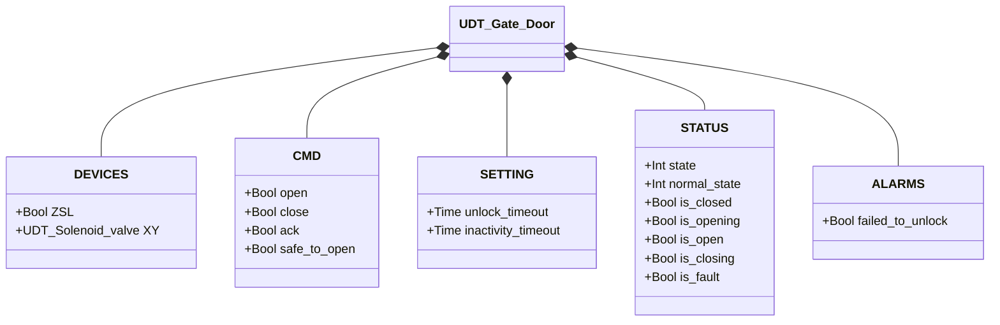

# Gate with Electric Lock

## Overview

**Tier 2.** Unlike the rest of the library's devices, the PLC never moves the gate itself. Physical opening is done by the operator by hand; the PLC can only grant or deny permission, by commanding the retaining solenoid (`XY`) to unlock. Closing is analogous — the PLC commands the solenoid to re-lock, but completion depends entirely on the operator physically closing the gate, with no time limit imposed by the logic.

**Safety constraint:** the actual safety function (preventing unlock when it isn't safe to open) must be implemented via electrical wiring (e.g. a safety relay or a contact wired in series with the solenoid's supply), not left to PLC logic alone. `CMD.safe_to_open` in this block is a coordination/HMI-level permission, not the safety barrier — the latter must work independently of any program bug or lockup.

---

## Composition

| Tag | Type | Role |
|-----|------|------|
| `XY` | Solenoid Valve (Tier 1) | Retaining solenoid — energize-to-unlock logic |

---

## Control Signals

| Signal | Type | Description |
|--------|------|-------------|
| `DEVICES.ZSL` | Bool | INPUT — Gate physically closed **and** solenoid actively engaged (combined signal: the PLC cannot distinguish "closed but unlocked" from "open") |
| `DEVICES.XY` | UDT_Solenoid_valve | OUTPUT — Retaining solenoid (energized = unlocked) |
| `CMD.open` | Bool | Operator request to unlock/open |
| `CMD.close` | Bool | Operator request to re-lock early, before the inactivity timer expires |
| `CMD.safe_to_open` | Bool | Coordination-level permission (ReadOnly external) — necessary but not sufficient, see safety constraint above |
| `CMD.ack` | Bool | Acknowledges alarms and clears FAULT |

---

## Settings

| Parameter | Default | Description |
|-----------|---------|-------------|
| `SETTING.unlock_timeout` | T#5s | Maximum time allowed for unlock confirmation |
| `SETTING.inactivity_timeout` | T#3M | Maximum time open before automatic re-locking |

---

## States and Outputs

| State | `XY` | Description |
|-------|------|-------------|
| CLOSED | FALSE | Gate closed and locked, confirmed by `ZSL` |
| OPENING | TRUE | Unlock commanded, not yet confirmed |
| OPEN | TRUE | Unlock confirmed — physical position beyond this point is known only to the operator |
| CLOSING | FALSE | Re-lock commanded, waiting for the operator to physically close it — no deadline, this is normal waiting |
| FAULT | TRUE | Fault — deliberately unlocks (see below) |

---

## State Machine



```Pascal
internal_error := failed_to_unlock;
```

`CMD.open` during `CLOSING` goes straight back to `OPEN`, without passing through `OPENING` or re-checking `CMD.safe_to_open` — the gate was never actually re-secured (`ZSL` never returned TRUE), so no new permission is being granted, only an incomplete re-lock being cancelled.

On return from `FAULT`, the entry guard re-evaluates the same `ZSL` sensor — same mechanism as the first scan. With only one combined signal, recovery can only distinguish `CLOSED` from `OPEN`, never an intermediate condition.

In `FAULT`, `XY` is deliberately energized (unlocked): a PLC fault must never trap an operator behind a locked door. The real safety barrier is the electrical interlock upstream of `XY`, not this function block.

---

## Alarms

| ID | Class | Title | Condition |
|----|-------|-------|-----------|
| `GD-E01` | E | Failed to unlock | `CMD.open` accepted (state `OPENING`), `ZSL` not released within `unlock_timeout` |

No timeout alarm on re-locking (`CLOSING`): the indefinite wait is normal behavior, not a fault, since completion depends on the operator's physical action, not the PLC.

---

## Data Structure



`internal_error` is internal to the function block, not exposed via the UDT.
