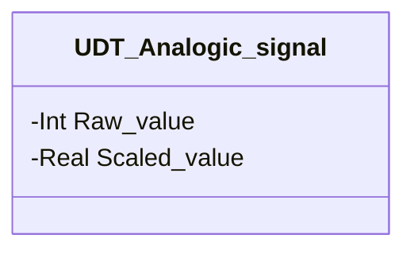

# Analog Signals

## Overview

**FC, stateless.** `Scale_input` is the library utility that converts a raw analog reading (integer count from the input module) into a value scaled to engineering units, writing it into `UDT_Analogic_signal.Scaled_value`. It is not a device — it has no `CMD`, no `STATUS`, it doesn't belong to any specific field category: it's shared by any module that reads an analog transmitter, today [Analog Pipeline](../pipeline/analogic/index.md) and [Sealed Inlet Transporter](../transporters/sealed-inlet/index.md) (`PT01`/`PT02`).

No FB instance in this library calls `Scale_input` internally: it's invoked upstream, once per analog channel, by the calling program — the consuming module already receives the `UDT_Analogic_signal` instance with `Scaled_value` populated and just reads it.

---

## Interface

### Data Structure



`-` = read-only from a consuming module's point of view — `Scale_input` is the sole authorized writer of `Scaled_value`; `Raw_value` is written by the input module's driver, upstream.

### Control Signals

| Signal | Type | Direction | Description |
|---------|------|-----------|-------------|
| `analogic_signal.Raw_value` | Int | IN | Raw count from the analog input module |
| `Min_value` | Real | IN | Engineering value corresponding to the minimum raw count (0) |
| `Max_value` | Real | IN | Engineering value corresponding to the maximum raw count (27648) |
| `analogic_signal.Scaled_value` | Real | OUT | Resulting scaled value, in engineering units |

### Settings

`Min_value`/`Max_value` are not `SETTING` fields on a persistent instance — they are `VAR_INPUT` parameters passed on every call, configured per channel at the call site (upstream of this library), not via HMI/DCS.

---

## Behavior

### Operation

```Pascal
normalized_value := INT_TO_REAL(Raw_value) / 27648.0;
Scaled_value := normalized_value * (Max_value - Min_value) + Min_value;
```

`27648` is the standard Siemens S7-1500 normalized integer full scale for an analog input channel (0–20mA/4–20mA/0–10V) — not a constant specific to this library. The conversion happens in two steps: normalization to a 0–1 fraction of full scale, then linear rescaling over the `Min_value`–`Max_value` range configured for that channel.
