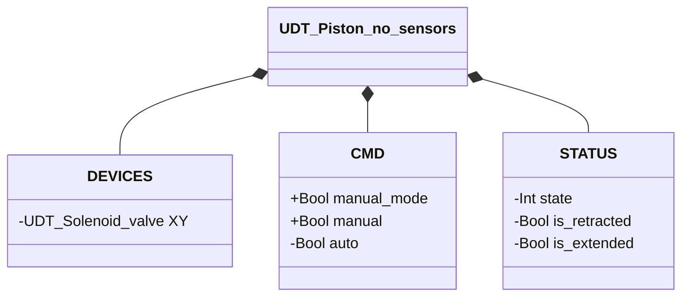
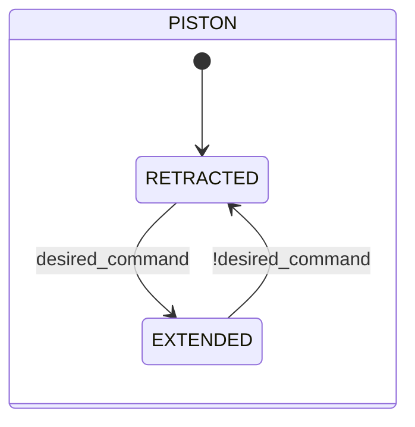

# Piston — No Sensors

## Overview

**Livello 2.** The no-sensors piston is a pneumatic linear actuator embedding a single Solenoid Valve (Livello 1, `XY`) as its own actuator. It has no position feedback of its own — the transition between retracted and extended follows the command with no delay, exactly like the underlying Solenoid Valve.

No configurable parameters. No alarms of its own — `UDT_Piston_no_sensors` includes no `ALARMS` struct: there's no sensor to base a fault detection on.

---

## Interface

### Composition

| Tag | Type | Role |
|-----|------|------|
| `XY` | Solenoid Valve (Livello 1) | Drives piston extension/retraction |

### Data structure

`+` = writable by DCS/HMI, `-` = read-only.

### Control signals

| Signal | Type | Direction | Description |
|--------|------|-----------|-------------|
| `DEVICES.XY` | UDT_Solenoid_valve | OUT | Drive solenoid valve — commanded, its own state is never read back by this block |
| `CMD.manual_mode` | Bool | IN | TRUE = command sourced from manual mode |
| `CMD.manual` | Bool | IN | Extension command in manual mode |
| `CMD.auto` | Bool | IN | Extension command in automatic mode |

---

## Behavior

### Operation

The desired command is resolved every scan (`manual_mode ? manual : auto`) and forwarded directly to the embedded solenoid valve (`XY.CMD.auto`) — there's no physical confirmation to wait for, so the state transition follows the command with no delay, the same mechanism as the Solenoid Valve itself.

### State diagram

| State | `XY` | Description |
|-------|------|-------------|
| RETRACTED | FALSE | Piston retracted, embedded solenoid de-energized |
| EXTENDED | TRUE | Piston extended, embedded solenoid energized |

| State | Int value |
|---|---|
| RETRACTED | 1 |
| EXTENDED | 2 |
