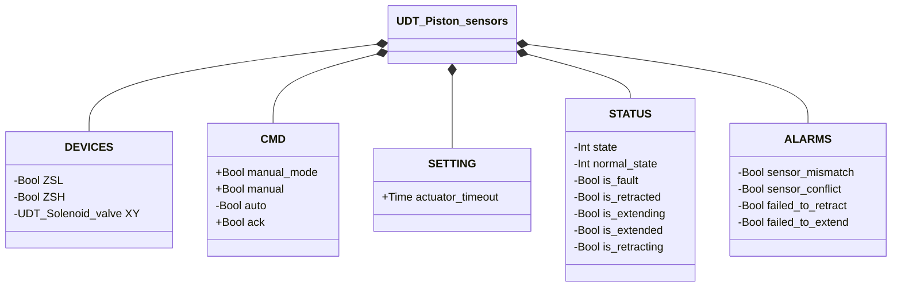
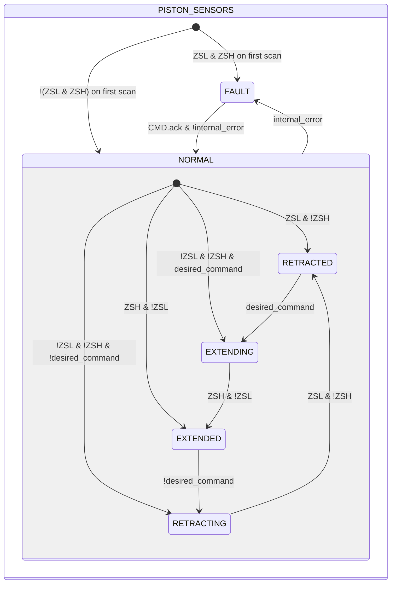

# Piston — With Sensors

## Overview

**Livello 2.** The with-sensors piston adds position feedback via two limit switches (`ZSL` retracted, `ZSH` extended) to the same embedded Solenoid Valve (Livello 1, `XY`) as the no-sensors piston. Unlike the base variant, every EXTENDING/RETRACTING transition requires confirmation from the corresponding limit switch, not just the command; a movement timeout (`SETTING.actuator_timeout`) and a FAULT tier with four alarms complete the model.

---

## Interface

### Composition

| Tag | Type | Role |
|-----|------|------|
| `XY` | Solenoid Valve (Livello 1) | Drives piston extension/retraction |

### Data structure



`+` = writable by DCS/HMI, `-` = read-only.

### Control signals

| Signal | Type | Direction | Description |
|--------|------|-----------|-------------|
| `DEVICES.ZSL` | Bool | IN | Retracted-position limit switch |
| `DEVICES.ZSH` | Bool | IN | Extended-position limit switch |
| `DEVICES.XY` | UDT_Solenoid_valve | OUT | Drive solenoid valve — commanded, its own state is never read back by this block |
| `CMD.manual_mode` | Bool | IN | TRUE = command sourced from manual mode |
| `CMD.manual` | Bool | IN | Extension command in manual mode |
| `CMD.auto` | Bool | IN | Extension command in automatic mode |
| `CMD.ack` | Bool | IN | Acknowledges alarms and recovers from FAULT |

### Parameters

| Parameter | Default | Description |
|-----------|---------|-------------|
| `SETTING.actuator_timeout` | T#2s | Maximum time allowed to complete extension or retraction |

---

## Behavior

### Operation

On first scan (and on re-entry from FAULT), the internal state is seeded from the current limit-switch readings instead of blindly assuming RETRACTED: `ZSL` and `!ZSH` → RETRACTED, `ZSH` and `!ZSL` → EXTENDED; if neither is active, the state resumes as EXTENDING or RETRACTING based on the current command. Both limit switches TRUE at once is treated as an immediate fault (sensor conflict), not as a fifth valid position.

Unlike the no-sensors variant, the transition from EXTENDING to EXTENDED (or RETRACTING to RETRACTED) requires confirmation from the corresponding limit switch, not just the command elapsing — `movement_timer` covers the case where that confirmation never arrives.

### Alarms

- [`AL-E01`](../index.md#linear-actuator-alarms) — the current stable state (RETRACTED/EXTENDED) is not confirmed by the expected limit switch
- [`AL-E02`](../index.md#linear-actuator-alarms) — `ZSL AND ZSH` TRUE at the same time
- [`AL-E03`](../index.md#linear-actuator-alarms) — retraction movement not confirmed within `actuator_timeout`
- [`AL-E04`](../index.md#linear-actuator-alarms) — extension movement not confirmed within `actuator_timeout`

All four feed into `internal_error`, the block-internal variable that drives the transition to `FAULT`.

### State diagram



```Pascal
internal_error := ALARMS.sensor_mismatch OR ALARMS.sensor_conflict OR ALARMS.failed_to_retract OR ALARMS.failed_to_extend;
```

| State | `XY` | Description |
|-------|------|-------------|
| NORMAL.RETRACTED | FALSE | Piston fully retracted, confirmed by `ZSL` |
| NORMAL.EXTENDING | TRUE | Actuator pushes piston toward extended |
| NORMAL.EXTENDED | TRUE | Piston fully extended, confirmed by `ZSH` |
| NORMAL.RETRACTING | FALSE | Solenoid released, piston returns to retracted |
| FAULT | FALSE | Fault; awaiting ack with valid sensors |

| State | Int value |
|---|---|
| NORMAL | 1 |
| NORMAL.RETRACTED | 1 |
| NORMAL.EXTENDING | 2 |
| NORMAL.EXTENDED | 3 |
| NORMAL.RETRACTING | 4 |
| FAULT | 0 |

### Timer

| Timer | Active state(s) | Threshold (parameter) |
|-------|------------------|------------------------|
| `movement_timer` | `EXTENDING` or `RETRACTING` (within `NORMAL`) | `SETTING.actuator_timeout` |
