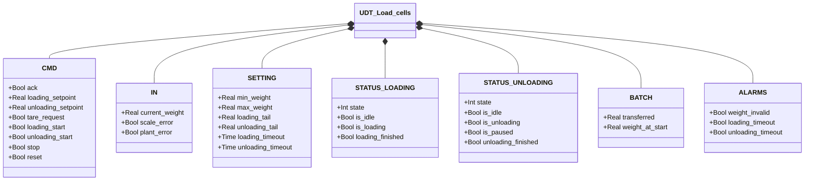
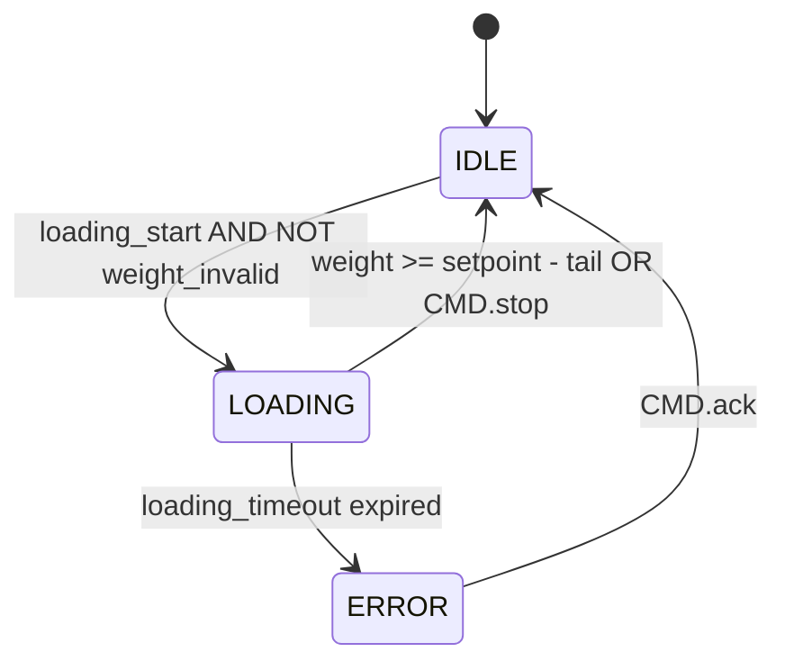
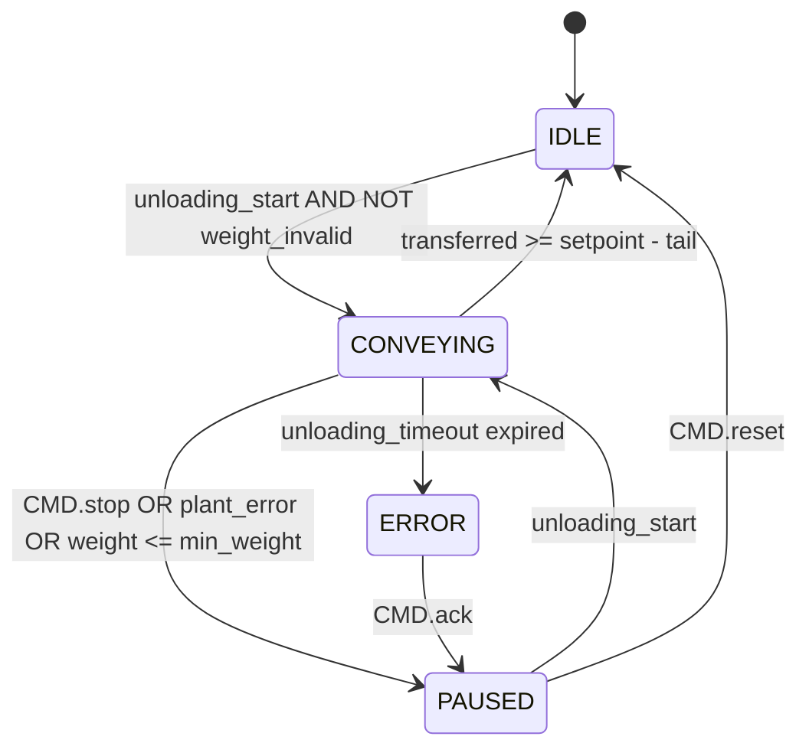

# Load Cells

## Overview

**Tier 3 — composite.** `UDT_Load_cells` is the shared data structure used by two independent function blocks — `Loading` and `Unloading` — and the optional hardware adapter `Pavone_DAT_1400`. Each block manages its own state machine via the `STATUS.LOADING` and `STATUS.UNLOADING` sub-structs of the same UDT instance.

`Loading` handles filling a vessel to a target weight. `Unloading` handles emptying with pause and resume support. `Pavone_DAT_1400` is an optional FC that converts raw Pavone DAT 1400 transmitter registers into the `IN` fields expected by the UDT.

---

## Load Cell Alarms

| ID | Class | Title | Condition | Applies to |
|----|-------|-------|-----------|------------|
| `LC-W01` | W | Weight out of range | `ALARMS.weight_invalid` — doesn't cause a transition to ERROR, only blocks starting a cycle | Load Cells |
| `LC-E01` | E | Loading timeout | `ALARMS.loading_timeout` — drives `Loading` to ERROR | Load Cells |
| `LC-E02` | E | Unloading timeout | `ALARMS.unloading_timeout` — drives `Unloading` to ERROR | Load Cells |

`LC-W01` is a warning (no state transition) because it only blocks entry into `LOADING`/`CONVEYING` from `IDLE` — unlike `LC-E01`/`LC-E02`, genuine errors each with their own transition to `ERROR` on their respective FSM.

---

## Main Components

- **Load cells** — physical sensors producing the raw weight signal
- **Transmitter** — converts signal to `IN.current_weight` [kg]; reports faults via `IN.scale_error` and `IN.plant_error`
- **`Pavone_DAT_1400`** — optional FC: scales `net_weight` using the `decimals` field and manages the tare command (bit `16#4` in the command register)
- **`Loading`** — loading FB: manages filling up to the setpoint with timeout detection
- **`Unloading`** — unloading FB: manages conveying with pause/resume support

---

## I/O Signals

### Commands (`CMD`)

| Signal | Type | Description |
|--------|------|-------------|
| `CMD.ack` | Bool | Acknowledge for ERROR state (Loading or Unloading) |
| `CMD.loading_setpoint` | Real | Target loading weight [kg] |
| `CMD.unloading_setpoint` | Real | Weight to unload in this cycle [kg] |
| `CMD.tare_request` | Bool | Request tare from transmitter |
| `CMD.loading_start` | Bool | Start loading cycle |
| `CMD.unloading_start` | Bool | Start or resume unloading cycle |
| `CMD.stop` | Bool | Stop the active cycle |
| `CMD.reset` | Bool | Return to IDLE from PAUSED (Unloading only) |

### Inputs (`IN` — from transmitter)

| Signal | Type | Description |
|--------|------|-------------|
| `IN.current_weight` | Real | Current weight [kg] |
| `IN.scale_error` | Bool | Transmitter hardware fault |
| `IN.plant_error` | Bool | External plant error (e.g. material loss) |

### Loading Status (`STATUS.LOADING`)

| Signal | Type | Description |
|--------|------|-------------|
| `STATUS.LOADING.state` | Int | FSM state: 0=ERROR, 1=IDLE, 2=LOADING |
| `STATUS.LOADING.is_idle` | Bool | TRUE in IDLE |
| `STATUS.LOADING.is_loading` | Bool | TRUE during loading |
| `STATUS.LOADING.loading_finished` | Bool | 1-scan pulse on entering IDLE after a completed load |

### Unloading Status (`STATUS.UNLOADING`)

| Signal | Type | Description |
|--------|------|-------------|
| `STATUS.UNLOADING.state` | Int | FSM state: 0=ERROR, 1=IDLE, 2=CONVEYING, 3=PAUSED |
| `STATUS.UNLOADING.is_idle` | Bool | TRUE in IDLE |
| `STATUS.UNLOADING.is_unloading` | Bool | TRUE during conveying (CONVEYING state) |
| `STATUS.UNLOADING.is_paused` | Bool | TRUE in PAUSED |
| `STATUS.UNLOADING.unloading_finished` | Bool | 1-scan pulse on entering IDLE after a completed unload |

### Batch (`BATCH`)

| Signal | Type | Description |
|--------|------|-------------|
| `BATCH.transferred` | Real | Quantity processed in the current cycle [kg] |
| `BATCH.weight_at_start` | Real | Weight snapshot taken at the start of the active phase [kg] |

### Alarms (`ALARMS`)

| Signal | Type | Description |
|--------|------|-------------|
| `ALARMS.weight_invalid` | Bool | Weight out of range (loading: > max_weight; unloading: < min_weight or > max_weight) |
| `ALARMS.loading_timeout` | Bool | TRUE when Loading is in ERROR |
| `ALARMS.unloading_timeout` | Bool | TRUE when Unloading is in ERROR |

---

## Operating Routine

### FB Loading

**IDLE** — Waiting for `CMD.loading_start` with valid weight (`NOT weight_invalid`). On entry to IDLE: `BATCH.transferred := 0`.

**LOADING** — Computes every scan: `BATCH.transferred := current_weight − weight_at_start` (clamped to 0). Loading ends when:
- `current_weight ≥ loading_setpoint − loading_tail` → IDLE (`loading_finished` = TRUE for 1 scan)
- `CMD.stop` → IDLE
- `loading_timeout` expires → ERROR

`weight_at_start` is snapshotted on entry to LOADING.

**ERROR** — `ALARMS.loading_timeout = TRUE`. `CMD.ack` returns to IDLE.

### FB Unloading

**IDLE** — Waiting for `CMD.unloading_start` with valid weight. On entry to IDLE: `BATCH.transferred := 0`.

**CONVEYING** — Computes every scan: `BATCH.transferred := weight_at_start − current_weight` (clamped to 0). Ends when:
- `BATCH.transferred ≥ unloading_setpoint − unloading_tail` → IDLE (`unloading_finished` = TRUE for 1 scan)
- `CMD.stop` OR `current_weight ≤ min_weight` OR `IN.plant_error` → PAUSED
- `unloading_timeout` expires → ERROR

On resume (PAUSED → CONVEYING): `weight_at_start := current_weight + transferred` — the anchor is re-calculated so `transferred` continues from the frozen value without a jump.

**PAUSED** — `BATCH.transferred` frozen. `CMD.unloading_start` resumes; `CMD.reset` returns to IDLE.

**ERROR** — `ALARMS.unloading_timeout = TRUE`. `CMD.ack` transitions to PAUSED.

### FC Pavone_DAT_1400

Converts raw transmitter data:

```
scale.IN.scale_error := dat_IN.Status_register.weight_error
scale.IN.current_weight := DINT_TO_REAL(net_weight) × 10^(−decimals)
```

Output: `dat_OUT.Command_register := 16#4` if `CMD.tare_request`, otherwise 0.

---

## Alarms

| ID | Device-specific condition |
|----|----------------------------|
| [`LC-W01`](#load-cell-alarms) | Weight out of scale range — check cells, wiring, transmitter |
| [`LC-E01`](#load-cell-alarms) | Loading cycle exceeded `loading_timeout` — check plant |
| [`LC-E02`](#load-cell-alarms) | Unloading cycle exceeded `unloading_timeout` — check plant |

---

## Settings

| Parameter | Default | Description |
|-----------|---------|-------------|
| `SETTING.min_weight` | 0.0 | Lower valid weight threshold [kg] (used by Unloading) |
| `SETTING.max_weight` | 1000.0 | Upper valid weight threshold [kg] |
| `SETTING.loading_tail` | — | Early cut-off before loading setpoint [kg] |
| `SETTING.unloading_tail` | — | Early cut-off before unloading setpoint [kg] |
| `SETTING.loading_timeout` | T#10M | Maximum LOADING cycle duration before ERROR |
| `SETTING.unloading_timeout` | T#10M | Maximum CONVEYING cycle duration before ERROR |

---

## Data Structure



---

## State Machines (FSM)

### Loading



| State | Value | Description |
|-------|-------|-------------|
| ERROR | 0 | Timeout; `loading_timeout=TRUE`; awaiting ACK |
| IDLE | 1 | Waiting; `transferred=0` on entry |
| LOADING | 2 | Loading active; `transferred` updated every scan |

### Unloading



| State | Value | Description |
|-------|-------|-------------|
| ERROR | 0 | Timeout; `unloading_timeout=TRUE`; awaiting ACK → PAUSED |
| IDLE | 1 | Waiting; `transferred=0` on entry |
| CONVEYING | 2 | Unloading active; `transferred` updated every scan |
| PAUSED | 3 | Batch suspended; `transferred` frozen |
