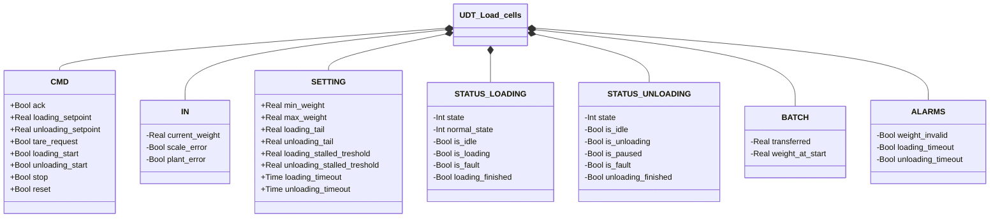
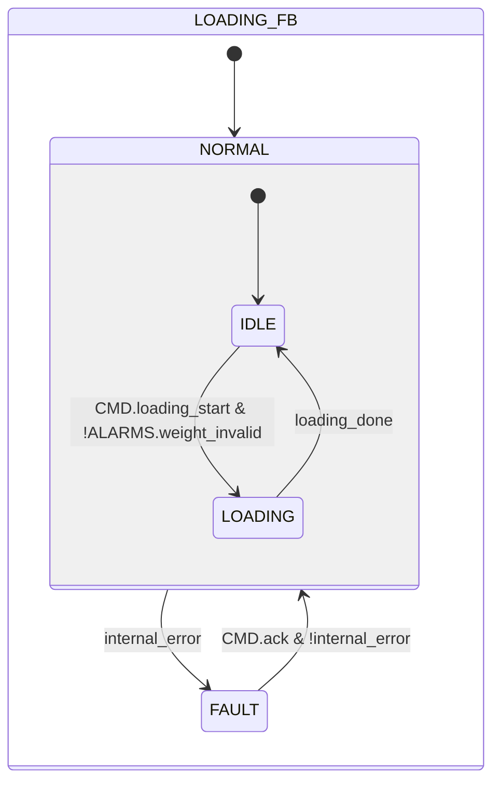
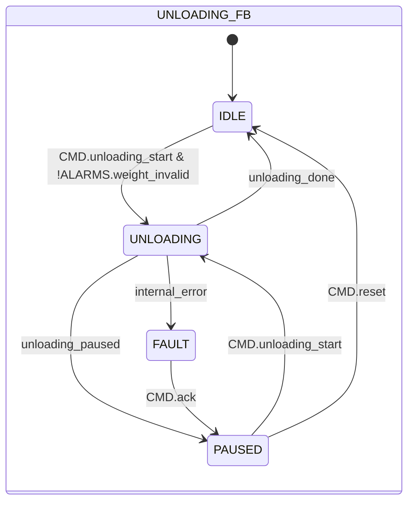

# Loading and Unloading Cycle

## Overview

**Level 1.** Embeds no sub-instances — unlike this library's other Level 1 modules (the Solenoid Valve, atomic), `UDT_Load_cells` is the data structure shared between two independent function blocks — `Loading` and `Unloading` — each with its own state machine, stored respectively in `STATUS.LOADING` and `STATUS.UNLOADING` of the same UDT instance. `Loading` handles filling a container by weight; `Unloading` handles emptying it, with the ability to pause and resume.

The `IN` field of this structure (`current_weight`, `scale_error`, `plant_error`) is the generic surface that any connected transmitter interface writes to — see [Load Cells](../index.md) for how the decoupling between this block and the actual physical transmitter works.

---

## Interface

### Data Structure



`+` = writable by DCS/HMI, `-` = read-only. `IN` is written by the connected transmitter interface (e.g. [Pavone DAT 1400 Interface](../pavone-dat-1400/index.md)), not directly by DCS/HMI.

### Control Signals

| Signal | Type | Direction | Description |
|---------|------|-----------|-------------|
| `CMD.ack` | Bool | IN | Acknowledge for FAULT state (Loading or Unloading) |
| `CMD.loading_setpoint` | Real | IN | Reference weight for loading [kg] |
| `CMD.unloading_setpoint` | Real | IN | Weight to unload in the cycle [kg] |
| `CMD.tare_request` | Bool | IN | Tare request, read by the connected transmitter interface |
| `CMD.loading_start` | Bool | IN | Start loading cycle |
| `CMD.unloading_start` | Bool | IN | Start or resume unloading cycle |
| `CMD.stop` | Bool | IN | Stop the active cycle |
| `CMD.reset` | Bool | IN | Return to IDLE from PAUSED (Unloading only) |
| `IN.current_weight` | Real | IN | Current weight [kg] |
| `IN.scale_error` | Bool | IN | Transmitter hardware fault |
| `IN.plant_error` | Bool | IN | External plant error (e.g. material loss) |
| `STATUS.LOADING.state` | Int | OUT | 0=FAULT, 1=NORMAL |
| `STATUS.LOADING.normal_state` | Int | OUT | 1=IDLE, 2=LOADING (valid only in NORMAL) |
| `STATUS.LOADING.is_idle` | Bool | OUT | TRUE in NORMAL/IDLE |
| `STATUS.LOADING.is_loading` | Bool | OUT | TRUE in NORMAL/LOADING |
| `STATUS.LOADING.is_fault` | Bool | OUT | TRUE in FAULT |
| `STATUS.LOADING.loading_finished` | Bool | OUT | 1-scan pulse on entering IDLE after a completed load |
| `STATUS.UNLOADING.state` | Int | OUT | 0=FAULT, 1=IDLE, 2=UNLOADING, 3=PAUSED |
| `STATUS.UNLOADING.is_idle` | Bool | OUT | TRUE in IDLE |
| `STATUS.UNLOADING.is_unloading` | Bool | OUT | TRUE during conveying (UNLOADING) |
| `STATUS.UNLOADING.is_paused` | Bool | OUT | TRUE in PAUSED |
| `STATUS.UNLOADING.is_fault` | Bool | OUT | TRUE in FAULT |
| `STATUS.UNLOADING.unloading_finished` | Bool | OUT | 1-scan pulse on entering IDLE after a completed unload |
| `BATCH.transferred` | Real | OUT | Quantity processed in the current cycle [kg] |
| `BATCH.weight_at_start` | Real | OUT | Weight captured on entering the active phase [kg] |
| `ALARMS.weight_invalid` | Bool | OUT | Weight out of range: `current_weight < min_weight OR current_weight > max_weight` — same condition for Loading and Unloading |
| `ALARMS.loading_timeout` | Bool | OUT | Mirrors Loading's `internal_error` (loading timeout, transmitter fault, or plant error) |
| `ALARMS.unloading_timeout` | Bool | OUT | Mirrors Unloading's `internal_error` (unloading timeout, transmitter fault, or plant error) |

### Settings

| Setting | Default | Description |
|-----------|---------|-------------|
| `SETTING.min_weight` | 0.0 | Lower valid-weight threshold [kg] (also used for the UNLOADING → PAUSED transition) |
| `SETTING.max_weight` | 1000.0 | Upper valid-weight threshold [kg] |
| `SETTING.loading_tail` | 0.0 | Early cutoff for loading, relative to the setpoint [kg] |
| `SETTING.unloading_tail` | 0.0 | Early cutoff for unloading, relative to the setpoint [kg] |
| `SETTING.loading_stalled_treshold` | 0.0 | Minimum weight change [kg] required within `loading_timeout` for the load to not be considered stalled |
| `SETTING.unloading_stalled_treshold` | 0.0 | Minimum weight change [kg] required within `unloading_timeout` for the unload to not be considered stalled |
| `SETTING.loading_timeout` | T#10M | Maximum time with no weight progress in LOADING before FAULT |
| `SETTING.unloading_timeout` | T#10M | Maximum time with no weight progress in UNLOADING before FAULT |

---

## Behavior

### Operation

#### Loading FB

The cycle fills the container up to `loading_setpoint`, with an early cutoff (`loading_tail`) that stops loading a bit before the target to compensate for material still falling after the command is cut — without this margin the final settled weight would overshoot the setpoint. `BATCH.transferred` is recalculated every scan as the difference from the weight captured on entering `LOADING` (`weight_at_start`), clamped to 0 to avoid negative readings caused by sensor noise/drift near zero.

The timer that feeds `internal_error` (`stall_timer`) doesn't measure the total loading duration — it measures time since the last significant weight progress: every scan where `current_weight` has risen by at least `loading_stalled_treshold` since the last check, the anchor re-aligns and the timer resets to zero. A slow but still-progressing load therefore never nuisance-trips `internal_error` — only a genuine stall (jammed feed, empty hopper) with no progress for the entire `loading_timeout` duration leads to `FAULT`.

A fault (`internal_error`: stall, transmitter error, or plant error) always leads to `FAULT`; the acknowledge (`CMD.ack`) always restarts from `IDLE` — a load interrupted by a fault is never resumed midway, it starts over from scratch.

#### Unloading FB

The cycle unloads the container down to `unloading_setpoint`, with the same early cutoff (`unloading_tail`) as Loading: the cutoff arrives a bit before the target to compensate for material still in transit after the command is cut.

Unlike Loading, unloading can be suspended and resumed rather than just started/stopped. Two distinct conditions lead to `PAUSED` instead of ending the cycle: the operator presses `CMD.stop`, or the weight drops to `min_weight` — the same threshold used for `weight_invalid`, applied here as a safety limit to avoid continuing to unload from a reading that's already near the bottom of the scale (risk of an unreliable reading or an empty container).

On resuming (`PAUSED` → `UNLOADING`), the `weight_at_start` anchor isn't simply re-read from the current weight: it's recalculated as `current_weight + transferred`, where `transferred` is the value frozen during the pause. This way the `transferred` calculation on the next scan (`weight_at_start − current_weight`) picks up exactly from the frozen value, with no jump visible to the operator.

As in Loading, the timer that feeds `internal_error` (`stall_timer`) measures time since the last significant weight progress, not the total unloading duration: every scan where `current_weight` has dropped by at least `unloading_stalled_treshold` since the last check, the anchor re-aligns and the timer resets to zero. A slow but still-progressing unload never nuisance-trips `internal_error`; only a genuine stall (stuck valve, already-empty container) with no progress for the entire `unloading_timeout` duration leads to `FAULT`.

A fault (`internal_error`) always leads to `FAULT`. But the acknowledge (`CMD.ack`) returns to `PAUSED`, not to `IDLE` as in Loading: a fault mid-unload must not lose the progress of the batch already transferred. The operator then decides whether to resume unloading or abandon it entirely with `CMD.reset` (returns to `IDLE`).

### Alarms

- [`LC-W01`](../index.md#load-cell-alarms) — `weight_invalid`, shared by Loading and Unloading; prevents starting a new cycle in either block. Check the load cells, wiring, and transmitter
- [`LC-E01`](../index.md#load-cell-alarms) — no weight progress for `loading_timeout` during LOADING (stalled), or transmitter/plant fault
- [`LC-E02`](../index.md#load-cell-alarms) — no weight progress for `unloading_timeout` during UNLOADING (stalled), or transmitter/plant fault

### State Diagrams

#### Loading



```Pascal
internal_error := stall_timer.Q OR IN.scale_error OR IN.plant_error;
loading_done := CMD.stop OR (IN.current_weight >= CMD.loading_setpoint - SETTING.loading_tail);
```

| State | Description |
|-------|-------------|
| NORMAL/IDLE | Waiting; `transferred` reset to 0 on entry |
| NORMAL/LOADING | Loading active; `transferred` recomputed every scan |
| FAULT | `internal_error` active; `CMD.ack` always returns to NORMAL/IDLE |

| State | Int value |
|---|---|
| NORMAL.IDLE | 1 |
| NORMAL.LOADING | 2 |
| FAULT | 0 |

#### Unloading



```Pascal
internal_error := stall_timer.Q OR IN.scale_error OR IN.plant_error;
unloading_done := BATCH.transferred >= CMD.unloading_setpoint - SETTING.unloading_tail;
unloading_paused := CMD.stop OR (IN.current_weight <= SETTING.min_weight);
```

| State | Description |
|-------|-------------|
| IDLE | Waiting; `transferred` reset to 0 on entry |
| UNLOADING | Unloading active; `transferred` recomputed every scan |
| PAUSED | Batch suspended; `transferred` frozen at its last computed value |
| FAULT | `internal_error` active; `CMD.ack` returns to PAUSED, not IDLE |

| State | Int value |
|---|---|
| IDLE | 1 |
| UNLOADING | 2 |
| PAUSED | 3 |
| FAULT | 0 |

### Entry Actions

#### Loading

| State reached | Entry action |
|------------------|----------------------|
| NORMAL/IDLE | `BATCH.transferred := 0`; `STATUS.LOADING.loading_finished` 1-scan pulse |
| NORMAL/LOADING | `BATCH.weight_at_start := IN.current_weight` (anchor snapshot); `last_checked_weight := IN.current_weight` (re-anchors the stall watchdog) |

#### Unloading

| State reached | Entry action |
|------------------|----------------------|
| IDLE | `BATCH.transferred := 0`; `STATUS.UNLOADING.unloading_finished` 1-scan pulse |
| UNLOADING | `BATCH.weight_at_start := IN.current_weight + BATCH.transferred` (recalculates the anchor — covers both the first start, with `transferred=0`, and resuming from pause); `last_checked_weight := IN.current_weight` (re-anchors the stall watchdog) |

### Timer

#### Loading

| Timer | Active in state | Threshold (parameter) |
|-------|------------------------|---------------------|
| `stall_timer` | NORMAL/LOADING | `SETTING.loading_timeout` |

#### Unloading

| Timer | Active in state | Threshold (parameter) |
|-------|------------------------|---------------------|
| `stall_timer` | UNLOADING | `SETTING.unloading_timeout` |
