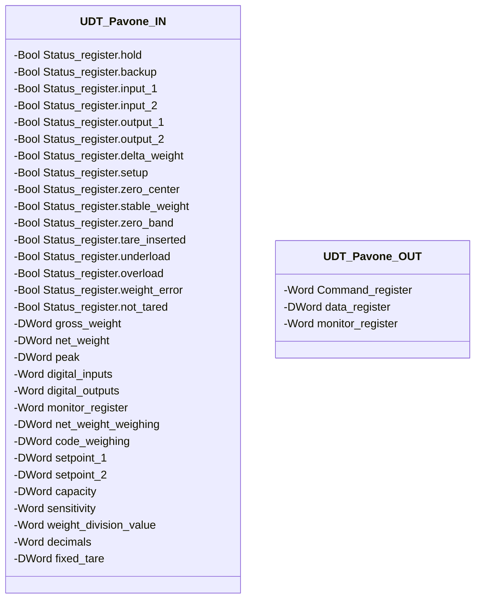

# Pavone DAT 1400 Interface

## Overview

**FC, stateless.** `Pavone_DAT_1400` is the interface to the Pavone Sistemi DAT 1400 weight transmitter: it reads `UDT_Pavone_IN` (transmitter registers) and writes `UDT_Pavone_OUT` (command register), converting the raw data into the generic `IN` fields of [`UDT_Load_cells`](../loading-unloading/index.md) via the `VAR_IN_OUT scale` parameter. No state of its own, no `CMD`/`ack` — it recomputes everything from scratch every scan.

This is, as of today, the library's only transmitter interface. A different transmitter will require a new UDT pair (`IN`/`OUT`) and a new dedicated FC, written to the same scheme — [`UDT_Load_cells`](../loading-unloading/index.md) and the `Loading`/`Unloading` blocks don't change.

---

## Interface

### Data Structure



`-` = read-only — both UDTs are entirely read-only from DCS/HMI, including `Command_register`, which is nonetheless written by this same FC every scan: the attribute governs external DCS/HMI access, not the internal writes of the FC that owns the instance.

`Status_register` maps bit-for-bit to the Status Register documented in the transmitter's manual, exchanged as PROFINET process data:

| Bit | Field | Meaning (from manual) |
|-----|-------|---------------------------|
| 15 | `setup` | Configuration in progress |
| 14 | `delta_weight` | Weight change detected |
| 13 | `output_2` | Logic output 2 active |
| 12 | `output_1` | Logic output 1 active |
| 11 | `input_2` | Logic input 2 active |
| 10 | `input_1` | Logic input 1 active |
| 9 | `backup` | Backup in progress (E²PROM save in progress) |
| 8 | `hold` | Hold function active |
| 7 | `not_tared` | Not tared |
| 6 | `weight_error` | Weight error (cell signal missing or out of range) |
| 5 | `overload` | Overload |
| 4 | `underload` | Underload |
| 3 | `tare_inserted` | Tare inserted |
| 2 | `zero_band` | Weight in zero band |
| 1 | `stable_weight` | Stable weight |
| 0 | `zero_center` | Zero center |

### Control Signals

The FC receives `dat_IN : UDT_Pavone_IN`, returns `dat_OUT : UDT_Pavone_OUT`, and receives in `VAR_IN_OUT` the instance `scale : UDT_Load_cells` it writes to. Of the many registers available in `UDT_Pavone_IN`/`UDT_Pavone_OUT`, only three are read and one is written:

| Signal | Type | Direction | Description |
|---------|------|-----------|-------------|
| `dat_IN.Status_register.weight_error` | Bool | IN | Copied into `scale.IN.scale_error` |
| `dat_IN.net_weight` | DWord | IN | Raw net weight, converted into `scale.IN.current_weight` |
| `dat_IN.decimals` | Word | IN | Number of decimals on the transmitter (0–4); selects the scale factor |
| `dat_OUT.Command_register` | Word | OUT | Written as `16#2` (Autotara) while `scale.CMD.tare_request` is TRUE, otherwise `0` |

`UDT_Pavone_IN` also exposes `gross_weight`, `peak`, `digital_inputs`/`digital_outputs`, `net_weight_weighing`, `code_weighing`, `setpoint_1`/`setpoint_2`, and the other 15 bits of `Status_register` — all present in the type but not read by this FC today. `UDT_Pavone_OUT.data_register`/`monitor_register` are not written. `capacity`, `sensitivity`, `weight_division_value`, and `fixed_tare` are not read because they are the same parameters already set directly on the transmitter through its CALIBRAZIONE menu (`L.C. CAP`, `L.C. SEN`, `rESoLU`, and `dEAd L.` respectively — DAT 1400 manual) — duplicating them here would add nothing. They are raw margin of the transmitter, not missing functionality in the documentation.

---

## Behavior

### Operation

```Pascal
scale.IN.scale_error := dat_IN.Status_register.weight_error;

CASE dat_IN.decimals OF
  0: magnitude := 1;
  1: magnitude := 0.1;
  2: magnitude := 0.01;
  3: magnitude := 0.001;
  4: magnitude := 0.0001;
END_CASE;

scale.IN.current_weight := DINT_TO_REAL(DWORD_TO_DINT(dat_IN.net_weight)) * magnitude;

IF scale.CMD.tare_request THEN
    dat_OUT.Command_register := 16#2;
ELSE
    dat_OUT.Command_register := 0;
END_IF;
```

`net_weight` arrives as a `DWord` — it's reinterpreted as `DINT` (signed integer) and then converted to `Real`, finally scaled by `magnitude` based on `decimals`. The tare command is a continuous value (`16#2`, Autotara per the DAT 1400 manual, for as long as `tare_request` remains TRUE), not an edge-triggered pulse.
