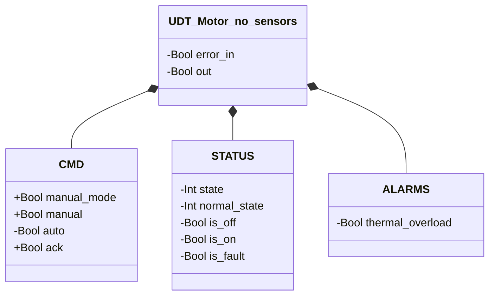
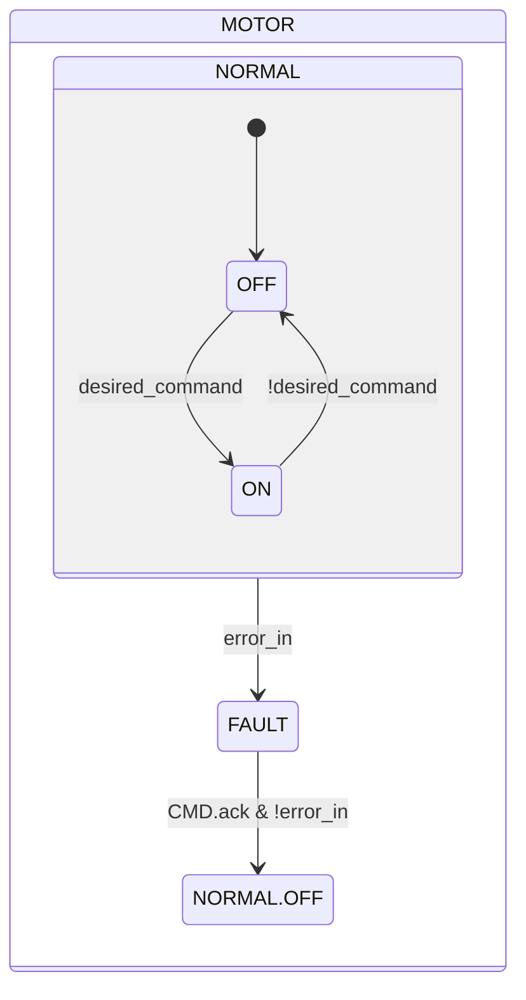

# Motor — No Sensors

## Overview

**Livello 1.** The no-sensors motor is a pure electric actuator: it embeds no pneumatic component or solenoid valve, and has no `DEVICES` struct of its own — unlike every other module in the library, `error_in` and `out` are flat UDT fields, not nested under a sub-component. It isn't "atomic" in the strict Solenoid Valve sense: it carries its own FAULT tier with a thermal-overload alarm, not just an immediate command.

The "No Sensors" suffix in the UDT name (`UDT_Motor_no_sensors`) anticipates a future sensored variant — the same pattern already followed by Nolvac ("Timed Cycle") and Access Devices ("Gate Leaf — Electric Lock").

---

## Interface

### Data structure

`+` = writable by DCS/HMI, `-` = read-only.

### Control signals

| Signal | Type | Direction | Description |
|--------|------|-----------|-------------|
| `CMD.manual_mode` | Bool | IN | TRUE = command sourced from manual mode |
| `CMD.manual` | Bool | IN | Run command in manual mode |
| `CMD.auto` | Bool | IN | Run command in automatic mode |
| `CMD.ack` | Bool | IN | Acknowledges alarm and recovers from FAULT |
| `error_in` | Bool | IN | External fault signal (typically a thermal relay auxiliary contact) |
| `out` | Bool | OUT | Motor run command |

---

## Behavior

### Operation

The desired command is resolved every scan (`manual_mode ? manual : auto`). `error_in` drives an immediate transition to FAULT regardless of the current run state; recovery requires both `CMD.ack` and `error_in` no longer active, and always resumes at OFF — with no sensor available to safely confirm a direct resume to ON, the block always prefers the safer state.

### Alarms

[`MO-E01`](../index.md#motor-alarms) — `error_in` TRUE, asserted every scan the state is FAULT; clears only via `CMD.ack`.

### State diagram

| State | `out` | Description |
|-------|-------|-------------|
| NORMAL.OFF | FALSE | Motor stopped |
| NORMAL.ON | TRUE | Motor running |
| FAULT | FALSE | Fault; awaiting ack with `error_in` no longer active |

| State | Int value |
|---|---|
| NORMAL | 1 |
| NORMAL.OFF | 1 |
| NORMAL.ON | 2 |
| FAULT | 0 |
