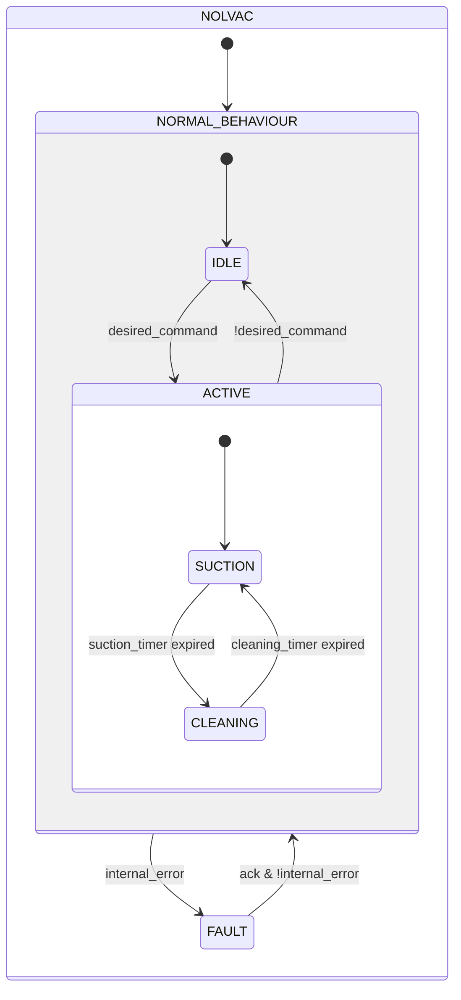
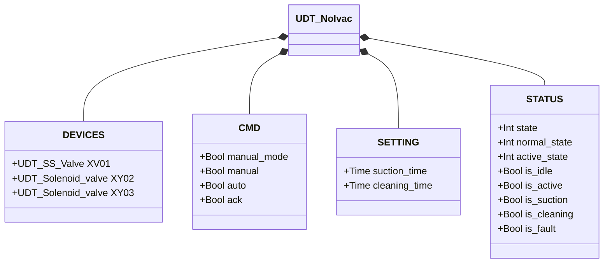

# Nolvac — Pneumatic Conveying Unit

## Overview

**Tier 3 — composite.** The Nolvac is a pneumatic conveying unit operating on a suction/cleaning cycle, embedding an SS Butterfly Valve (Tier 2) and two Solenoid Valves (Tier 1). `XY03` activates the suction path to convey material; `XV01` and `XY02` work together during the cleaning phase to regenerate the internal filter.

The cycle alternates two phases — **suction** (`suction_time`) and **cleaning** (`cleaning_time`) — and restarts automatically as long as the command stays active.

---

## Composition

| Tag | Type | Role |
|-----|------|------|
| `XV01` | SS Butterfly Valve (Tier 2) | Opens the inlet during `CLEANING` — see [SS Butterfly Valve](../valves/butterfly/single_solenoid/index.md) |
| `XY02` | Solenoid Valve (Tier 1) | Filter backwash air during `CLEANING` |
| `XY03` | Solenoid Valve (Tier 1) | Conveying suction during `SUCTION` |

---

## Control Signals

| Signal | Type | Description |
|--------|------|-------------|
| `DEVICES.XV01` | UDT_SS_Valve | SS butterfly valve; open during `CLEANING` |
| `DEVICES.XY02` | UDT_Solenoid_valve | Cleaning solenoid; energized during `CLEANING` |
| `DEVICES.XY03` | UDT_Solenoid_valve | Suction solenoid; energized during `SUCTION` |
| `CMD.manual_mode` | Bool | TRUE = HMI manual mode |
| `CMD.manual` | Bool | Cycle start command in manual mode |
| `CMD.auto` | Bool | Cycle start command from automation (ReadOnly external) |
| `CMD.ack` | Bool | Acknowledges alarms and clears FAULT |

---

## Settings

| Parameter | Default | Description |
|-----------|---------|-------------|
| `SETTING.suction_time` | T#30s | Duration of the suction phase |
| `SETTING.cleaning_time` | T#30s | Duration of the filter cleaning phase |

---

## States and Outputs

| State | `XV01` | `XY02` | `XY03` | Description |
|-------|--------|--------|--------|-------------|
| IDLE | closed | off | off | Standby, waiting for command |
| ACTIVE / SUCTION | closed | off | energized | Material suction |
| ACTIVE / CLEANING | open | energized | off | Filter cleaning |
| FAULT | — | off | off | Fault; awaiting operator acknowledgment |

---

## State Machine



```Pascal
internal_error := XV01.STATUS.is_fault;
```

Removing the command at any point during `ACTIVE` returns immediately to `IDLE`, deactivating all outputs.

---

## Alarms

No alarms of its own — `UDT_Nolvac` has no `ALARMS` struct. The only fault detected is a direct propagation of `XV01.STATUS.is_fault`; solenoids `XY02`/`XY03` have no sensors of their own and cannot raise a fault.

See [SS Butterfly Valve alarms](../valves/butterfly/single_solenoid/index.md#alarms) for the actual cause when `internal_error` is TRUE.

---

## Data Structure



No `ALARMS` class — this UDT has none of its own. `internal_error` is internal to the function block.
