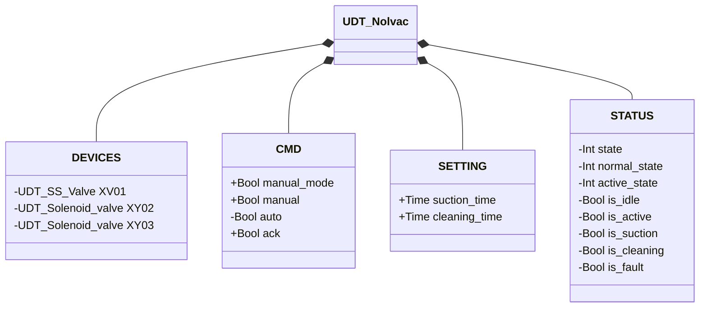
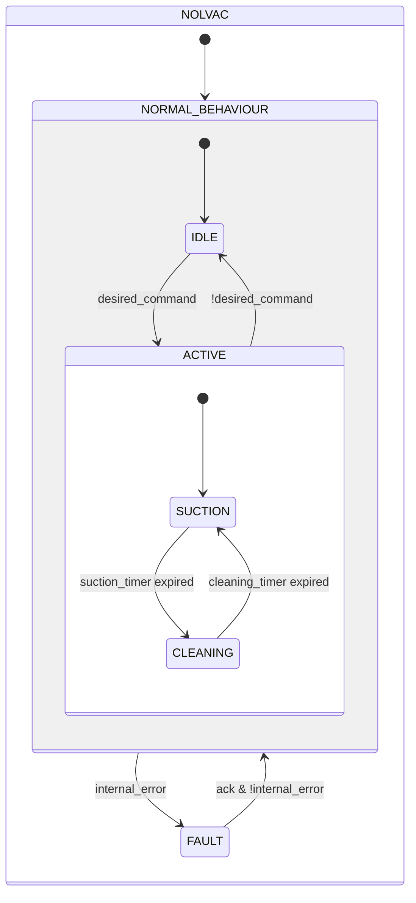

# Nolvac — Timed Cycle

## Overview

**Level 3 — composite.** `Nolvac — Timed Cycle` is the pneumatic conveying unit with a suction/cleaning cycle that starts and ends each phase purely by configured duration (`SETTING.suction_time`/`cleaning_time`), with no level feedback at all on the material being conveyed. It embeds an SS Butterfly Valve (Level 2) and two Solenoid Valves (Level 1). `XY03` activates the suction path to convey material; `XV01` and `XY02` work together during the cleaning phase to regenerate the internal filter.

---

## Interface

### Composition

| Tag | Type | Direction | Role |
|-----|------|-----------|------|
| `XV01` | Butterfly Valve — Single Solenoid (SS) (Level 2) | IN/OUT | Opens the inlet during `CLEANING` — see [Butterfly Valve — Single Solenoid (SS)](../../valves/butterfly/single_solenoid/index.md) |
| `XY02` | Solenoid Valve (Level 1) | OUT | Filter backwash air during `CLEANING` |
| `XY03` | Solenoid Valve (Level 1) | OUT | Conveying suction during `SUCTION` |

`XV01` is IN/OUT: the Nolvac writes `CMD.ack`/`CMD.auto` and reads back `STATUS.is_fault` for its own `internal_error`. `XY02`/`XY03` are OUT-only: commanded, their own state is never read back.

### Data Structure



`+` = writable from DCS/HMI, `-` = read-only. No `ALARMS` class — this UDT doesn't have one of its own.

### Control Signals

| Signal | Type | Direction | Description |
|--------|------|-----------|-------------|
| `DEVICES.XV01` | UDT_SS_Valve | IN/OUT | SS butterfly valve; open during `CLEANING` |
| `DEVICES.XY02` | UDT_Solenoid_valve | OUT | Cleaning solenoid valve; energized during `CLEANING` |
| `DEVICES.XY03` | UDT_Solenoid_valve | OUT | Suction solenoid valve; energized during `SUCTION` |
| `CMD.manual_mode` | Bool | IN | TRUE = HMI manual mode |
| `CMD.manual` | Bool | IN | Cycle start command in manual mode |
| `CMD.auto` | Bool | IN | Cycle start command in automatic mode |
| `CMD.ack` | Bool | IN | Acknowledges alarm and restores from FAULT |

### Settings

| Parameter | Default | Description |
|-----------|---------|-------------|
| `SETTING.suction_time` | T#30s | Duration of the suction phase |
| `SETTING.cleaning_time` | T#30s | Duration of the filter cleaning phase |

---

## Behavior

### Operation

The cycle alternates two phases — **suction** (`suction_time`) and **cleaning** (`cleaning_time`) — and restarts automatically as long as the command stays active.

Removing the command at any point during `ACTIVE` returns immediately to `IDLE`, deactivating all outputs.

### Alarms

No alarms of its own — `UDT_Nolvac` has no `ALARMS` struct. The only fault detected by the block is a direct propagation of `XV01.STATUS.is_fault` — solenoid valves `XY02`/`XY03` have no sensors of their own and cannot generate a fault. See [Valve Alarms](../../valves/index.md#valve-alarms) for the actual cause when `internal_error` is TRUE.

### State Diagram



```Pascal
internal_error := XV01.STATUS.is_fault;
```

| State | `XV01` | `XY02` | `XY03` | Description |
|-------|--------|--------|--------|-------------|
| IDLE | closed | off | off | Standby, waiting for command |
| ACTIVE / SUCTION | closed | off | energized | Material suction |
| ACTIVE / CLEANING | open | energized | off | Filter cleaning |
| FAULT | — | off | off | Fault; awaiting operator acknowledgment |

### Timer

| Timer | State it's active in | Threshold (parameter) |
|-------|------------------------|------------------------|
| `suction_timer` | ACTIVE/SUCTION (in NORMAL) | `SETTING.suction_time` |
| `cleaning_timer` | ACTIVE/CLEANING (in NORMAL) | `SETTING.cleaning_time` |
