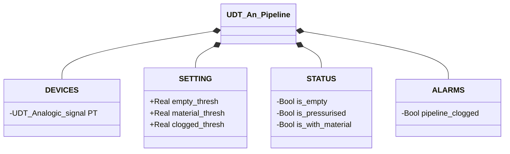

# Analog Pipeline

## Overview

**FC, stateless.** `An_pipeline` derives the pipeline's state from the reading of the analog pressure transmitter (`PT.Scaled_value`). The conversion from raw count to a value scaled in engineering units happens upstream, not in this block — see [Analog Signals](../../io/index.md). The logic is a lookup table: the PT value is compared against three configurable thresholds. No `CMD`, no `ack` — with no state to keep, there's nothing to confirm.

---

## Interface

### Data Structure

`+` = writable by DCS/HMI, `-` = read-only.

### Control Signals

| Signal | Type | Direction | Description |
|---------|------|-----------|-------------|
| `DEVICES.PT.Scaled_value` | Real | IN | Pressure reading, already scaled to engineering units |
| `STATUS.is_empty` | Bool | OUT | TRUE if `PT < empty_thresh` |
| `STATUS.is_pressurised` | Bool | OUT | TRUE if `empty_thresh ≤ PT < material_thresh` |
| `STATUS.is_with_material` | Bool | OUT | TRUE if `material_thresh ≤ PT < clogged_thresh` |
| `ALARMS.pipeline_clogged` | Bool | OUT | TRUE if `PT ≥ clogged_thresh` |

### Settings

| Parameter | Default | Description |
|-----------|---------|-------------|
| `SETTING.empty_thresh` | 0.1 | Lower threshold: below it → pipeline empty |
| `SETTING.material_thresh` | 0.4 | Material threshold: above it → material present |
| `SETTING.clogged_thresh` | 0.8 | Clogging threshold: above it → abnormal pressure |

---

## Behavior

### Operation

| Range | Outcome | Category |
|------------|-------|-----------|
| `PT < empty_thresh` | `is_empty` | State |
| `empty_thresh ≤ PT < material_thresh` | `is_pressurised` | State |
| `material_thresh ≤ PT < clogged_thresh` | `is_with_material` | State |
| `PT ≥ clogged_thresh` | `pipeline_clogged` | Alarm ([`PL-E01`](../index.md#pipeline-alarms)) |

The first three conditions are normal phases the process continuously moves through. `pipeline_clogged` is not a fourth band of the same kind — it represents an abnormal physical condition that should never persist. There is no state machine: the evaluation is purely combinatorial and recomputed from scratch every scan, with no hysteresis.

### Alarms

- [`PL-E01`](../index.md#pipeline-alarms) — `PT.Scaled_value ≥ clogged_thresh`
- Not applicable: `PL-E02` (sensor mismatch) — a single continuous measurement has no second, independent value it could be in contradiction with
