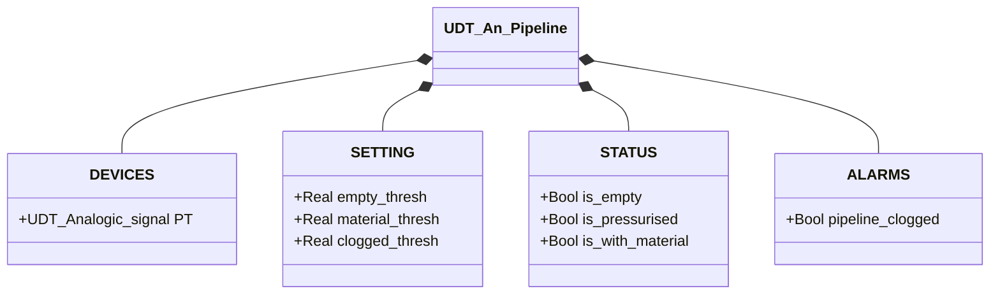

# Analogic Pipeline

## Overview

**FC, stateless.** `An_pipeline` derives the pipeline's state from the analog pressure transmitter reading (`PT.Scaled_value`). Conversion from raw count to a scaled engineering value happens upstream, not in this block. The logic is a lookup table: the PT value is compared against three configurable thresholds. No `CMD`, no `ack` — with no state to keep, there's nothing to acknowledge.

---

## Main Components

- **Pressure transmitter `PT`** (`UDT_Analogic_signal`) — scaled pipeline pressure reading
- **Three configurable thresholds** — define the boundaries between the four states

---

## Control Signals

| Signal | Type | Description |
|--------|------|-------------|
| `DEVICES.PT.Scaled_value` | Real | Pressure reading, already scaled to engineering units |
| `STATUS.is_empty` | Bool | TRUE if `PT < empty_thresh` |
| `STATUS.is_pressurised` | Bool | TRUE if `empty_thresh ≤ PT < material_thresh` |
| `STATUS.is_with_material` | Bool | TRUE if `material_thresh ≤ PT < clogged_thresh` |
| `ALARMS.pipeline_clogged` | Bool | TRUE if `PT ≥ clogged_thresh` |

---

## Settings

| Parameter | Default | Description |
|-----------|---------|-------------|
| `SETTING.empty_thresh` | 0.1 | Lower threshold: below → pipeline empty |
| `SETTING.material_thresh` | 0.4 | Material threshold: above → material present |
| `SETTING.clogged_thresh` | 0.8 | Obstruction threshold: above → abnormal pressure |

---

## Logic

```Pascal
STATUS.is_empty := PT.Scaled_value < empty_thresh;
STATUS.is_pressurised := (PT.Scaled_value >= empty_thresh) AND (PT.Scaled_value < material_thresh);
STATUS.is_with_material := (PT.Scaled_value >= material_thresh) AND (PT.Scaled_value < clogged_thresh);

ALARMS.pipeline_clogged := PT.Scaled_value >= clogged_thresh;
```

The first three conditions are normal phases the process continuously passes through. `pipeline_clogged` isn't a fourth band of the same kind — it represents an abnormal physical condition that should never persist. There's no state machine: evaluation is purely combinatorial and recomputed from scratch every scan, with no hysteresis.

---

## Alarms

| ID | Device-specific condition |
|----|----------------------------|
| [`PL-E01`](../index.md#pipeline-alarms) | `PT.Scaled_value ≥ clogged_thresh` |

Not applicable: `PL-E02` (sensor mismatch) — a single continuous measurement has no second independent value it can contradict.

---

## Data Structure


