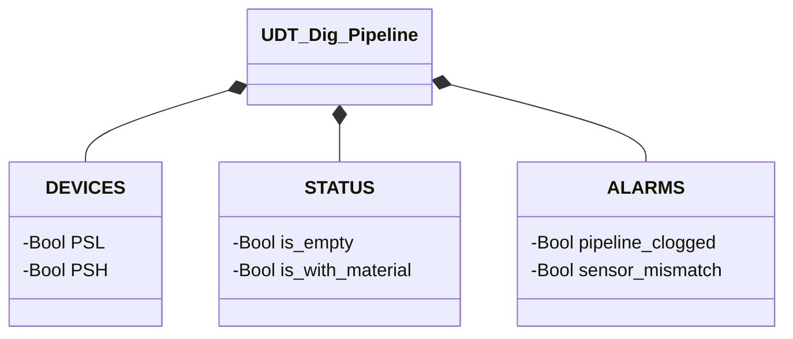

# Digital Pipeline

## Overview

**FC, stateless.** `Dig_pipeline` determines the pipeline's state through two digital pressure switches (`PSL` low threshold, `PSH` high threshold). The logic is a two-input truth table: the four binary combinations map to states and alarms. No `CMD`, no `ack` — with no state to hold, there's nothing to acknowledge.

The low-threshold pressure switch (`PSL`) activates when pressure exceeds the minimum threshold to detect the presence of material. The high-threshold pressure switch (`PSH`) activates at a higher pressure, indicating excessive pressure or an obstruction. Under normal conditions `PSH` cannot activate without `PSL`.

---

## Interface

### Data Structure

`-` = read-only — every field of this UDT is read-only from DCS/HMI; there is no `SETTING` struct.

### Control Signals

| Signal | Type | Direction | Description |
|---------|------|-----------|-------------|
| `DEVICES.PSL` | Bool | IN | Low-threshold pressure switch: TRUE = pressure ≥ low threshold |
| `DEVICES.PSH` | Bool | IN | High-threshold pressure switch: TRUE = pressure ≥ high threshold |
| `STATUS.is_empty` | Bool | OUT | TRUE if `PSL=0` and `PSH=0` |
| `STATUS.is_with_material` | Bool | OUT | TRUE if `PSL=1` and `PSH=0` |
| `ALARMS.pipeline_clogged` | Bool | OUT | TRUE if `PSL=1` and `PSH=1` |
| `ALARMS.sensor_mismatch` | Bool | OUT | TRUE if `PSL=0` and `PSH=1` (physically impossible combination) |

---

## Behavior

### Operation

| `PSL` | `PSH` | Outcome | Category |
|-------|-------|-------|-----------|
| 0 | 0 | `is_empty` | State |
| 1 | 0 | `is_with_material` | State |
| 0 | 1 | `sensor_mismatch` | Alarm ([`PL-E02`](../index.md#pipeline-alarms)) |
| 1 | 1 | `pipeline_clogged` | Alarm ([`PL-E01`](../index.md#pipeline-alarms)) |

`is_empty`/`is_with_material` are normal conditions the process cycles through continuously. `pipeline_clogged` is not a third variant of the same cycle: physically it indicates that material has built up to the point of engaging the high sensor too, a condition that should never persist. `sensor_mismatch` signals a physically inconsistent combination (the high sensor cannot activate without the low one having already done so) — a likely fault or wiring error rather than a real process condition. There is no state machine: the evaluation is purely combinational and recalculated from scratch every scan, with no hysteresis.

### Alarms

- [`PL-E01`](../index.md#pipeline-alarms) — `pipeline_clogged` (`PSL AND PSH`)
- [`PL-E02`](../index.md#pipeline-alarms) — `sensor_mismatch` (`NOT PSL AND PSH`)

Being an FC with no state of its own, neither condition automatically flows into an `internal_error` — this device has no state machine of its own to bring into fault. If the caller wants `pipeline_clogged`/`sensor_mismatch` to contribute to its own fault aggregate, it's the calling block's responsibility to include them explicitly (the same pattern by which Nolvac incorporates `XV01.STATUS.is_fault`).
