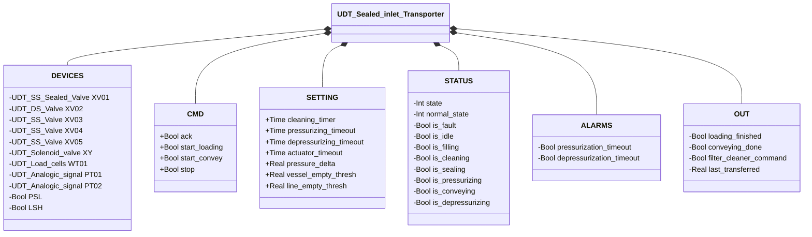
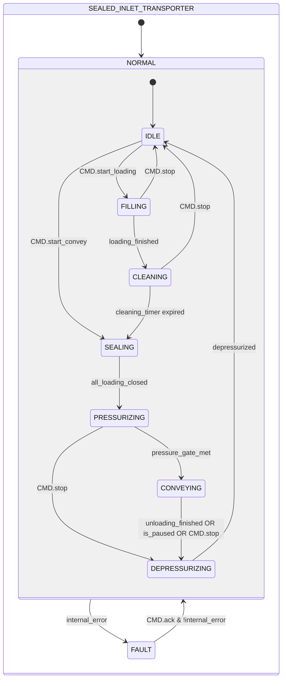

# Sealed Inlet Transporter

## Overview

**Level 4 — composite.** `Sealed_inlet_Transporter` manages a complete pressure pneumatic conveying cycle: it loads material into a vessel, seals it, pressurizes it above line pressure, conveys the material to the line, and finally depressurizes the vessel before a new cycle.

The block coordinates five valves (`XV01`–`XV05`), a pressurization solenoid valve (`XY`), a scale (`WT01`), and two analog pressure transmitters (`PT01` vessel, `PT02` line). A line pressure switch (`PSL`) checks the availability of compressed air for valve actuation and vessel pressurization; a high-level sensor (`LSH`) instead protects against vessel overfilling — two different conditions, not both "safety" in the same sense.

The state machine has two levels: `NORMAL`/`FAULT` at the top level; `IDLE`→`FILLING`→`CLEANING`→`SEALING`→`PRESSURIZING`→`CONVEYING`→`DEPRESSURIZING` at the operational level.

`XV01` is currently bound to `UDT_SS_Sealed_Valve`: a future revision could reduce this slot to a minimal contract (`auto` command + fault status), via polymorphism or a dedicated adapter FC, to make it replaceable with any type of inlet valve.

---

## Interface

### Composition

| Tag | Type | Direction | Role |
|-----|------|-----------|-------|
| `XV01` | Sealed Valve — SS (Level 3) | IN/OUT | Inlet valve; sealed at rest |
| `XV02` | Butterfly Valve — DS (Level 2) | IN/OUT | Vent valve; open in IDLE, FILLING, FAULT |
| `XV03` | Butterfly Valve — SS (Level 2) | IN/OUT | Orifice valve; open during FILLING |
| `XV04` | Butterfly Valve — SS (Level 2) | IN/OUT | Discharge valve; open during PRESSURIZING and CONVEYING |
| `XV05` | Butterfly Valve — SS (Level 2) | IN/OUT | Line valve; open during CONVEYING |
| `XY` | Solenoid Valve (Level 1) | OUT | Pressurization solenoid valve; energized during PRESSURIZING and CONVEYING |
| `WT01` | Load Cells (Level 1) | IN/OUT | Scale; managed by the internal `Loading` and `Unloading` — see [Loading and Unloading Cycle](../../load-cells/loading-unloading/index.md) |
| `PT01` | [UDT_Analogic_signal](../../io/index.md) | IN | Vessel pressure transmitter |
| `PT02` | [UDT_Analogic_signal](../../io/index.md) | IN | Line pressure transmitter |
| `PSL` | Bool | IN | Line air pressure switch: TRUE = compressed air available for actuation and pressurization |
| `LSH` | Bool | IN | High-level sensor: TRUE = vessel full (fault condition) |

`XV01`–`XV05` and `WT01` are IN/OUT: the transporter writes their `CMD` (auto/ack, and for `WT01` also stop/reset/loading_start/unloading_start) and reads back their `STATUS`/`ALARMS`/`BATCH` for its own state machine and `internal_error`. `XY` is OUT-only, like every Solenoid Valve commanded without reading back its own state. `PT01`/`PT02`/`PSL`/`LSH` are pure sensors, with no `CMD` to write.

### Data Structure



`+` = writable by DCS/HMI, `-` = read-only.

### Control Signals

| Signal | Type | Direction | Description |
|---------|------|-----------|-------------|
| `CMD.ack` | Bool | IN | Alarm acknowledgment; propagated to all sub-devices |
| `CMD.start_loading` | Bool | IN | Starts the loading sequence (IDLE → FILLING) |
| `CMD.start_convey` | Bool | IN | Starts the conveying sequence without loading (IDLE → SEALING) |
| `CMD.stop` | Bool | IN | Operator stop; drives toward DEPRESSURIZING or IDLE |
| `STATUS.state` | Int | OUT | 0=FAULT, 1=NORMAL |
| `STATUS.normal_state` | Int | OUT | 1=IDLE, 2=FILLING, 3=CLEANING, 4=SEALING, 5=PRESSURIZING, 6=CONVEYING, 7=DEPRESSURIZING |
| `STATUS.is_fault` | Bool | OUT | TRUE in FAULT |
| `STATUS.is_idle` | Bool | OUT | TRUE in IDLE |
| `STATUS.is_filling` | Bool | OUT | TRUE in FILLING |
| `STATUS.is_cleaning` | Bool | OUT | TRUE in CLEANING |
| `STATUS.is_sealing` | Bool | OUT | TRUE in SEALING |
| `STATUS.is_pressurizing` | Bool | OUT | TRUE in PRESSURIZING |
| `STATUS.is_conveying` | Bool | OUT | TRUE in CONVEYING |
| `STATUS.is_depressurizing` | Bool | OUT | TRUE in DEPRESSURIZING |
| `OUT.loading_finished` | Bool | OUT | 1-scan pulse on entry into SEALING from CLEANING (loading completed) |
| `OUT.conveying_done` | Bool | OUT | 1-scan pulse on entry into IDLE (cycle finished) |
| `OUT.filter_cleaner_command` | Bool | OUT | TRUE during CLEANING — enables the external filter cleaning system |
| `OUT.last_transferred` | Real | OUT | Quantity conveyed in the last CONVEYING cycle [kg] |

### Settings

| Parameter | Default | Description |
|-----------|---------|-------------|
| `SETTING.cleaning_timer` | T#2M | Duration of the CLEANING phase |
| `SETTING.pressurizing_timeout` | T#1M | Maximum timeout for the PRESSURIZING phase |
| `SETTING.depressurizing_timeout` | T#1M | Maximum timeout for the DEPRESSURIZING phase |
| `SETTING.pressure_delta` | 0.2 | Minimum vessel-to-line overpressure [bar] |
| `SETTING.vessel_empty_thresh` | 0.2 | PT01 threshold for `depressurized` [bar] |
| `SETTING.line_empty_thresh` | 0.2 | PT02 threshold for `depressurized` [bar] |
| `SETTING.actuator_timeout` | T#2s | Timeout forwarded to all valves XV01–05 |

---

## Behavior

### Operation

#### Derived Conditions (every scan)

- **`all_loading_closed`** — XV01, XV02, XV03 all confirmed closed (prerequisite for SEALING → PRESSURIZING)
- **`pressure_gate_met`** — `PT01 ≥ PT02 + pressure_delta` (vessel sufficiently overpressurized relative to the line)
- **`depressurized`** — `PT01 ≤ vessel_empty_thresh AND PT02 ≤ line_empty_thresh`
- **`internal_error`** — a fault on XV01/02/03/04/05, a scale timeout, `NOT PSL` (line air absent — no air available to actuate the valves or pressurize the vessel), `LSH` (high level), `ALARMS.pressurization_timeout`, or `ALARMS.depressurization_timeout`

The cycle conveys a batch of material from the loading point to the process line, passing through a filter cleaning phase and a pressurization phase that brings the vessel to a pressure higher than the line before opening the connecting valve: the material flows toward the line by pressure differential, not by direct mechanical action.

Loading (FILLING) opens the inlet (XV01), the vent (XV02), and the orifice (XV03) while the `Loading` FB fills the vessel to the setpoint; completion automatically starts the filter cleaning phase (CLEANING, timed), which regenerates the filtering element before the vessel is sealed. Once all inlet valves are closed (SEALING → PRESSURIZING), `XY` and XV04 pressurize the vessel until the required overpressure relative to the line (`pressure_delta`) is reached — only then does the line valve (XV05) open for conveying (CONVEYING), preventing material from flowing back from the line into the vessel due to insufficient pressure. `CMD.start_convey` allows the entire loading/cleaning phase to be skipped when the vessel already contains material from a previous cycle, going directly to SEALING.

The cycle ends by venting the residual pressure (DEPRESSURIZING, XV02 open) before returning to IDLE, ready for a new load.

In FAULT, both the vent (XV02) and the discharge (XV04) remain open — a passively safe configuration that doesn't require actuation air to be maintained, useful since a fault can specifically include the loss of line air (`NOT PSL`). The scale is stopped and reset; `CMD.ack` with the error cleared brings the transporter back to NORMAL/IDLE.

### Alarms

- [`TR-E01`](../index.md#transporter-alarms) — `ALARMS.pressurization_timeout`, latched by the timer and cleared only by `CMD.ack`; check the air supply, XV04, PT01/02
- [`TR-E02`](../index.md#transporter-alarms) — `ALARMS.depressurization_timeout`, same latch behavior; check XV02, PT01/02
- [`TR-E03`](../index.md#transporter-alarms) — `NOT PSL`, line air absent
- [`TR-E04`](../index.md#transporter-alarms) — `LSH`, high level in the vessel

A fault on one of the internal valves (`XV01`–`XV05`) or a Loading/Unloading timeout on `WT01` contributes to `internal_error` without an ID of its own at this level — see the [valve alarms](../../valves/index.md#valve-alarms) and the [load cell alarms](../../load-cells/index.md#load-cell-alarms) for the specific cause.

### State Diagram



```Pascal
all_loading_closed := XV01.STATUS.is_closed AND XV02.STATUS.is_closed AND XV03.STATUS.is_closed;
pressure_gate_met := PT01.Scaled_value >= PT02.Scaled_value + SETTING.pressure_delta;
depressurized := PT01.Scaled_value <= SETTING.vessel_empty_thresh AND PT02.Scaled_value <= SETTING.line_empty_thresh;
internal_error := XV01.STATUS.is_fault OR XV02.STATUS.is_fault OR XV03.STATUS.is_fault OR XV04.STATUS.is_fault OR XV05.STATUS.is_fault OR WT01.ALARMS.loading_timeout OR WT01.ALARMS.unloading_timeout OR NOT PSL OR LSH OR ALARMS.pressurization_timeout OR ALARMS.depressurization_timeout;
```

`pressurization_timeout`/`depressurization_timeout` are not a second, independent condition on the NORMAL → FAULT edge — both are already OR'd into `internal_error`'s own expression above, so the single `internal_error` guard already covers them.

| State | XV01 | XV02 | XV03 | XV04 | XV05 | XY | WT01 | Filter Cleaning |
|-------|------|------|------|------|------|----|------|-----------------|
| IDLE | FALSE | TRUE | FALSE | FALSE | FALSE | FALSE | — | FALSE |
| FILLING | TRUE | TRUE | TRUE | FALSE | FALSE | FALSE | Loading | FALSE |
| CLEANING | FALSE | FALSE | FALSE | FALSE | FALSE | FALSE | — | TRUE |
| SEALING | FALSE | FALSE | FALSE | FALSE | FALSE | FALSE | — | FALSE |
| PRESSURIZING | FALSE | FALSE | FALSE | TRUE | FALSE | TRUE | — | FALSE |
| CONVEYING | FALSE | FALSE | FALSE | TRUE | TRUE | TRUE | Unloading | FALSE |
| DEPRESSURIZING | FALSE | TRUE | FALSE | FALSE | FALSE | FALSE | — | FALSE |
| FAULT | FALSE | TRUE | FALSE | TRUE | FALSE | FALSE | stop+reset | FALSE |

| State | Int value |
|---|---|
| NORMAL | 1 |
| NORMAL.IDLE | 1 |
| NORMAL.FILLING | 2 |
| NORMAL.CLEANING | 3 |
| NORMAL.SEALING | 4 |
| NORMAL.PRESSURIZING | 5 |
| NORMAL.CONVEYING | 6 |
| NORMAL.DEPRESSURIZING | 7 |
| FAULT | 0 |

### Entry Actions

| State reached | Entry action |
|------------------|----------------------|
| IDLE | `WT01.CMD.stop`/`CMD.reset` pulsed (stops a loading in progress, brings a paused unloading back to IDLE); `OUT.conveying_done` 1-scan pulse |
| FILLING | `WT01.CMD.loading_start` pulsed |
| SEALING | `OUT.loading_finished` 1-scan pulse |
| CONVEYING | `WT01.CMD.unloading_start` pulsed |
| DEPRESSURIZING | `WT01.CMD.stop` pulsed |

### Timer

| Timer | Active in state | Threshold (parameter) |
|-------|------------------|------------------------|
| `filter_cleaning_timer` | NORMAL/CLEANING | `SETTING.cleaning_timer` |
| `pressurizing_timer` | NORMAL/PRESSURIZING | `SETTING.pressurizing_timeout` |
| `depressurizing_timer` | NORMAL/DEPRESSURIZING | `SETTING.depressurizing_timeout` |

XV01–05 and XY each have their own sub-FB controller always running; the outer block only writes `CMD.auto`.
