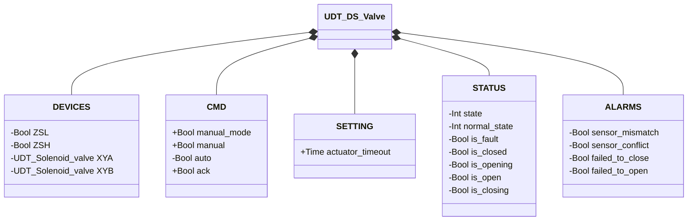
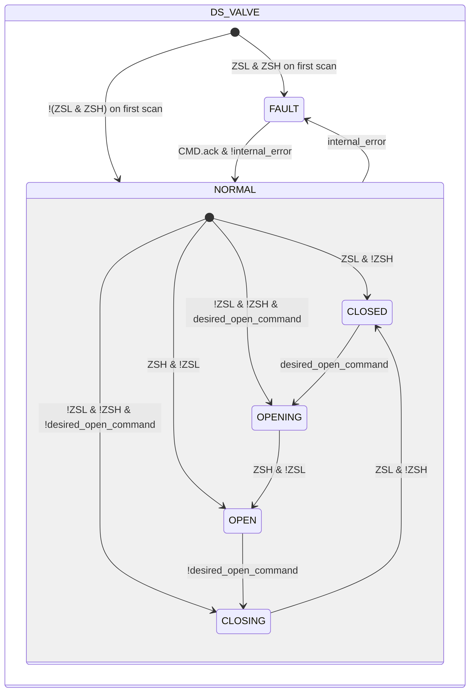

# Butterfly Valve — Double Solenoid (DS)

## Overview

**Level 2.** `DS_valve` manages a pneumatic butterfly valve with two independent solenoids (`XYA` opening, `XYB` closing), embedding two Solenoid Valve instances (Level 1). Double-acting (bistable) actuator, position feedback via two limit switches (`ZSL` closed, `ZSH` open).

---

## Interface

### Composition

| Tag | Type | Role |
|-----|------|------|
| `XYA` | Solenoid Valve (Level 1) | Drives toward opening |
| `XYB` | Solenoid Valve (Level 1) | Drives toward closing |

A single manual/automatic decision (`manual_mode`/`manual`/`auto`, resolved into `desired_open_command`) drives which of the two solenoid valves gets energized — the two instances never arbitrate on their own.

### Data Structure



`+` = writable by DCS/HMI, `-` = read-only.

### Control Signals

| Signal | Type | Direction | Description |
|---------|------|-----------|-------------|
| `DEVICES.ZSL` | Bool | IN | Closed-position limit switch |
| `DEVICES.ZSH` | Bool | IN | Open-position limit switch |
| `DEVICES.XYA` | UDT_Solenoid_valve | OUT | Opening solenoid valve — commanded, its own state is not read back by this block |
| `DEVICES.XYB` | UDT_Solenoid_valve | OUT | Closing solenoid valve — commanded, its own state is not read back by this block |
| `CMD.manual_mode` | Bool | IN | TRUE = HMI manual mode |
| `CMD.manual` | Bool | IN | Opening command in manual mode |
| `CMD.auto` | Bool | IN | Opening command in automatic mode |
| `CMD.ack` | Bool | IN | Alarm acknowledgment and recovery from FAULT |

### Settings

| Setting | Default | Description |
|-----------|---------|-------------|
| `SETTING.actuator_timeout` | T#2s | See the convention in [Valves — Overview](../../index.md) |

---

## Behavior

### Operation

`XYA`/`XYB` are energized only during movement (`OPENING`/`CLOSING`) — the bistable actuator requires no holding excitation in `CLOSED`/`OPEN`, it holds position even with both solenoids de-energized (no spring return).

On the first PLC scan, the block reads `ZSL`/`ZSH` for the initial state, with the same logic as `SS_valve` — including the case where neither is active (valve mid-travel), resolved into `OPENING`/`CLOSING` per `desired_open_command` instead of FAULT.

The desired command is resolved on every scan, the same pattern as [Solenoid Valve](../../solenoid/index.md):

```
desired_open_command := manual_mode ? manual : auto
```

### Alarms

- [`XV-E01`](../../index.md#valve-alarms) — current stable state not confirmed by the expected limit switch
- [`XV-E02`](../../index.md#valve-alarms) — `ZSL AND ZSH` simultaneously TRUE
- [`XV-E03`](../../index.md#valve-alarms) — `CLOSING` not completed within `actuator_timeout`
- [`XV-E04`](../../index.md#valve-alarms) — `OPENING` not completed within `actuator_timeout`

### State Diagram



```Pascal
internal_error := ALARMS.sensor_mismatch OR ALARMS.sensor_conflict OR ALARMS.failed_to_close OR ALARMS.failed_to_open;
```

| State | `XYA` | `XYB` | Description |
|-------|-------|-------|-------------|
| CLOSED | FALSE | FALSE | Disc closed; no excitation needed (bistable) |
| OPENING | TRUE | FALSE | `XYA` pushes the disc toward opening |
| OPEN | FALSE | FALSE | Disc open; no excitation needed |
| CLOSING | FALSE | TRUE | `XYB` drives the disc back to closing |
| FAULT | FALSE | FALSE | Fault; bistable disc holds its last physical position |

### Timer

| Timer | State in which it is active | Threshold (setting) |
|-------|------------------------|---------------------|
| `movement_timer` | `OPENING` or `CLOSING` (in `NORMAL`) | `SETTING.actuator_timeout` |
