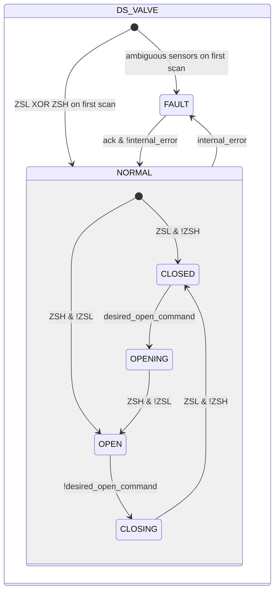
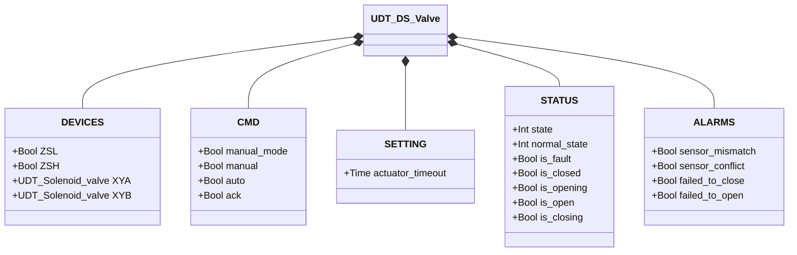

# Butterfly Valve — Double Solenoid (DS)

## Overview

**Tier 3 — composite.** `DS_valve` controls a pneumatic butterfly valve with two independent solenoids, embedding two Solenoid Valve (Tier 1) instances. `XYA` drives the actuator toward open; `XYB` drives it toward closed. The actuator is double-acting (bistable): it holds position even when both solenoids are de-energized — no spring return. Two limit switches (`ZSL` closed, `ZSH` open) provide position feedback.

On the first PLC scan, the block reads `ZSL`/`ZSH` for the initial state, using the same logic as `SS_valve`.

---

## Composition

| Tag | Type | Role |
|-----|------|------|
| `XYA` | Solenoid Valve (Tier 1) | Drives toward open |
| `XYB` | Solenoid Valve (Tier 1) | Drives toward closed |

A single manual/automatic decision (`manual_mode`/`manual`/`auto`, resolved into `desired_open_command`) drives which of the two solenoids gets energized — the two instances never arbitrate independently.

---

## Control Signals

| Signal | Type | Description |
|--------|------|-------------|
| `DEVICES.ZSL` | Bool | INPUT — Closed-position limit switch |
| `DEVICES.ZSH` | Bool | INPUT — Open-position limit switch |
| `DEVICES.XYA` | UDT_Solenoid_valve | OUTPUT — Opening solenoid valve |
| `DEVICES.XYB` | UDT_Solenoid_valve | OUTPUT — Closing solenoid valve |
| `CMD.manual_mode` | Bool | TRUE = HMI manual mode |
| `CMD.manual` | Bool | Open command in manual mode |
| `CMD.auto` | Bool | Open command from automation (ReadOnly external) |
| `CMD.ack` | Bool | Acknowledges alarms and clears FAULT |

---

## Settings

| Parameter | Default | Description |
|-----------|---------|-------------|
| `SETTING.actuator_timeout` | T#2s | Maximum time allowed for OPENING and CLOSING |

---

## States and Outputs

| State | `XYA` | `XYB` | Description |
|-------|-------|-------|-------------|
| CLOSED | FALSE | FALSE | Disc closed; no energization needed (bistable) |
| OPENING | TRUE | FALSE | `XYA` driving disc toward open |
| OPEN | FALSE | FALSE | Disc open; no energization needed |
| CLOSING | FALSE | TRUE | `XYB` driving disc toward closed |
| FAULT | FALSE | FALSE | Fault; bistable disc holds its last physical position |

`XYA`/`XYB` are only energized during movement (`OPENING`/`CLOSING`) — the bistable actuator needs no holding energization in `CLOSED`/`OPEN`.

---

## State Machine



```Pascal
internal_error := sensor_mismatch OR sensor_conflict OR failed_to_close OR failed_to_open;
```

---

## Alarms

| ID | Device-specific condition |
|----|----------------------------|
| [`XV-E01`](../../index.md#valve-alarms) | Current stable state not confirmed by the expected limit switch |
| [`XV-E02`](../../index.md#valve-alarms) | `ZSL AND ZSH` TRUE at the same time |
| [`XV-E03`](../../index.md#valve-alarms) | `CLOSING` not confirmed within `actuator_timeout` |
| [`XV-E04`](../../index.md#valve-alarms) | `OPENING` not confirmed within `actuator_timeout` |

---

## Data Structure



`internal_error` is internal to the function block, not exposed via the UDT.
