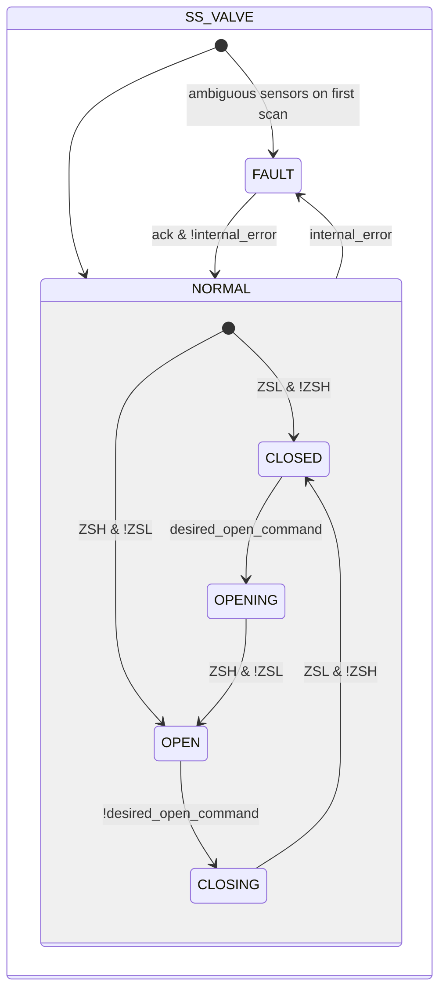
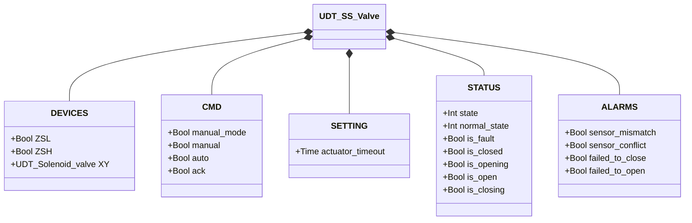

# Butterfly Valve — Single Solenoid (SS)

## Overview

**Tier 2.** `SS_valve` controls a pneumatic butterfly valve with a single solenoid. Energizing `XY` drives the actuator toward open; de-energizing lets the return spring close the disc. Two limit switches (`ZSL` closed, `ZSH` open) provide position feedback.

On the first PLC scan, the block reads `ZSL` and `ZSH` to establish the initial state: `ZSL AND NOT ZSH` → NORMAL/CLOSED, `ZSH AND NOT ZSL` → NORMAL/OPEN, ambiguous → FAULT.

---

## Composition

| Tag | Type | Role |
|-----|------|------|
| `XY` | Solenoid Valve (Tier 1) | Actuator — energized during opening, and held energized in OPEN against the spring |

Manual/automatic arbitration as in [Solenoid Valve](../../solenoid/index.md).

---

## Control Signals

| Signal | Type | Description |
|--------|------|-------------|
| `DEVICES.ZSL` | Bool | INPUT — Closed-position limit switch |
| `DEVICES.ZSH` | Bool | INPUT — Open-position limit switch |
| `DEVICES.XY` | UDT_Solenoid_valve | OUTPUT — Actuator solenoid valve |
| `CMD.manual_mode` | Bool | TRUE = HMI manual mode |
| `CMD.manual` | Bool | Open command in manual mode |
| `CMD.auto` | Bool | Open command from automation (ReadOnly external) |
| `CMD.ack` | Bool | Acknowledges alarms and clears FAULT |

---

## Settings

| Parameter | Default | Description |
|-----------|---------|-------------|
| `SETTING.actuator_timeout` | T#2s | Maximum time allowed for OPENING and CLOSING |

---

## States and Outputs

| State | `XY` | Description |
|-------|------|-------------|
| CLOSED | FALSE | Disc closed; spring at rest |
| OPENING | TRUE | Actuator pushing disc toward open |
| OPEN | TRUE | Disc open; solenoid holding against spring |
| CLOSING | FALSE | Spring returning disc to closed |
| FAULT | FALSE | Fault; awaits `ack` with valid sensors |

---

## State Machine



```Pascal
internal_error := sensor_mismatch OR sensor_conflict OR failed_to_close OR failed_to_open;
```

---

## Alarms

| ID | Device-specific condition |
|----|----------------------------|
| [`XV-E01`](../../index.md#valve-alarms) | Current stable state not confirmed by the expected limit switch (`CLOSED` but `!ZSL`, or `OPEN` but `!ZSH`) |
| [`XV-E02`](../../index.md#valve-alarms) | `ZSL AND ZSH` TRUE at the same time |
| [`XV-E03`](../../index.md#valve-alarms) | `CLOSING` not confirmed within `actuator_timeout` |
| [`XV-E04`](../../index.md#valve-alarms) | `OPENING` not confirmed within `actuator_timeout` |

---

## Data Structure



`internal_error` is internal to the function block, not exposed via the UDT.
