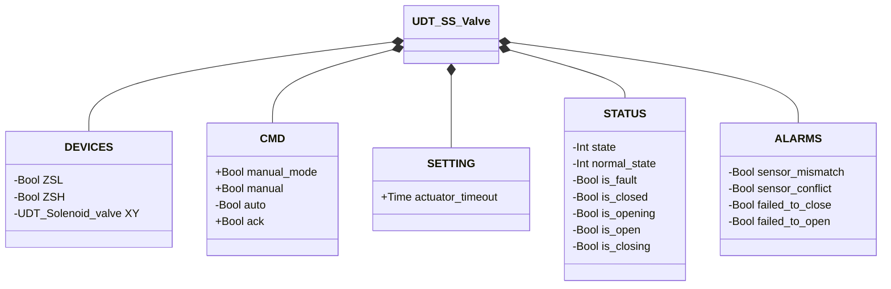
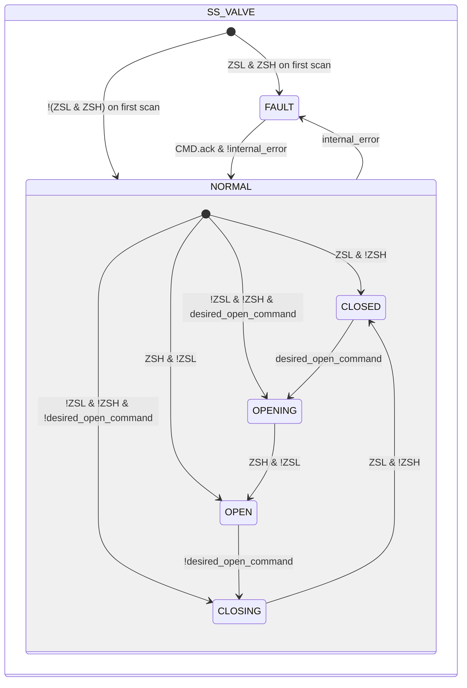

# Butterfly Valve — Single Solenoid (SS)

## Overview

**Level 2.** `SS_valve` controls a pneumatic butterfly valve with a single solenoid (`XY`, monostable — spring-return to a single stable rest position) and dual-limit-switch position feedback (`ZSL` closed, `ZSH` open).

---

## Interface

### Composition

| Tag | Type | Role |
|-----|------|------|
| `XY` | Solenoid Valve (Level 1) | Actuator — energized during opening and held energized in OPEN against the spring |

Manual/automatic arbitration follows the common pattern — see [Library — Overview](../../../index.md).

### Data Structure



`+` = writable by DCS/HMI, `-` = read-only.

### Control Signals

| Signal | Type | Direction | Description |
|--------|------|-----------|-------------|
| `DEVICES.ZSL` | Bool | IN | Closed-position limit switch |
| `DEVICES.ZSH` | Bool | IN | Open-position limit switch |
| `DEVICES.XY` | UDT_Solenoid_valve | OUT | Actuator solenoid valve — commanded, its own status is not read back by this block |
| `CMD.manual_mode` | Bool | IN | TRUE = HMI manual mode |
| `CMD.manual` | Bool | IN | Open command in manual mode |
| `CMD.auto` | Bool | IN | Open command in automatic mode |
| `CMD.ack` | Bool | IN | Acknowledges alarms and clears FAULT |

### Settings

| Parameter | Default | Description |
|-----------|---------|-------------|
| `SETTING.actuator_timeout` | T#2s | See the convention in [Valves — Overview](../../index.md) |

---

## Behavior

### Operation

The actuator is monostable: energizing `XY` drives it toward open, while the spring returns the disc to its single rest position (closed) as soon as `XY` de-energizes.

On the first PLC scan, the block reads `ZSL` and `ZSH` to determine the initial state: `ZSL AND NOT ZSH` → NORMAL/CLOSED, `ZSH AND NOT ZSL` → NORMAL/OPEN, neither active (valve mid-travel) → NORMAL/OPENING or NORMAL/CLOSING per `desired_open_command`, `ZSL AND ZSH` → FAULT (ambiguous condition).

The desired command is resolved on every scan, the same pattern as [Solenoid Valve](../../solenoid/index.md):

```
desired_open_command := manual_mode ? manual : auto
```

### Alarms

- [`XV-E01`](../../index.md#valve-alarms) — current stable state not confirmed by the expected limit switch (`CLOSED` but `!ZSL`, or `OPEN` but `!ZSH`)
- [`XV-E02`](../../index.md#valve-alarms) — `ZSL AND ZSH` TRUE at the same time
- [`XV-E03`](../../index.md#valve-alarms) — `CLOSING` not completed within `actuator_timeout`
- [`XV-E04`](../../index.md#valve-alarms) — `OPENING` not completed within `actuator_timeout`

### State Diagram



```Pascal
internal_error := ALARMS.sensor_mismatch OR ALARMS.sensor_conflict OR ALARMS.failed_to_close OR ALARMS.failed_to_open;
```

| State | `XY` | Description |
|-------|------|-------------|
| CLOSED | FALSE | Disc closed; spring at rest |
| OPENING | TRUE | Actuator pushing the disc toward open |
| OPEN | TRUE | Disc open; the solenoid valve holds against the spring |
| CLOSING | FALSE | Spring returns the disc to closed |
| FAULT | FALSE | Fault; awaits `ack` with valid sensors |

| State | Int value |
|---|---|
| NORMAL.CLOSED | 1 |
| NORMAL.OPENING | 2 |
| NORMAL.OPEN | 3 |
| NORMAL.CLOSING | 4 |
| FAULT | 0 |

### Timer

| Timer | Active in state | Threshold (parameter) |
|-------|------------------|------------------------|
| `movement_timer` | `OPENING` or `CLOSING` (within `NORMAL`) | `SETTING.actuator_timeout` |
