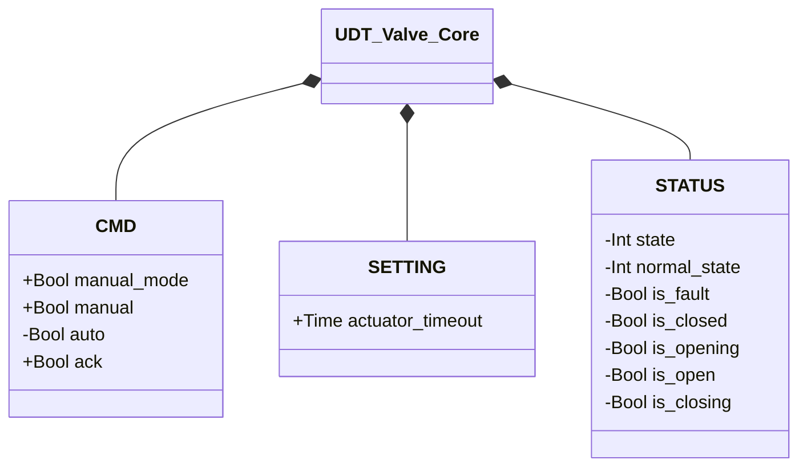

# Valves

Pneumatically controlled valves for isolation, actuation, and process control.

The `SETTING.actuator_timeout` parameter (default `T#2s`, the maximum time allowed to complete an opening or closing move) is the same, with the same meaning, on every valve that has its own `movement_timer` — Pinch, Butterfly SS, Butterfly DS. Modules that embed one of these (Sealed, Pinch Diverter, Transporter) don't have their own `actuator_timeout`: they forward the value they receive to the internal instance on every scan.

## Core

`UDT_Valve_Core` holds the `CMD`/`STATUS`/`SETTING` contract shared by the whole valve
family, embedded as a `CORE` field in all four members (Pinch, Butterfly SS, Butterfly DS,
Sealed) — field-for-field identical. `DEVICES` and `ALARMS` stay outside `CORE`: that's where
the family diverges (different sensors between Pinch and Butterfly, no alarms at all on
Sealed).

`+` = writable by DCS/HMI, `-` = read-only. A generically-typed `CORE` field lets an
orchestrator compose any member of this family without knowing in advance which one — the
dependency-injection mechanism [Sealed Valve](sealed/index.md) uses to wrap whichever valve
is injected into its own `XV` parameter, and the same pattern (`UDT_Filter_Core`) used by
filters — see [Filters — Overview](../filters/index.md#core).

## Valve Alarms

Shared by every entry in this category that has position feedback.

| ID | Title | Condition | Applicable to |
|----|--------|------------|----------------|
| `XV-E01` | Sensor mismatch | The current stable state (CLOSED/OPEN) is not confirmed by the expected position sensor | Pinch, Butterfly SS, Butterfly DS |
| `XV-E02` | Sensor conflict | Both position limit switches read TRUE at the same time | Butterfly SS, Butterfly DS |
| `XV-E03` | Closing failure | Closing movement not confirmed within `actuator_timeout` | Pinch, Butterfly SS, Butterfly DS |
| `XV-E04` | Opening failure | Opening movement not confirmed within `actuator_timeout` | Pinch, Butterfly SS, Butterfly DS |

All four contribute to `internal_error`, a variable internal to the block (not exposed via the UDT) that drives the transition to `FAULT`. The pinch valve has only one position sensor (`PSL`) and cannot generate `XV-E02`.

## Modules

| Module | Level | Description |
|--------|------|-------------|
| [Solenoid Valve](solenoid/index.md) | 1 | Atomic on/off actuator; no position feedback |
| [Pinch Valve](pinch/index.md) | 2 | Compresses a flexible hose; a pressure switch confirms the closed position |
| [Butterfly Valve — Single Solenoid (SS)](butterfly/single_solenoid/index.md) | 2 | Spring return to close; position feedback via ZSL/ZSH |
| [Butterfly Valve — Double Solenoid (DS)](butterfly/double_solenoid/index.md) | 2 | Bistable, double-acting; position feedback via ZSL/ZSH |
| [Sealed Valve](sealed/index.md) | 3 | Wraps any valve-family member (`CORE`) with a dedicated sealing solenoid valve |
