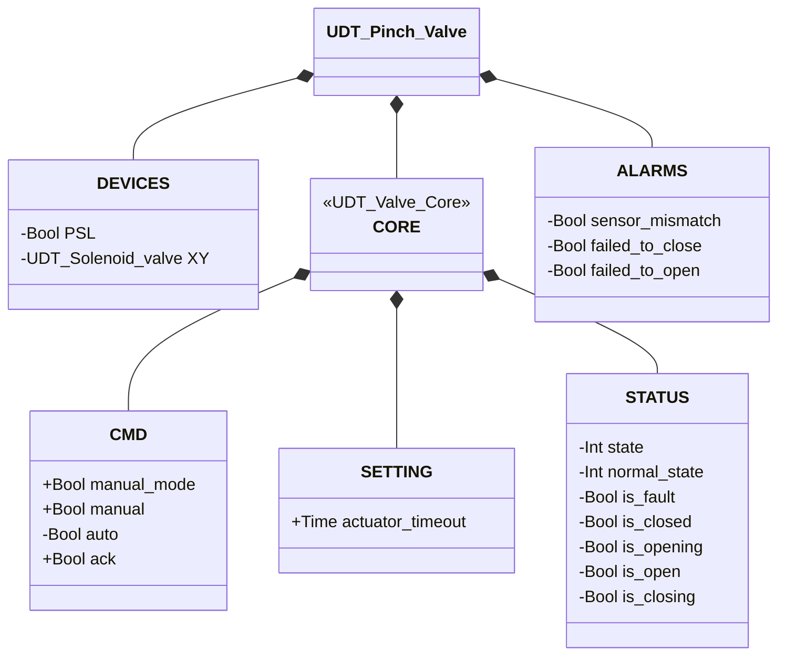
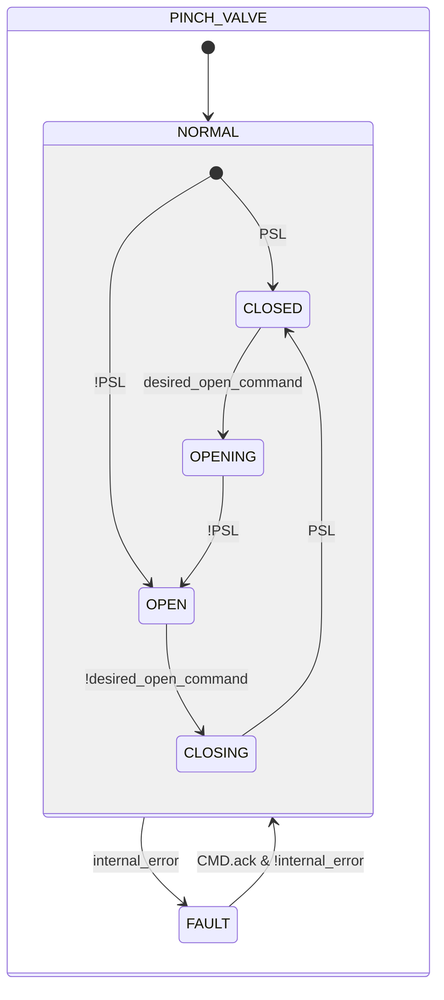

# Pinch Valve

## Overview

**Level 2.** The pinch valve controls flow by mechanically compressing a flexible tube, using an internal solenoid valve (`XY`) as actuator and a pressure switch (`PSL`) as its only position sensor.

---

## Interface

### Composition

| Tag | Type | Role |
|-----|------|------|
| `XY` | Solenoid Valve (Level 1) | Actuator — energized = closed |

Manual/automatic arbitration (`manual_mode`/`manual`/`auto`) follows the common pattern described in [Library — Overview](../../index.md).

### Data Structure



`+` = writable by DCS/HMI, `-` = read-only. `CORE` is the contract shared by the whole valve
family — see [Valves — Overview](../index.md#core).

### Control Signals

| Signal | Type | Direction | Description |
|--------|------|-----------|--------------|
| `DEVICES.PSL` | Bool | IN | Pressure switch: TRUE = valve closed (tube pinched) |
| `DEVICES.XY` | UDT_Solenoid_valve | OUT | Actuator solenoid valve — commanded; this block does not read its state back |
| `CORE.CMD.manual_mode` | Bool | IN | TRUE = HMI manual mode |
| `CORE.CMD.manual` | Bool | IN | Close command in manual mode |
| `CORE.CMD.auto` | Bool | IN | Close command in automatic mode |
| `CORE.CMD.ack` | Bool | IN | Acknowledges alarms and clears FAULT |

### Settings

| Parameter | Default | Description |
|-----------|---------|--------------|
| `CORE.SETTING.actuator_timeout` | T#2s | See the convention in [Valves — Overview](../index.md) |

---

## Behavior

### Operation

Energizing `XY` drives the pneumatic actuator that pinches the tube shut; de-energizing releases the tube and restores flow. The valve is normally open — it requires active energization to remain closed. `PSL` confirms the closed position.

The desired command is resolved on every scan, the same pattern as [Solenoid Valve](../solenoid/index.md):

```
desired_open_command := manual_mode ? manual : auto
```

The pinch valve resolves manual/automatic arbitration at its own level and exposes only the already-resolved command to `XY.CMD.auto` — the internal solenoid valve does not arbitrate on its own.

On return from `FAULT`, the block re-reads `PSL` to determine the stable state (`CLOSED` if TRUE, otherwise `OPEN`) — the same mechanism used on the first scan.

In `FAULT`, `XY` is deliberately de-energized (tube open), regardless of how it was commanded before the fault: leaving the tube pinched indefinitely would accelerate wear on the material.

### Alarms

- [`XV-E01`](../index.md#valve-alarms) — current stable state (`CLOSED`/`OPEN`) not confirmed by `PSL`
- [`XV-E03`](../index.md#valve-alarms) — `CLOSING` not completed within `actuator_timeout`
- [`XV-E04`](../index.md#valve-alarms) — `OPENING` not completed within `actuator_timeout`
- Not applicable: `XV-E02` (sensor conflict) — the pinch valve has only one position sensor

### State Diagram



```Pascal
internal_error := ALARMS.sensor_mismatch OR ALARMS.failed_to_close OR ALARMS.failed_to_open;
```

| State | `XY` | Description |
|-------|------|--------------|
| CLOSED | TRUE | Tube pinched, flow blocked |
| OPENING | FALSE | Actuator releases the tube |
| OPEN | FALSE | Tube free, flow allowed |
| CLOSING | TRUE | Actuator pinches the tube |
| FAULT | FALSE | `XY` deliberately de-energized (tube open) — avoids leaving the tube pinched during the fault, preventing wear on the material; requires operator acknowledgment |

| State | Int value |
|---|---|
| NORMAL.CLOSED | 1 |
| NORMAL.OPENING | 2 |
| NORMAL.OPEN | 3 |
| NORMAL.CLOSING | 4 |
| FAULT | 0 |

### Timer

| Timer | State it's active in | Threshold (parameter) |
|-------|------------------------|-------------------------|
| `movement_timer` | `OPENING` or `CLOSING` (within `NORMAL`) | `SETTING.actuator_timeout` |
