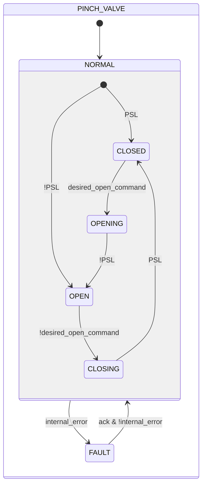
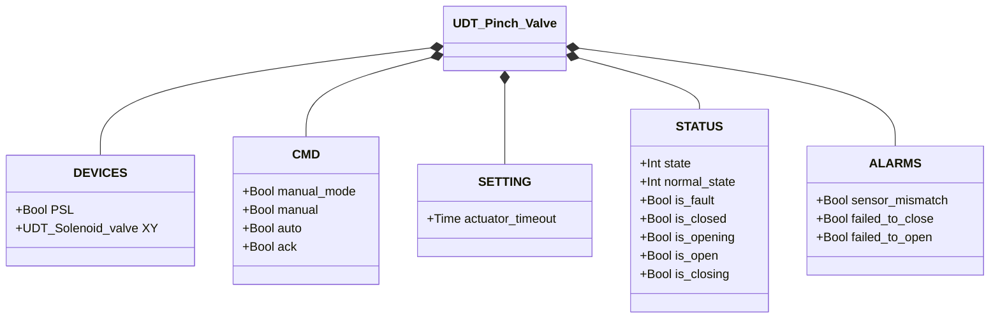

# Pinch Valve

## Overview

**Tier 2.** The pinch valve controls flow by mechanically compressing a flexible tube. Energizing the internal solenoid (`XY`) drives the pneumatic actuator to pinch the tube closed; de-energizing releases the tube and restores flow. A pressure switch (`PSL`) confirms the closed position — it's the device's only position sensor. The valve is normally open — it requires active energization to remain closed.

---

## Composition

| Tag | Type | Role |
|-----|------|------|
| `XY` | Solenoid Valve (Tier 1) | Actuator — energized = closed |

Manual/automatic arbitration (`manual_mode`/`manual`/`auto`) follows the same pattern described in [Solenoid Valve](../solenoid/index.md).

---

## Control Signals

| Signal | Type | Description |
|--------|------|-------------|
| `DEVICES.PSL` | Bool | INPUT — Pressure switch: TRUE = valve closed (tube pinched) |
| `DEVICES.XY` | UDT_Solenoid_valve | OUTPUT — Actuator solenoid valve |
| `CMD.manual_mode` | Bool | TRUE = HMI manual mode |
| `CMD.manual` | Bool | Close command in manual mode |
| `CMD.auto` | Bool | Close command from automation (ReadOnly external) |
| `CMD.ack` | Bool | Acknowledges alarms and clears FAULT |

---

## Settings

| Parameter | Default | Description |
|-----------|---------|-------------|
| `SETTING.actuator_timeout` | T#2s | Maximum time allowed to complete an opening or closing movement |

---

## States and Outputs

| State | `XY` | Expected `PSL` | Description |
|-------|------|-----------------|-------------|
| CLOSED | TRUE | TRUE | Tube pinched, flow blocked |
| OPENING | FALSE | (transitioning) | Actuator releasing tube |
| OPEN | FALSE | FALSE | Tube free, flow allowed |
| CLOSING | TRUE | (transitioning) | Actuator pinching tube |
| FAULT | — | — | Outputs frozen; operator acknowledgment required |

---

## State Machine



```Pascal
internal_error := sensor_mismatch OR failed_to_close OR failed_to_open;
```

On return from `FAULT`, the block re-reads `PSL` to determine the stable state (`CLOSED` if TRUE, otherwise `OPEN`) — the same mechanism used on the first scan.

---

## Alarms

| ID | Device-specific condition |
|----|----------------------------|
| [`XV-E01`](../index.md#valve-alarms) | Current stable state (CLOSED/OPEN) not confirmed by `PSL` |
| [`XV-E03`](../index.md#valve-alarms) | `CLOSING` not confirmed within `actuator_timeout` |
| [`XV-E04`](../index.md#valve-alarms) | `OPENING` not confirmed within `actuator_timeout` |

Not applicable: `XV-E02` (sensor conflict) — the Pinch valve has only one position sensor.

---

## Data Structure



`internal_error` is internal to the function block, not exposed via the UDT.
