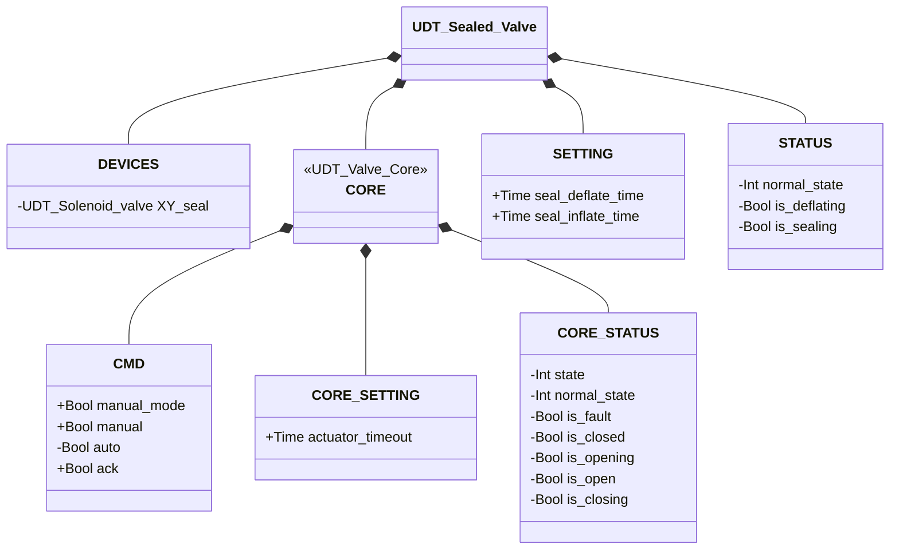
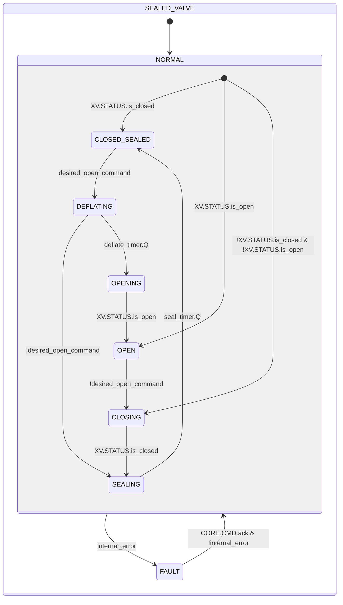

# Sealed Valve

## Overview

**Level 3 — composite.** `Sealed_valve` composes any member of the valve family — injected through an `XV` parameter generically typed `UDT_Valve_Core`, Level 2 — with a dedicated sealing solenoid valve (`XY_seal`, Level 1) under its own deflate/seal sequencing state machine. The seal de-energizes and dwells (`DEFLATING`) before the inner valve is commanded open, and re-energizes and dwells (`SEALING`) after the inner valve confirms closed, before the assembly is considered sealed again — a two-stage interlock, not an instantaneous combinational rule.

The composition root instantiates the concrete valve (Pinch, Butterfly SS, Butterfly DS...) and injects only its `CORE` into the `XV` parameter — see [Valves — Overview](../index.md#core) for the rationale. Its own `CORE.STATUS` is **not** a copy of `XV.STATUS`: it's a projection onto the shared 4-phase valve contract, where `DEFLATING` folds into `is_opening` and `SEALING` into `is_closing` — see Operation for why. `Sealed_valve` has no `ALARMS` of its own: `UDT_Valve_Core` deliberately carries none, so the only possible fault source is `XV.STATUS.is_fault` — see [Valve Alarms](../index.md#valve-alarms) for the actual source, which depends on whichever concrete valve fills `XV`.

---

## Interface

### Composition

| Tag | Type | Direction | Role |
|-----|------|-----------|------|
| `XV` (injected parameter) | `UDT_Valve_Core` | IN/OUT | CMD/STATUS/SETTING contract of the inner valve — which concrete valve fills it is decided by whoever composes this block, not by `Sealed_valve` itself |
| `sealed_XV.DEVICES.XY_seal` | Solenoid Valve (Level 1) | OUT | Sealing solenoid valve — driven by this FB's own state machine (`CLOSED_SEALED`/`SEALING` → energized), not a single combinational rule |

`XV` is IN/OUT: the block writes `XV.CMD.ack`/`CMD.auto`/`SETTING.actuator_timeout` and reads `XV.STATUS` back to derive both its own state machine and the `CORE.STATUS` projection. `XY_seal` is OUT-only: driven by the current state, its own state is never read back.

### Data Structure



`+` = writable by DCS/HMI, `-` = read-only. `CORE_SETTING`/`CORE_STATUS` are the classes nested under `CORE` (`UDT_Valve_Core`'s own `SETTING`/`STATUS`, i.e. the injected valve's); the unprefixed `SETTING`/`STATUS` are `UDT_Sealed_Valve`'s own fields for its own deflate/seal interlock — `UDT_Sealed_Valve` is the library's first UDT with two separate CMD/STATUS/SETTING homes (own + `CORE`), hence the two names. The `XV : UDT_Valve_Core` parameter injected by the composition root **is not a field of `UDT_Sealed_Valve`** — it's a second `VAR_IN_OUT` parameter, alongside `sealed_XV`, in `Sealed_valve`'s signature.

### Control Signals

| Signal | Type | Direction | Description |
|--------|------|-----------|--------------|
| `XV` (injected) | UDT_Valve_Core | IN/OUT | Inner valve — CMD written, STATUS read back |
| `sealed_XV.DEVICES.XY_seal` | UDT_Solenoid_valve | OUT | Sealing solenoid valve |
| `sealed_XV.CORE.CMD.manual_mode` | Bool | IN | TRUE = HMI manual mode |
| `sealed_XV.CORE.CMD.manual` | Bool | IN | Open command in manual mode |
| `sealed_XV.CORE.CMD.auto` | Bool | IN | Open command in automatic mode |
| `sealed_XV.CORE.CMD.ack` | Bool | IN | Alarm acknowledge — forwarded to `XV.CMD.ack` |

### Settings

| Setting | Default | Description |
|---------|---------|--------------|
| `sealed_XV.CORE.SETTING.actuator_timeout` | T#2s | Forwarded to `XV.SETTING.actuator_timeout` every scan |
| `sealed_XV.SETTING.seal_deflate_time` | T#2s | Dwell duration in `DEFLATING` before the inner valve is commanded open |
| `sealed_XV.SETTING.seal_inflate_time` | T#2s | Dwell duration in `SEALING` before the assembly is considered sealed again |

---

## Behavior

### Operation

The seal has no confirmation sensor of its own — there's no physical feedback that it has actually released or re-inflated. `DEFLATING` and `SEALING` exist precisely for this: sensor-less, parameter-timed dwells (`seal_deflate_time`/`seal_inflate_time`) used as the only available confirmation before trusting it's safe to move the inner valve, or before considering the assembly sealed again. The interlock is what stops the valve from opening while the seal is still inflated: `XV.CMD.auto` only becomes TRUE in `OPENING`, never in `DEFLATING`, so the inner valve stays put for the entire dwell.

If the open command is withdrawn while still in `DEFLATING`, the block returns straight to `SEALING` instead of completing a full, pointless open/close cycle — the seal was never actually released long enough to need re-deflating.

`sealed_XV.CORE.STATUS` is not a copy of `XV.STATUS`, but a projection onto the shared 4-phase valve contract: `DEFLATING` folds into `CORE.STATUS.is_opening` and `SEALING` into `CORE.STATUS.is_closing`, so `CORE.STATUS.is_closed` reads TRUE only once the disc is closed **and** the seal has finished inflating. `UDT_Sealed_Valve.CORE` is itself injectable (e.g. a future Transporter slot): a direct copy would let a downstream consumer see `is_closed` while the seal is still mid-inflate — a false positive the projection rules out by construction.

In `FAULT`, `XY_seal.CMD.auto` follows `XV.STATUS.is_closed` directly rather than being forced unconditionally TRUE — inflating the seal against a partly-open disc of an unknown injected valve type could extrude or damage it. `XV.CMD.auto` stays FALSE throughout `FAULT`, so a recoverable valve drifts closed on its own and re-seals once it gets there. Recovery from `FAULT` requires `CORE.CMD.ack`, matching every other valve/diverter state machine in this library: an operator must consciously acknowledge before automatic recovery resumes, a requirement for a sealed/atmosphere-isolating valve on an operator-attended, explosion-proof-panel-class installation. This block still has no latch of its own — `CORE.CMD.ack` is still forwarded to `XV` every scan and the injected valve owns the actual fault latch — but it now also gates its own exit from `FAULT` on that same ack, instead of only tracking `XV.STATUS.is_fault` clearing.

There's no "ambiguous on first scan" guard like the other valve state machines in this library: the injected valve is called by the composition root before `Sealed_valve`, so `XV.STATUS.is_closed`/`is_open` are already reliably resolved by the time this block reads them, even on the first scan.

### Alarms

No alarms of its own — `UDT_Valve_Core` deliberately carries no `ALARMS`, so the only possible source for `internal_error` is `XV.STATUS.is_fault`. Alarms remain visible exclusively through the injected valve: see [Valve Alarms](../index.md#valve-alarms).

### State Diagram



```Pascal
internal_error := XV.STATUS.is_fault;
```

| State | `XV` | `XY_seal` | Description |
|-------|------|-----------|-------------|
| NORMAL.CLOSED_SEALED | closed | TRUE | Valve closed and seal energized — resting state, fully sealed |
| NORMAL.DEFLATING | closed | FALSE | Seal de-energized, dwelling for `seal_deflate_time` before the valve is commanded open |
| NORMAL.OPENING | open | FALSE | Valve commanded open |
| NORMAL.OPEN | open | FALSE | Valve open, no seal needed |
| NORMAL.CLOSING | closed | FALSE | Valve commanded closed, seal not yet energized |
| NORMAL.SEALING | closed | TRUE | Valve confirmed closed, seal energized and dwelling for `seal_inflate_time` before the assembly is considered sealed again |
| FAULT | — | follows `XV.STATUS.is_closed` | Fault; the seal has no fixed value — see Operation |

| State | Int value |
|---|---|
| NORMAL | 1 |
| NORMAL.CLOSED_SEALED | 1 |
| NORMAL.DEFLATING | 2 |
| NORMAL.OPENING | 3 |
| NORMAL.OPEN | 4 |
| NORMAL.CLOSING | 5 |
| NORMAL.SEALING | 6 |
| FAULT | 0 |

`CORE.STATUS.normal_state` projects the six own states onto the valve family's shared 4-phase contract:

| CORE.STATUS.normal_state | Int value | Derived from |
|---|---|---|
| CORE_CLOSED | 1 | CLOSED_SEALED |
| CORE_OPENING | 2 | DEFLATING, OPENING |
| CORE_OPEN | 3 | OPEN |
| CORE_CLOSING | 4 | CLOSING, SEALING |

### Timer

| Timer | State it's active in | Threshold (parameter) |
|-------|------------------------|------------------------|
| `deflate_timer` | NORMAL.DEFLATING | `SETTING.seal_deflate_time` |
| `seal_timer` | NORMAL.SEALING | `SETTING.seal_inflate_time` |
