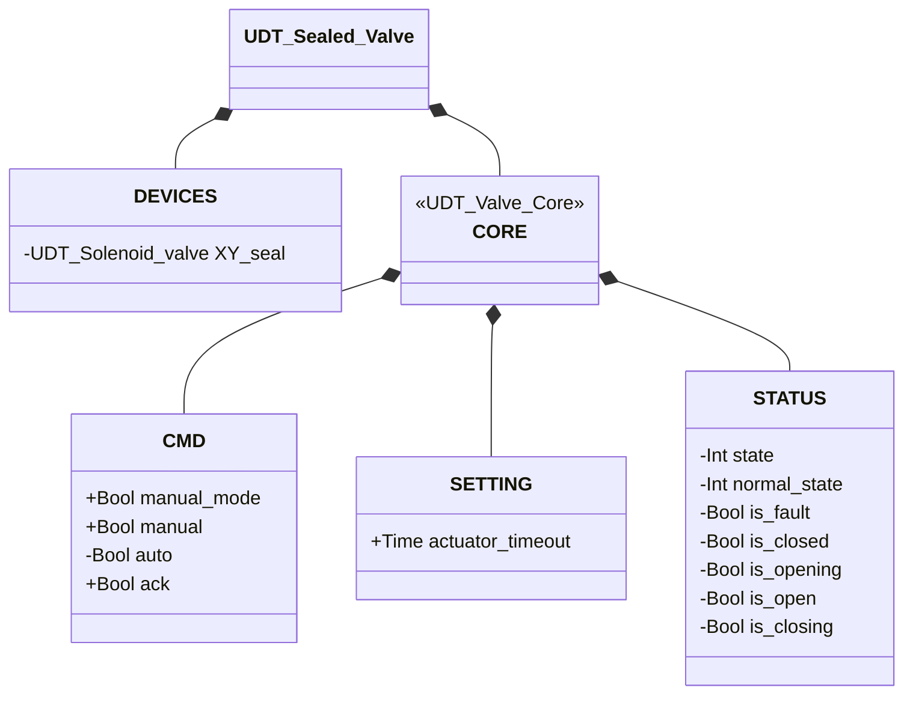

# Sealed Valve

## Overview

**Level 3 — composite.** `Sealed_valve` wraps any member of the valve family — injected through an `XV` parameter generically typed `UDT_Valve_Core` — adding a dedicated sealing solenoid valve (`XY_seal`, Level 1). The seal is automatically energized once the inner valve is confirmed `CLOSED`, guaranteeing pneumatic tightness at rest; it de-energizes as soon as the valve starts opening.

The composition root instantiates the concrete valve (Pinch, Butterfly SS, Butterfly DS...) and injects only its `CORE` into the `XV` parameter — see [Valves — Overview](../index.md#core) for the rationale. `Sealed_valve` delegates open/close logic, alarm detection, and the state machine entirely to the injected valve; it has no state machine of its own and no `ALARMS` of its own — its own `CORE.STATUS` is a direct copy of `XV.STATUS` every scan.

---

## Interface

### Composition

| Tag | Type | Direction | Role |
|-----|------|-----------|------|
| `XV` (injected parameter) | `UDT_Valve_Core` | IN/OUT | CMD/STATUS/SETTING contract of the inner valve — which concrete valve fills it is decided by whoever composes this block, not by `Sealed_valve` itself |
| `sealed_XV.DEVICES.XY_seal` | Solenoid Valve (Level 1) | OUT | Sealing solenoid valve — energized ↔ inner valve in `CLOSED` |

`XV` is IN/OUT: the block writes `XV.CMD.ack`/`CMD.auto`/`SETTING.actuator_timeout` and reads `XV.STATUS` back as a mirror into `sealed_XV.CORE.STATUS`. `XY_seal` is OUT-only: driven by `XV.STATUS.is_closed`, its own state is never read back.

### Data Structure



`+` = writable by DCS/HMI, `-` = read-only. No `ALARMS` class — this UDT doesn't have one of its own: alarms remain readable only on the injected valve (its concrete `ALARMS` depends on whichever valve fills `XV`). The `XV : UDT_Valve_Core` parameter injected by the composition root **is not a field of `UDT_Sealed_Valve`** — it's a second `VAR_IN_OUT` parameter, alongside `sealed_XV`, in `Sealed_valve`'s signature.

### Control Signals

| Signal | Type | Direction | Description |
|--------|------|-----------|--------------|
| `XV` (injected) | UDT_Valve_Core | IN/OUT | Inner valve — CMD written, STATUS read back |
| `sealed_XV.DEVICES.XY_seal` | UDT_Solenoid_valve | OUT | Sealing solenoid valve |
| `sealed_XV.CORE.CMD.manual_mode` | Bool | IN | TRUE = HMI manual mode |
| `sealed_XV.CORE.CMD.manual` | Bool | IN | Open command in manual mode |
| `sealed_XV.CORE.CMD.auto` | Bool | IN | Open command in automatic mode |
| `sealed_XV.CORE.CMD.ack` | Bool | IN | Alarm acknowledge — forwarded to `XV.CMD.ack` |

### Settings

| Setting | Default | Description |
|---------|---------|--------------|
| `sealed_XV.CORE.SETTING.actuator_timeout` | T#2s | Forwarded to `XV.SETTING.actuator_timeout` every scan |

---

## Behavior

### Operation

The desired command is resolved by this block and written to `XV.CMD.auto`:

```
XV.CMD.auto := sealed_XV.CORE.CMD.manual_mode ? sealed_XV.CORE.CMD.manual : sealed_XV.CORE.CMD.auto
```

The seal follows a single rule:

```
sealed_XV.DEVICES.XY_seal.CMD.auto := XV.STATUS.is_closed
```

### Alarms

No alarms of its own — this block has no `ALARMS` of its own. Alarms remain visible exclusively through the injected valve: see [Valve Alarms](../index.md#valve-alarms).

### State Diagram

The state machine is entirely handled by the injected valve through `XV` — which page to consult depends on which concrete valve fills it (e.g. [Butterfly Valve — Single Solenoid (SS)](../butterfly/single_solenoid/index.md#state-diagram)). This block only adds the seal logic, with no states of its own.

| State (from `XV`) | `XY_seal` |
|--------------------|-----------|
| CLOSED | TRUE (sealed) |
| OPENING / OPEN / CLOSING | FALSE |
| FAULT | FALSE |
