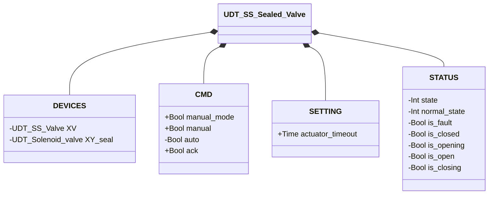

# Sealed Valve — Single Solenoid (SS Sealed)

## Overview

**Level 3 — composite.** `SS_Sealed_valve` wraps an instance of Butterfly Valve — Single Solenoid (SS) (Level 2, monostable — see [Butterfly Valve — Single Solenoid (SS)](../../butterfly/single_solenoid/index.md)) adding a dedicated sealing solenoid valve (`XY_seal`, Level 1). The seal is automatically energized once the inner valve is confirmed `CLOSED`, guaranteeing pneumatic tightness at rest; it de-energizes as soon as the valve starts opening.

The block delegates open/close logic, alarm detection, and the state machine entirely to the inner `XV` instance; it has no state machine of its own and no `ALARMS` of its own — `STATUS` is a direct copy of `XV.STATUS` every scan.

---

## Interface

### Composition

| Tag | Type | Direction | Role |
|-----|------|-----------|------|
| `XV` | Butterfly Valve — Single Solenoid (SS) (Level 2) | IN/OUT | Main valve — see [Butterfly Valve — Single Solenoid (SS)](../../butterfly/single_solenoid/index.md) |
| `XY_seal` | Solenoid Valve (Level 1) | OUT | Sealing solenoid valve — energized ↔ `XV` in `CLOSED` |

`XV` is IN/OUT: the outer block writes `XV.CMD.ack`/`CMD.auto`/`SETTING.actuator_timeout` and reads `XV.STATUS` back as a mirror. `XY_seal` is OUT-only: driven by `XV.STATUS.is_closed`, its own state is never read back.

### Data Structure



`+` = writable by DCS/HMI, `-` = read-only. No `ALARMS` class — unlike other composite devices, this UDT doesn't even mirror one: alarms remain readable only on `DEVICES.XV.ALARMS`.

### Control Signals

| Signal | Type | Direction | Description |
|--------|------|-----------|--------------|
| `DEVICES.XV` | UDT_SS_Valve | IN/OUT | Inner butterfly SS valve |
| `DEVICES.XY_seal` | UDT_Solenoid_valve | OUT | Sealing solenoid valve |
| `CMD.manual_mode` | Bool | IN | TRUE = HMI manual mode |
| `CMD.manual` | Bool | IN | Open command in manual mode |
| `CMD.auto` | Bool | IN | Open command in automatic mode |
| `CMD.ack` | Bool | IN | Alarm acknowledge — forwarded to `XV.CMD.ack` |

### Settings

| Setting | Default | Description |
|---------|---------|--------------|
| `SETTING.actuator_timeout` | T#2s | Forwarded to `XV.SETTING.actuator_timeout` every scan |

---

## Behavior

### Operation

The desired command is resolved by the outer block and written to `XV.CMD.auto`:

```
XV.CMD.auto := manual_mode ? manual : auto
```

The seal follows a single rule:

```
XY_seal.CMD.auto := XV.STATUS.is_closed
```

### Alarms

No alarms of its own — this block has no `ALARMS` of its own. Alarms remain visible exclusively through the inner `XV` instance: see [Valve Alarms](../../index.md#valve-alarms).

### State Diagram

The state machine is entirely handled by the inner `XV` instance — see [Butterfly Valve — Single Solenoid (SS)](../../butterfly/single_solenoid/index.md#state-diagram). This block only adds the seal logic, with no states of its own.

| State (from `XV`) | `XY_seal` |
|--------------------|-----------|
| CLOSED | TRUE (sealed) |
| OPENING / OPEN / CLOSING | FALSE |
| FAULT | FALSE |
