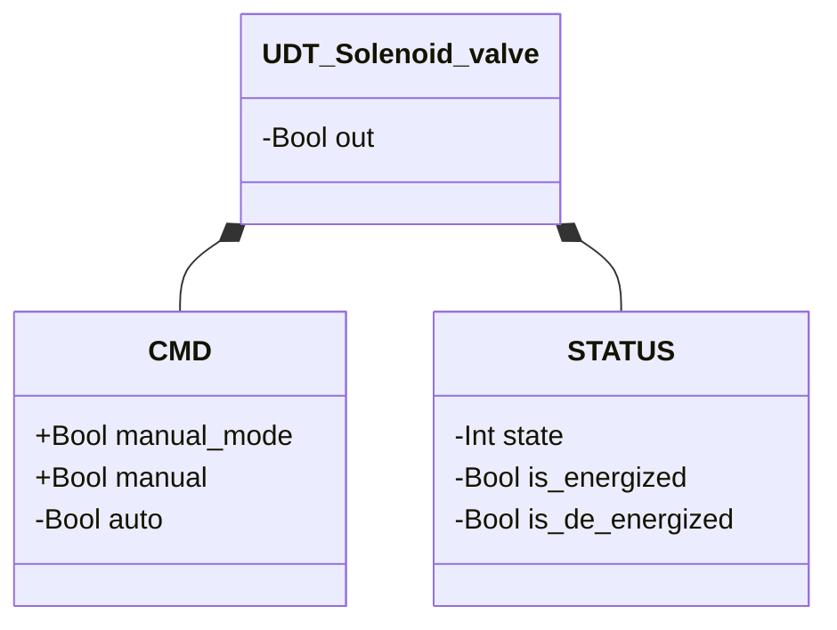
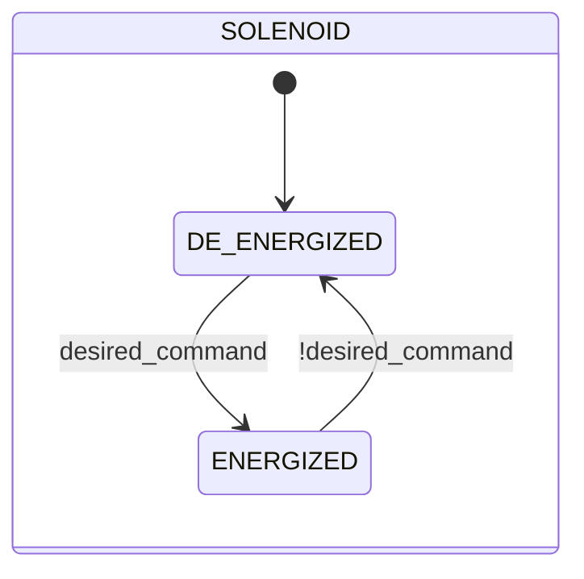

# Solenoid Valve

## Overview

**Level 1 — atomic.** The solenoid valve is the library's basic pneumatic actuator: an electromagnetic coil energizes or de-energizes a single physical output (`out`). It has no position feedback of its own — its own state (`ENERGIZED`/`DE_ENERGIZED`) reflects only the command received, not a physical confirmation. It's the library's most reused component: every higher-level valve (Sleeve, Butterfly SS/DS, Sealed) embeds one or more instances of it as its own actuator.

No configurable parameters. It doesn't raise its own alarms — no position sensor is available to base a fault detection on.

---

## Interface

### Data Structure



`+` = writable by DCS/HMI, `-` = read-only.

### Control Signals

| Signal | Type | Direction | Description |
|---------|------|-----------|-------------|
| `CMD.manual_mode` | Bool | IN | TRUE = manual command source instead of automatic |
| `CMD.manual` | Bool | IN | Excitation command in manual mode |
| `CMD.auto` | Bool | IN | Excitation command in automatic mode — written by the calling block, read by this block |
| `out` | Bool | OUT | Physical coil output: TRUE = energized |

---

## Behavior

### Operation

The desired command is resolved on every scan:

```
desired_command := manual_mode ? manual : auto
```

`out` follows `desired_command` without delay — there's no physical confirmation to wait for, so the state transition is immediate.

### State Diagram



| State | `out` | Description |
|-------|-------|-------------|
| `DE_ENERGIZED` | FALSE | Coil de-energized |
| `ENERGIZED` | TRUE | Coil energized |
