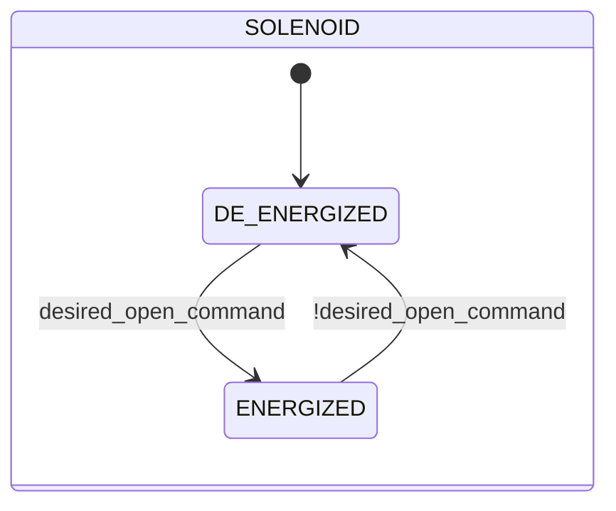

# Solenoid Valve

## Overview

**Tier 1 — atomic.** The solenoid valve is the library's base pneumatic actuator: an electromagnetic coil energizes or de-energizes a single physical output (`out`). It has no position feedback of its own — its state (`ENERGIZED`/`DE_ENERGIZED`) reflects only the command received, not a physical confirmation. It's the library's most reused component: every higher-level valve (Pinch, Butterfly SS/DS, Sealed) embeds one or more instances as its own actuator.

This block's `manual_mode`/`manual`/`auto` arbitration is the canonical pattern reused — with the same logic, though not always the same field name — by every device in this library that embeds a Solenoid Valve instance.

---

## Control Signals

| Signal | Type | Description |
|--------|------|-------------|
| `CMD.manual_mode` | Bool | TRUE = manual command source instead of automatic |
| `CMD.manual` | Bool | Energize command in manual mode |
| `CMD.auto` | Bool | Energize command from automation (ReadOnly external) |
| `out` | Bool | Physical coil output: TRUE = energized |

```
desired_open_command := manual_mode ? manual : auto
```

---

## Settings

No configurable settings.

---

## States and Outputs

| State | Value | `out` | Description |
|-------|-------|-------|-------------|
| `DE_ENERGIZED` | 1 | FALSE | Coil de-energized |
| `ENERGIZED` | 3 | TRUE | Coil energized |

---

## State Machine



---

## Alarms

This module raises no alarms of its own — no position sensor is available to base a fault detection on.

---

## Data Structure


