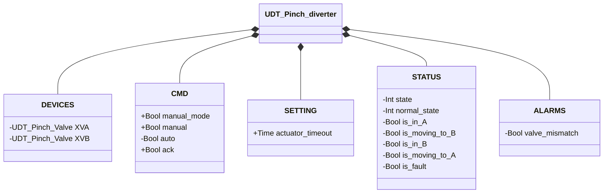
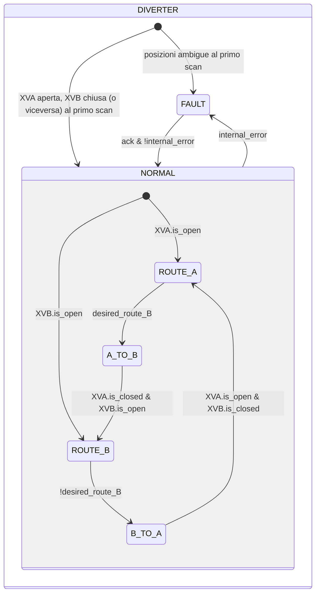

# Deviatore a Manicotto

## Panoramica

**Livello 3 — composito.** Il deviatore a manicotto indirizza il flusso di materiale tra due linee (A e B) incorporando due istanze di Valvola a Manicotto (Livello 2), `XVA` e `XVB`. Solo una linea è aperta alla volta. Non ci sono sensori fisici propri del deviatore — lo stato di instradamento è interamente derivato dal feedback di posizione delle due sotto-valvole.

---

## Composizione

| Tag | Tipo | Direzione | Ruolo |
|-----|------|-----------|-------|
| `XVA` | Valvola a Manicotto (Livello 2) | IN/OUT | Verso il percorso A |
| `XVB` | Valvola a Manicotto (Livello 2) | IN/OUT | Verso il percorso B |

Entrambe sono IN/OUT: il deviatore scrive `CMD.auto`/`CMD.ack`/`SETTING.actuator_timeout` su ciascuna e rilegge `STATUS.is_open`/`is_closed`/`is_fault` per determinare il proprio stato. Un'unica decisione manuale/automatica (`manual_mode`/`manual`/`auto`, risolta in `desired_route_B`: FALSE = instradamento su A, TRUE = instradamento su B) stabilisce quale valvola va aperta; l'altra è sempre comandata chiusa — le due istanze non arbitrano mai in autonomia. Vedere [Valvola a Manicotto](../../valves/pinch/index.md) per il dettaglio delle sotto-valvole.

---

## Struttura dati



`+` = scrivibile da DCS/HMI, `-` = sola lettura (`ReadOnly := External` nel sorgente).

---

## Segnali di controllo

| Segnale | Tipo | Direzione | Descrizione |
|---------|------|-----------|-------------|
| `DEVICES.XVA` | UDT_Pinch_Valve | IN/OUT | Sotto-valvola verso il percorso A |
| `DEVICES.XVB` | UDT_Pinch_Valve | IN/OUT | Sotto-valvola verso il percorso B |
| `CMD.manual_mode` | Bool | IN | TRUE = modalità manuale HMI |
| `CMD.manual` | Bool | IN | Selezione percorso in modalità manuale (TRUE = percorso B) |
| `CMD.auto` | Bool | IN | Selezione percorso dall'automazione |
| `CMD.ack` | Bool | IN | Conferma allarmi — inoltrato a entrambe le sotto-valvole |

`CMD.ack` viene propagato sia a `XVA.CMD.ack` sia a `XVB.CMD.ack` ad ogni scan.

---

## Parametri

| Parametro | Default | Descrizione |
|-----------|---------|-------------|
| `SETTING.actuator_timeout` | T#2s | Inoltrato a `XVA.SETTING.actuator_timeout` e `XVB.SETTING.actuator_timeout` |

---

## Funzionamento

[`DIV-E01`](../index.md#allarmi-dei-deviatori) scatta quando lo stato stabile corrente (`ROUTE_A`/`ROUTE_B`) non è confermato da `XVA.STATUS.is_open`/`XVB.STATUS.is_open`. Il guasto di `XVA` o `XVB` concorre a `internal_error` (transizione a `FAULT`) ma non genera un proprio ID a questo livello — vedere [Allarmi delle valvole](../../valves/index.md#allarmi-delle-valvole).

Al rientro da `FAULT`, il blocco rilegge lo stato delle due sotto-valvole per determinare il percorso stabile — stesso meccanismo del primo scan.

---

## Macchina a stati



```Pascal
internal_error := valve_mismatch OR XVA.is_fault OR XVB.is_fault;
```

| Stato | `XVA` (comandata) | `XVB` (comandata) | Descrizione |
|-------|--------------------|--------------------|-------------|
| ROUTE_A | aperta | chiusa | Instradamento su A stabilito |
| A_TO_B | chiusa | aperta | Transizione da A verso B |
| ROUTE_B | chiusa | aperta | Instradamento su B stabilito |
| B_TO_A | aperta | chiusa | Transizione da B verso A |
| FAULT | chiusa | chiusa | Guasto; nessun comando esplicito di apertura su nessuna delle due (fail-safe) |
