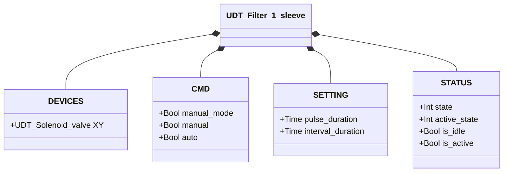
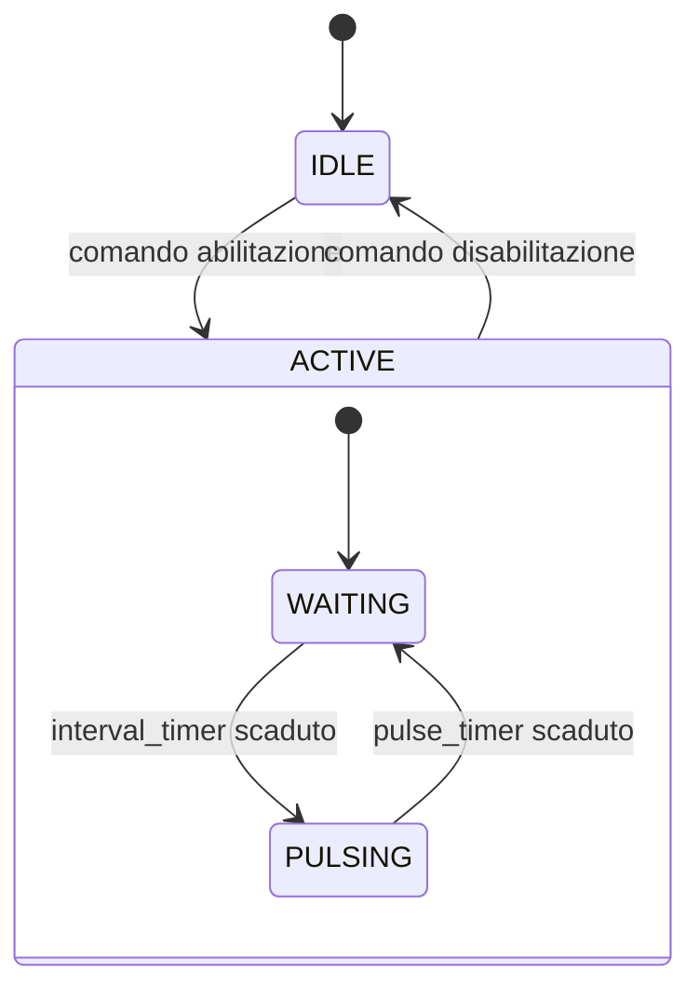

# Pulitore Filtro — 1 Manica

## Panoramica

**Tier 2.** Il pulitore filtro a 1 manica genera impulsi periodici di aria compressa tramite una singola Valvola a Solenoide (Tier 1, `XY`) per rimuovere la polvere accumulata da una manica filtrante. Quando abilitato, il ciclo parte sempre da un intervallo di attesa (`interval_duration`) prima del primo impulso, poi alterna attesa e impulso indefinitamente. Non è presente alcun feedback di posizione — il sistema è ad anello aperto.

---

## Composizione

| Tag | Tipo | Ruolo |
|-----|------|-------|
| `XY` | Valvola a Solenoide (Tier 1) | Impulso di pulizia |

---

## Segnali di controllo

| Segnale | Tipo | Descrizione |
|---------|------|-------------|
| `DEVICES.XY` | UDT_Solenoid_valve | OUTPUT — Elettrovalvola impulso pulizia |
| `CMD.manual_mode` | Bool | COMANDO — TRUE = modalità manuale |
| `CMD.manual` | Bool | COMANDO — Abilitazione in modalità manuale |
| `CMD.auto` | Bool | COMANDO — Abilitazione in modalità automatica (ReadOnly external) |
| `STATUS.state` | Int | STATO — 1=Inattivo, 2=Attivo |
| `STATUS.active_state` | Int | SOTTO-STATO — 1=Impulso, 2=Attesa |
| `STATUS.is_idle` | Bool | STATO — Filtro in attesa di abilitazione |
| `STATUS.is_active` | Bool | STATO — Ciclo di pulizia in corso |

---

## Funzionamento

**IDLE** — Il filtro è inattivo. `XY` è diseccitata. Quando arriva un comando di apertura (manuale o automatico), lo stato transita verso ACTIVE con `active_state = WAITING`.

**ACTIVE / WAITING** — Il filtro è attivo ma in pausa tra un impulso e l'altro. `XY` è diseccitata. Il timer intervallo (`interval_duration`) è in esecuzione. Alla scadenza, lo stato interno passa a PULSING.

**ACTIVE / PULSING** — `XY` viene eccitata per tutta la durata dell'impulso (`pulse_duration`). Alla scadenza del timer impulso, lo stato interno torna a WAITING.

Il ciclo WAITING → PULSING → WAITING si ripete finché il comando rimane attivo. La disabilitazione del comando in qualsiasi momento riporta il filtro in IDLE.

In **modalità manuale** (`manual_mode = TRUE`), il comando proviene da `CMD.manual`. In **modalità automatica**, da `CMD.auto`.

---

## Allarmi

Questo modulo non genera allarmi propri — `UDT_Filter_1_sleeve` non include una struttura `ALARMS`.

---

## Parametri

| Parametro | Default | Descrizione |
|-----------|---------|-------------|
| `pulse_duration` | T#500ms | Durata di ogni impulso di pulizia |
| `interval_duration` | T#3s | Tempo di attesa tra impulsi successivi |

---

## Struttura dati

---

## Macchina a stati (FSM)

### Tabella stati e uscite

| Stato | Sotto-stato | XY.CMD.auto | Descrizione |
|-------|------------|-------------|-------------|
| IDLE | — | FALSE | Filtro inattivo |
| ACTIVE | WAITING | FALSE | In pausa tra impulsi; interval_timer in esecuzione |
| ACTIVE | PULSING | TRUE | Impulso di pulizia attivo; pulse_timer in esecuzione |

### Tabella transizioni di stato

| Stato | Condizione | Stato successivo | Azione |
|-------|------------|-----------------|--------|
| IDLE | Comando abilitazione | ACTIVE / WAITING | Avvia interval_timer |
| ACTIVE | Comando disabilitazione | IDLE | Ferma timer, XY → FALSE |
| ACTIVE / WAITING | interval_timer.Q | ACTIVE / PULSING | XY → TRUE; avvia pulse_timer |
| ACTIVE / PULSING | pulse_timer.Q | ACTIVE / WAITING | XY → FALSE; avvia interval_timer |
