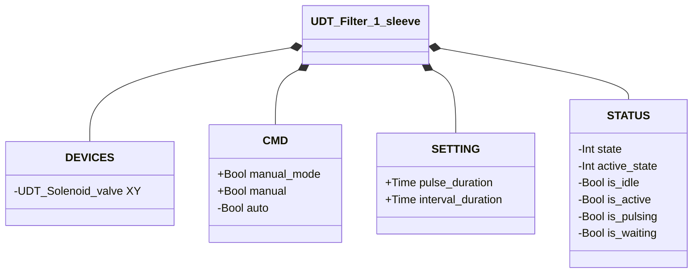
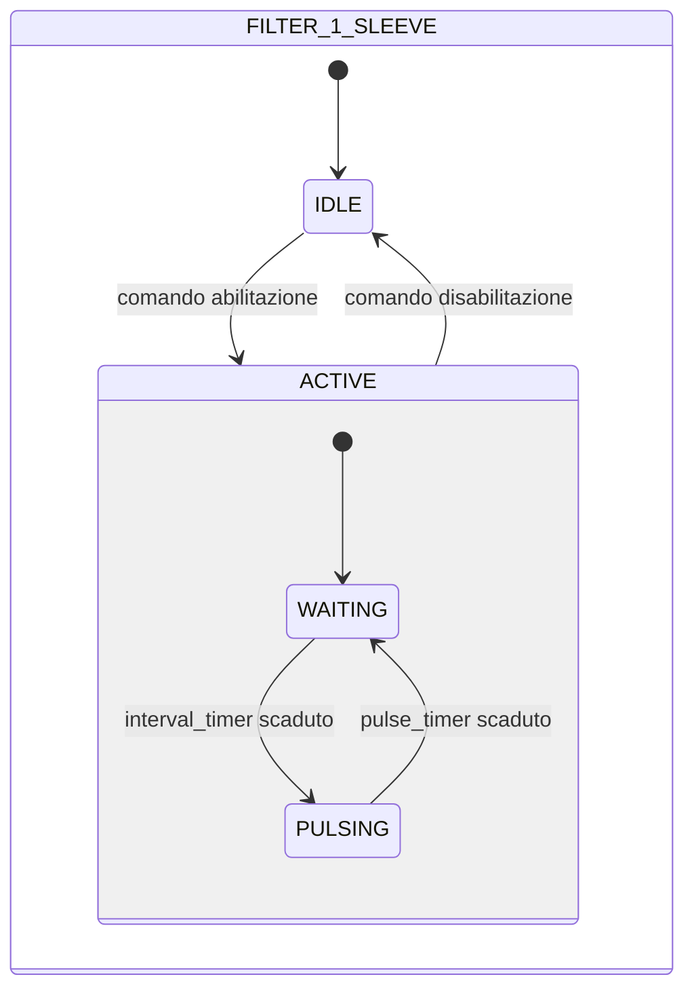

# Pulitore Filtro — 1 Manica

## Panoramica

**Livello 2.** Il pulitore filtro a 1 manica genera impulsi periodici di aria compressa tramite una singola Elettrovalvola (Livello 1, `XY`) per rimuovere la polvere accumulata da una manica filtrante. Non è presente alcuna retroazione di posizione — il sistema è ad anello aperto.

Nessun allarme proprio — `UDT_Filter_1_sleeve` non include una struttura `ALARMS`: non c'è sensore su cui basare una rilevazione di guasto.

---

## Interfaccia

### Composizione

| Tag | Tipo | Ruolo |
|-----|------|-------|
| `XY` | Elettrovalvola (Livello 1) | Impulso di pulizia |

### Struttura dati



`+` = scrivibile da DCS/HMI, `-` = sola lettura.

### Segnali di controllo

| Segnale | Tipo | Direzione | Descrizione |
|---------|------|-----------|-------------|
| `DEVICES.XY` | UDT_Solenoid_valve | OUT | Elettrovalvola impulso pulizia — comandata, il proprio stato non viene riletto da questo blocco |
| `CMD.manual_mode` | Bool | IN | TRUE = modalità manuale |
| `CMD.manual` | Bool | IN | Abilitazione in modalità manuale |
| `CMD.auto` | Bool | IN | Abilitazione in modalità automatica |

### Parametri

| Parametro | Default | Descrizione |
|-----------|---------|-------------|
| `pulse_duration` | T#500ms | Durata di ogni impulso di pulizia |
| `interval_duration` | T#3s | Tempo di attesa tra impulsi successivi |

---

## Comportamento

### Funzionamento

Quando abilitato, il ciclo parte sempre da un intervallo di attesa (`interval_duration`) prima del primo impulso, poi alterna attesa e impulso indefinitamente.

**IDLE** — Il filtro è inattivo. `XY` è diseccitata. Quando arriva un comando di abilitazione (manuale o automatico), lo stato transita verso ACTIVE con `active_state = WAITING`.

**ACTIVE / WAITING** — Il filtro è attivo ma in pausa tra un impulso e l'altro. `XY` è diseccitata. Il timer intervallo (`interval_duration`) è in esecuzione. Alla scadenza, lo stato interno passa a PULSING.

**ACTIVE / PULSING** — `XY` viene eccitata per tutta la durata dell'impulso (`pulse_duration`). Alla scadenza del timer impulso, lo stato interno torna a WAITING.

Il ciclo WAITING → PULSING → WAITING si ripete finché il comando rimane attivo. La disabilitazione del comando in qualsiasi momento riporta il filtro in IDLE.

In **modalità manuale** (`manual_mode = TRUE`), il comando proviene da `CMD.manual`. In **modalità automatica**, da `CMD.auto`.

### Diagramma di stato



```Pascal
desired_command := (manual_mode AND manual) OR (NOT manual_mode AND auto);
```

| Stato | Sotto-stato | `XY` | Descrizione |
|-------|-------------|------|-------------|
| IDLE | — | FALSE | Filtro inattivo |
| ACTIVE | WAITING | FALSE | In pausa tra impulsi; `interval_timer` in esecuzione |
| ACTIVE | PULSING | TRUE | Impulso di pulizia attivo; `pulse_timer` in esecuzione |

### Timer

| Timer | Stato in cui è attivo | Soglia (parametro) |
|-------|------------------------|---------------------|
| `interval_timer` | ACTIVE/WAITING | `SETTING.interval_duration` |
| `pulse_timer` | ACTIVE/PULSING | `SETTING.pulse_duration` |
