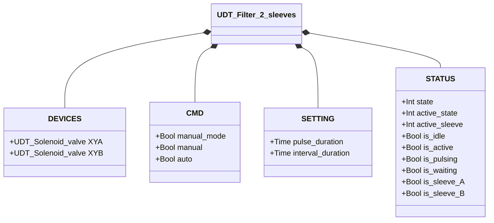
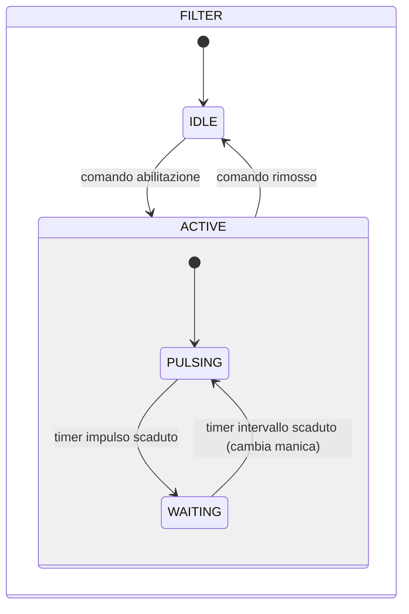

# Pulitore Filtro — 2 Maniche

## Panoramica

**Tier 3 — composito.** Il pulitore filtro a 2 maniche genera impulsi alternati di aria compressa tramite due Elettrovalvole (Tier 1, `XYA`/`XYB`) per pulire un filtro a doppia manica. Le maniche vengono pulsate in sequenza — mai simultaneamente — per minimizzare il calo di pressione nell'accumulatore e garantire una pulizia efficace di ciascuna manica. Non è presente alcun feedback di posizione — il sistema è ad anello aperto.

---

## Composizione

| Tag | Tipo | Ruolo |
|-----|------|-------|
| `XYA` | Elettrovalvola (Tier 1) | Impulso manica A |
| `XYB` | Elettrovalvola (Tier 1) | Impulso manica B |

---

## Segnali di controllo

| Segnale | Tipo | Descrizione |
|---------|------|-------------|
| `DEVICES.XYA` | UDT_Solenoid_valve | OUTPUT — Elettrovalvola impulso manica A |
| `DEVICES.XYB` | UDT_Solenoid_valve | OUTPUT — Elettrovalvola impulso manica B |
| `CMD.manual_mode` | Bool | TRUE = modalità manuale |
| `CMD.manual` | Bool | Abilitazione in modalità manuale |
| `CMD.auto` | Bool | Abilitazione in modalità automatica (ReadOnly external) |

---

## Funzionamento

Quando abilitato, il sistema alterna tra le maniche A e B in un ciclo continuo:

1. **PULSING manica A** — `XYA` eccitato per `pulse_duration`
2. **WAITING** — entrambe le elettrovalvole spente per `interval_duration`
3. **PULSING manica B** — `XYB` eccitato per `pulse_duration`
4. **WAITING** — entrambe le elettrovalvole spente per `interval_duration`
5. Ripetere dal passo 1

La manica attiva è tracciata da `STATUS.active_sleeve` (0 = A, 1 = B). La rimozione del comando di abilitazione in qualsiasi momento riporta il sistema in **IDLE**.

In **modalità manuale** (`manual_mode = TRUE`), l'operatore abilita la pulizia tramite `manual`. In **modalità automatica**, il comando arriva dal processo tramite `auto`.

---

## Allarmi

Questo modulo non genera allarmi propri — nessun sensore di feedback disponibile su cui basare una rilevazione di guasto.

---

## Parametri

| Parametro | Default | Descrizione |
|-----------|---------|-------------|
| `pulse_duration` | T#500ms | Durata di ogni impulso d'aria per manica |
| `interval_duration` | T#3s | Tempo di attesa tra gli impulsi |

---

## Struttura dati

---

## Macchina a stati (FSM)

### Tabella stati e uscite

| Stato | `active_sleeve` | `XYA` | `XYB` | Descrizione |
|-------|----------------|-------|-------|-------------|
| IDLE | — | FALSE | FALSE | Standby, nessuna pulizia |
| ACTIVE / PULSING | 0 (A) | TRUE | FALSE | Impulso d'aria nella manica A |
| ACTIVE / PULSING | 1 (B) | FALSE | TRUE | Impulso d'aria nella manica B |
| ACTIVE / WAITING | qualsiasi | FALSE | FALSE | Intervallo tra impulsi |

### Tabella transizioni di stato

| Stato attuale | Condizione | Stato successivo | Azione |
|---------------|------------|-----------------|--------|
| IDLE | Comando abilitazione | ACTIVE/PULSING | Inizia con manica A; `XYA` → TRUE; avvia timer impulso |
| ACTIVE/PULSING | Timer impulso scaduto | ACTIVE/WAITING | `XYA`/`XYB` → FALSE; avvia timer intervallo |
| ACTIVE/WAITING | Timer intervallo scaduto | ACTIVE/PULSING | Alterna manica (A→B o B→A); eccita l'elettrovalvola successiva; avvia timer impulso |
| ACTIVE (qualsiasi) | Comando rimosso | IDLE | `XYA` → FALSE, `XYB` → FALSE |
