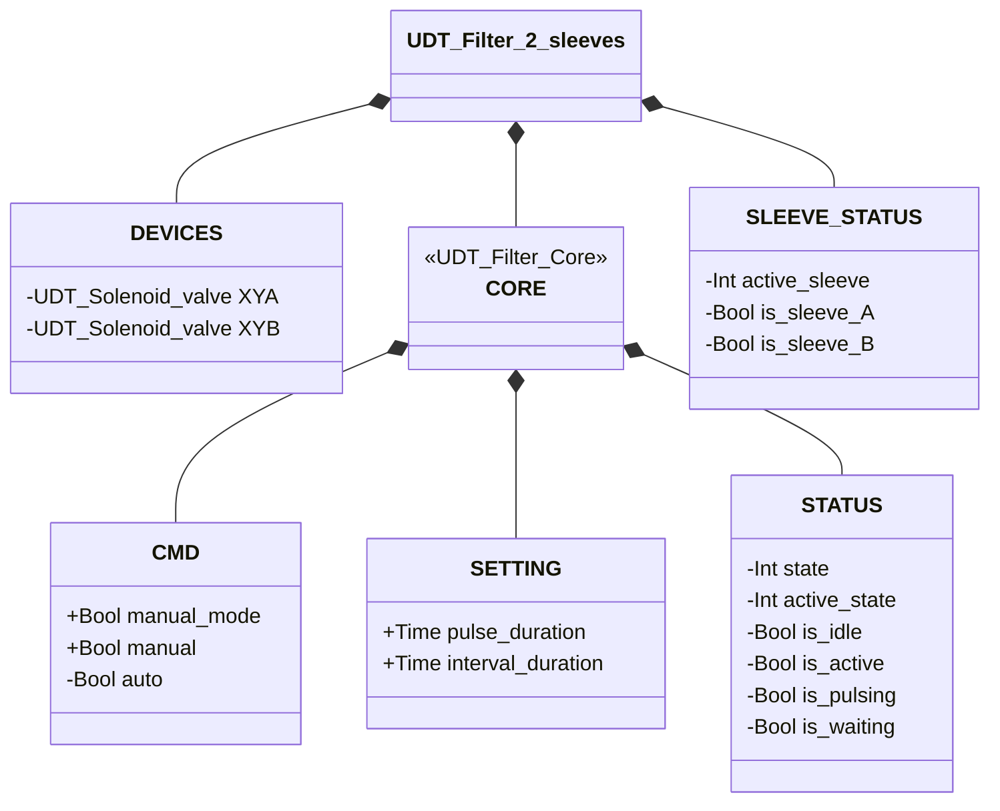
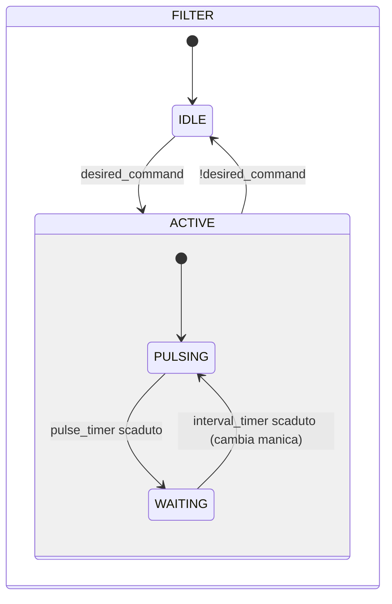

# Pulitore Filtro — 2 Maniche

## Panoramica

**Livello 2.** Il pulitore filtro a 2 maniche genera impulsi alternati di aria compressa tramite due Elettrovalvole (Livello 1, `XYA`/`XYB`) per pulire un filtro a doppia manica. Le maniche vengono pulsate in sequenza — mai simultaneamente — per minimizzare il calo di pressione nell'accumulatore e garantire una pulizia efficace di ciascuna manica. Non è presente alcuna retroazione di posizione — il sistema è ad anello aperto.

Nessun allarme proprio — nessun sensore di retroazione disponibile su cui basare una rilevazione di guasto.

---

## Interfaccia

### Composizione

| Tag | Tipo | Ruolo |
|-----|------|-------|
| `XYA` | Elettrovalvola (Livello 1) | Impulso manica A |
| `XYB` | Elettrovalvola (Livello 1) | Impulso manica B |

### Struttura dati



`+` = scrivibile da DCS/HMI, `-` = sola lettura. `CORE` è il contratto condiviso da entrambe
le varianti filtro — vedi [Filtri — Panoramica](../index.md#core); `SLEEVE_STATUS` resta
fuori da `CORE` perché è specifico della variante a 2 maniche.

### Segnali di controllo

| Segnale | Tipo | Direzione | Descrizione |
|---------|------|-----------|-------------|
| `DEVICES.XYA` | UDT_Solenoid_valve | OUT | Elettrovalvola impulso manica A — comandata, il proprio stato non viene riletto da questo blocco |
| `DEVICES.XYB` | UDT_Solenoid_valve | OUT | Elettrovalvola impulso manica B — comandata, il proprio stato non viene riletto da questo blocco |
| `CORE.CMD.manual_mode` | Bool | IN | TRUE = modalità manuale |
| `CORE.CMD.manual` | Bool | IN | Abilitazione in modalità manuale |
| `CORE.CMD.auto` | Bool | IN | Abilitazione in modalità automatica |

### Parametri

| Parametro | Default | Descrizione |
|-----------|---------|-------------|
| `CORE.SETTING.pulse_duration` | T#500ms | Durata di ogni impulso d'aria per manica |
| `CORE.SETTING.interval_duration` | T#3s | Tempo di attesa tra gli impulsi |

---

## Comportamento

### Funzionamento

Quando abilitato, il sistema alterna tra le maniche A e B in un ciclo continuo:

1. **PULSING manica A** — `XYA` eccitato per `pulse_duration`
2. **WAITING** — entrambe le elettrovalvole spente per `interval_duration`
3. **PULSING manica B** — `XYB` eccitato per `pulse_duration`
4. **WAITING** — entrambe le elettrovalvole spente per `interval_duration`
5. Ripetere dal passo 1

La manica attiva è tracciata da `SLEEVE_STATUS.is_sleeve_A`/`is_sleeve_B`. La rimozione del comando di abilitazione in qualsiasi momento riporta il sistema in **IDLE**.

In **modalità manuale** (`manual_mode = TRUE`), l'operatore abilita la pulizia tramite `manual`. In **modalità automatica**, il comando arriva dal processo tramite `auto`.

### Diagramma di stato



```Pascal
desired_command := (CORE.CMD.manual_mode AND CORE.CMD.manual) OR (NOT CORE.CMD.manual_mode AND CORE.CMD.auto);
```

| Stato | `XYA` | `XYB` | Descrizione |
|-------|-------|-------|-------------|
| IDLE | FALSE | FALSE | Standby, nessuna pulizia |
| ACTIVE / PULSING (manica A) | TRUE | FALSE | Impulso d'aria nella manica A |
| ACTIVE / PULSING (manica B) | FALSE | TRUE | Impulso d'aria nella manica B |
| ACTIVE / WAITING | FALSE | FALSE | Intervallo tra impulsi |

| Stato | Valore Int |
|---|---|
| IDLE | 1 |
| ACTIVE | 2 |
| ACTIVE.PULSING | 1 |
| ACTIVE.WAITING | 2 |

### Timer

| Timer | Stato in cui è attivo | Soglia (parametro) |
|-------|------------------------|---------------------|
| `pulse_timer` | ACTIVE/PULSING | `CORE.SETTING.pulse_duration` |
| `interval_timer` | ACTIVE/WAITING | `CORE.SETTING.interval_duration` |
