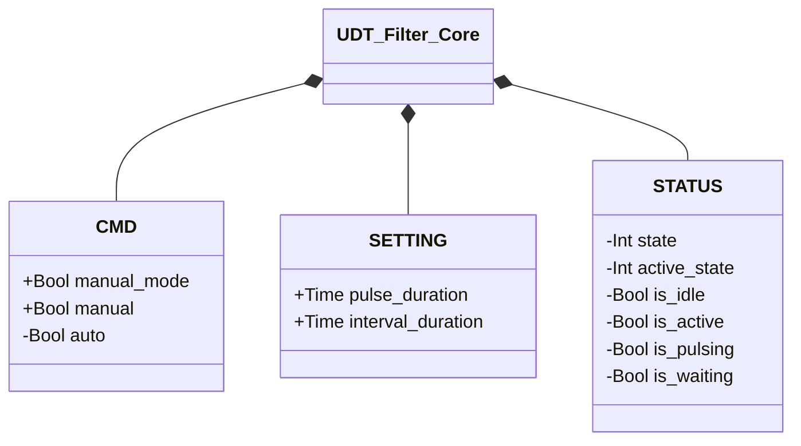

# Filtri

Sistemi di pulizia a impulsi d'aria compressa per maniche filtranti.

Il meccanismo di pulizia (alternanza attesa/impulso, temporizzata da `interval_duration`/`pulse_duration`) è identico a prescindere dal numero di maniche: le due varianti condividono la stessa macchina a stati di base, con l'unica aggiunta — nella versione a più maniche — di un contatore di rotazione (`active_sleeve`, avanzato con un modulo pari al numero di maniche) per alternare quale elettrovalvola viene pulsata. Il principio si estende naturalmente a un numero maggiore di maniche.

## Core

`UDT_Filter_Core` raccoglie il contratto `CMD`/`STATUS`/`SETTING` comune a entrambe le
varianti, incorporato come campo `CORE` in `UDT_Filter_1_sleeve` e `UDT_Filter_2_sleeves` —
identico tra le due. Solo l'alternanza a più maniche (`active_sleeve`, `is_sleeve_A`,
`is_sleeve_B`) resta fuori da `CORE`, in uno struct fratello dedicato, `SLEEVE_STATUS`.

`+` = scrivibile da DCS/HMI, `-` = sola lettura. Un campo `CORE` tipizzato genericamente
permette al [Propulsore](../transporters/transporter/index.md) di prendere un parametro `FI`
senza sapere in anticipo se è un filtro a 1 o 2 maniche: il composition root decide quale FB
concreto lo riempie — stesso meccanismo di iniezione delle dipendenze usato per le valvole,
vedi [Valvole — Panoramica](../valves/index.md#core).

| Modulo | Descrizione |
|--------|-------------|
| [Pulitore Filtro — 1 Manica](1-sleeve/index.md) | Ciclo a impulso periodico con una singola elettrovalvola |
| [Pulitore Filtro — 2 Maniche](2-sleeves/index.md) | Sequenza di impulsi alternati su due maniche |
