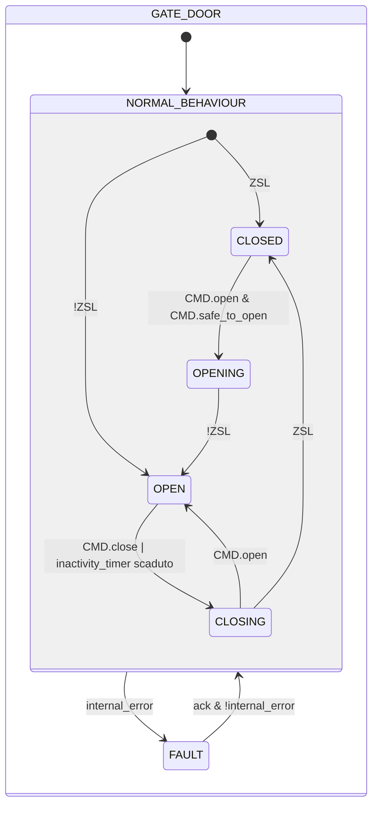
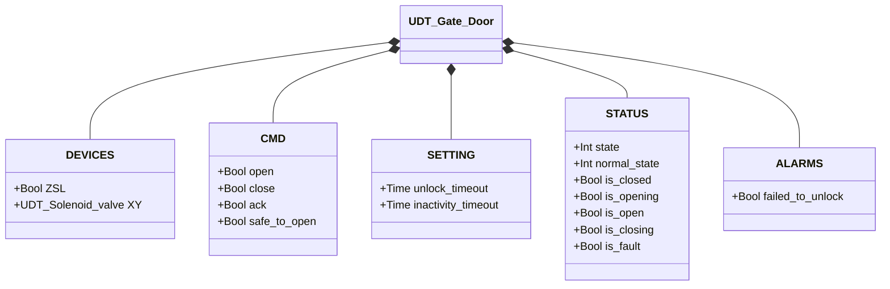

# Portello con Blocco Elettrico

## Panoramica

**Tier 2.** Diverso dagli altri dispositivi della libreria: il PLC non movimenta mai il portello. L'apertura fisica è compiuta dall'operatore a mano; il PLC può solo concedere o negare il permesso, comandando lo sblocco dell'elettrovalvola di ritenuta (`XY`). La chiusura è analoga — il PLC comanda l'elettrovalvola a ribloccare, ma il completamento dipende interamente dall'operatore che richiude fisicamente il portello, senza alcun limite di tempo imposto dalla logica.

**Vincolo di sicurezza:** la funzione di sicurezza vera e propria (impedire lo sblocco quando non è sicuro aprire) deve essere realizzata via cablaggio elettrico (es. un relè di sicurezza o un contatto cablato in serie all'alimentazione dell'elettrovalvola), non affidata alla sola logica PLC. `CMD.safe_to_open` in questo blocco è un permesso a livello di coordinamento/HMI, non la barriera di sicurezza — quest'ultima deve funzionare indipendentemente da qualsiasi bug o blocco del programma.

---

## Composizione

| Tag | Tipo | Ruolo |
|-----|------|-------|
| `XY` | Elettrovalvola (Tier 1) | Elettrovalvola di ritenuta — logica energizzato-per-sbloccare |

---

## Segnali di controllo

| Segnale | Tipo | Descrizione |
|---------|------|-------------|
| `DEVICES.ZSL` | Bool | INPUT — Portello fisicamente chiuso **e** elettrovalvola attivamente inserita (segnale combinato: il PLC non distingue "chiuso ma sbloccato" da "aperto") |
| `DEVICES.XY` | UDT_Solenoid_valve | OUTPUT — Elettrovalvola di ritenuta (energizzato = sbloccato) |
| `CMD.open` | Bool | Richiesta operatore di sblocco/apertura |
| `CMD.close` | Bool | Richiesta operatore di ri-blocco anticipato, prima della scadenza del timer di inattività |
| `CMD.safe_to_open` | Bool | Permesso a livello di coordinamento (ReadOnly external) — condizione necessaria ma non sufficiente, vedere vincolo di sicurezza sopra |
| `CMD.ack` | Bool | Conferma allarmi e ripristino da FAULT |

---

## Parametri di regolazione

| Parametro | Default | Descrizione |
|-----------|---------|-------------|
| `SETTING.unlock_timeout` | T#5s | Tempo massimo consentito per la conferma di sblocco |
| `SETTING.inactivity_timeout` | T#3M | Tempo massimo di apertura prima della richiusura automatica |

---

## Stati e output

| Stato | `XY` | Descrizione |
|-------|------|-------------|
| CLOSED | FALSE | Portello chiuso e bloccato, confermato da `ZSL` |
| OPENING | TRUE | Sblocco comandato, non ancora confermato |
| OPEN | TRUE | Sblocco confermato — la posizione fisica oltre questo punto è nota solo all'operatore |
| CLOSING | FALSE | Ri-blocco comandato, in attesa che l'operatore richiuda fisicamente — nessuna scadenza, è attesa normale |
| FAULT | TRUE | Guasto — sblocca deliberatamente (vedere sotto) |

---

## Diagramma di stato



```Pascal
internal_error := failed_to_unlock;
```

`CMD.open` durante `CLOSING` riporta direttamente a `OPEN`, senza ripassare da `OPENING` né rivalutare `CMD.safe_to_open` — il portello non è mai stato effettivamente ribloccato (`ZSL` non è mai tornato TRUE), quindi non si sta concedendo un nuovo permesso, solo annullando una richiusura non ancora completata.

Al rientro da `FAULT`, il guard d'ingresso rivaluta lo stesso sensore `ZSL` — stesso meccanismo del primo scan. Con un solo segnale combinato, il rientro può distinguere solo `CLOSED` da `OPEN`, mai una condizione intermedia.

In `FAULT`, `XY` viene deliberatamente energizzato (sbloccato): un guasto del PLC non deve mai intrappolare un operatore dietro una porta bloccata. La barriera di sicurezza reale è l'interblocco elettrico a monte di `XY`, non questo blocco funzionale.

---

## Allarmi

| ID | Classe | Titolo | Condizione |
|----|--------|--------|------------|
| `GD-E01` | E | Mancato sblocco | `CMD.open` accolto (stato `OPENING`), `ZSL` non rilasciato entro `unlock_timeout` |

Nessun allarme di timeout sul ri-blocco (`CLOSING`): l'attesa indefinita è comportamento normale, non un guasto, poiché il completamento dipende dall'azione fisica dell'operatore e non dal PLC.

---

## Struttura dati



`internal_error` è interno al blocco funzionale, non esposto tramite l'UDT.
