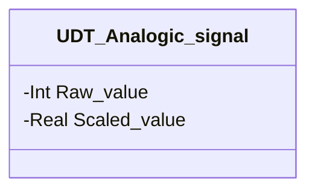

# Segnali Analogici

## Panoramica

**FC, senza stato.** `Scale_input` è l'utility di libreria che converte una lettura analogica grezza (conteggio intero del modulo di ingresso) in un valore scalato in unità ingegneristiche, scrivendolo in `UDT_Analogic_signal.Scaled_value`. Non è un dispositivo — non ha `CMD`, non ha `STATUS`, non appartiene a nessuna categoria di campo specifica: è condivisa da qualunque modulo che legga un trasmettitore analogico, oggi [Pipeline Analogica](../pipeline/analogic/index.md) e [Propulsore Ingresso Sigillato](../transporters/sealed-inlet/index.md) (`PT01`/`PT02`).

Nessuna istanza FB di questa libreria chiama `Scale_input` al proprio interno: viene invocata a monte, una volta per canale analogico, dal programma chiamante — il modulo consumatore riceve già l'istanza `UDT_Analogic_signal` con `Scaled_value` popolato e si limita a leggerlo.

---

## Interfaccia

### Struttura dati



`-` = sola lettura dal punto di vista di un modulo consumatore — `Scale_input` è l'unico scrittore autorizzato di `Scaled_value`; `Raw_value` è scritto dal driver del modulo di ingresso, a monte.

### Segnali di controllo

| Segnale | Tipo | Direzione | Descrizione |
|---------|------|-----------|-------------|
| `analogic_signal.Raw_value` | Int | IN | Conteggio grezzo dal modulo di ingresso analogico |
| `Min_value` | Real | IN | Valore ingegneristico corrispondente al conteggio grezzo minimo (0) |
| `Max_value` | Real | IN | Valore ingegneristico corrispondente al conteggio grezzo massimo (27648) |
| `analogic_signal.Scaled_value` | Real | OUT | Valore scalato risultante, in unità ingegneristiche |

### Parametri

`Min_value`/`Max_value` non sono campi `SETTING` su un'istanza persistente — sono parametri `VAR_INPUT` passati ad ogni chiamata, configurati per canale al punto di chiamata (a monte di questa libreria), non tramite HMI/DCS.

---

## Comportamento

### Funzionamento

```Pascal
normalized_value := INT_TO_REAL(Raw_value) / 27648.0;
Scaled_value := normalized_value * (Max_value - Min_value) + Min_value;
```

`27648` è il fondo scala intero normalizzato standard Siemens S7-1500 per un canale di ingresso analogico (0–20mA/4–20mA/0–10V) — non una costante specifica di questa libreria. La conversione è in due passi: normalizzazione a una frazione 0–1 del fondo scala, poi riscalatura lineare sull'intervallo `Min_value`–`Max_value` configurato per quel canale.
