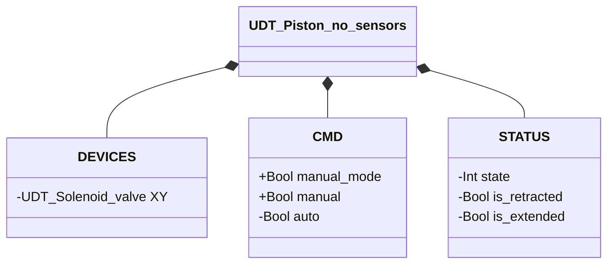
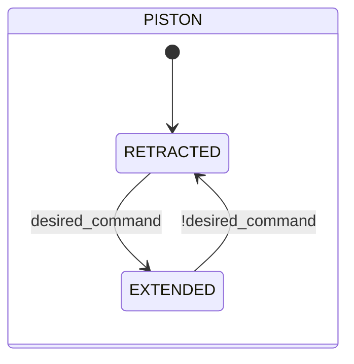

# Pistone — Senza Sensori

## Panoramica

**Livello 2.** Il pistone senza sensori è un attuatore lineare pneumatico che incorpora una singola Elettrovalvola (Livello 1, `XY`) come proprio attuatore. Non ha retroazione di posizione propria — la transizione tra retratto ed esteso segue il comando senza attesa, esattamente come l'Elettrovalvola sottostante.

Nessun parametro configurabile. Nessun allarme proprio — `UDT_Piston_no_sensors` non include una struttura `ALARMS`: non c'è sensore su cui basare una rilevazione di guasto.

---

## Interfaccia

### Composizione

| Tag | Tipo | Ruolo |
|-----|------|-------|
| `XY` | Elettrovalvola (Livello 1) | Comanda l'estensione/retrazione del pistone |

### Struttura dati

`+` = scrivibile da DCS/HMI, `-` = sola lettura.

### Segnali di controllo

| Segnale | Tipo | Direzione | Descrizione |
|---------|------|-----------|-------------|
| `DEVICES.XY` | UDT_Solenoid_valve | OUT | Elettrovalvola di comando — comandata, il proprio stato non viene riletto da questo blocco |
| `CMD.manual_mode` | Bool | IN | TRUE = comando in modalità manuale |
| `CMD.manual` | Bool | IN | Comando di estensione in modalità manuale |
| `CMD.auto` | Bool | IN | Comando di estensione in modalità automatica |

---

## Comportamento

### Funzionamento

Il comando desiderato si risolve ad ogni scan (`manual_mode ? manual : auto`) e viene inoltrato direttamente all'elettrovalvola incorporata (`XY.CMD.auto`) — non c'è alcuna conferma fisica da attendere, quindi la transizione di stato segue il comando senza ritardo, stesso meccanismo dell'Elettrovalvola stessa.

### Diagramma di stato

| Stato | `XY` | Descrizione |
|-------|------|-------------|
| RETRACTED | FALSE | Pistone retratto, elettrovalvola incorporata diseccitata |
| EXTENDED | TRUE | Pistone esteso, elettrovalvola incorporata eccitata |

| Stato | Valore Int |
|---|---|
| RETRACTED | 1 |
| EXTENDED | 2 |
