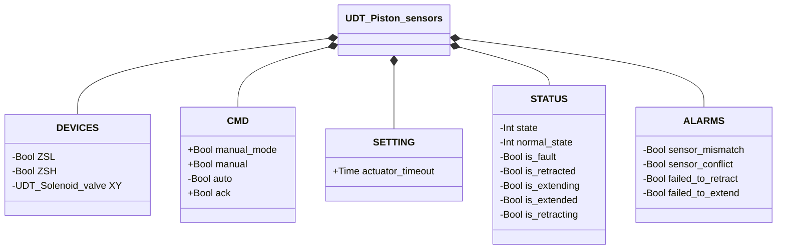
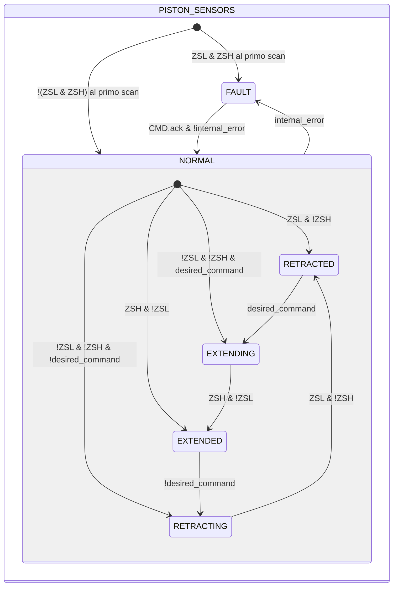

# Pistone — Con Sensori

## Panoramica

**Livello 2.** Il pistone con sensori aggiunge retroazione di posizione tramite due finecorsa (`ZSL` retratto, `ZSH` esteso) alla stessa Elettrovalvola incorporata (Livello 1, `XY`) del pistone senza sensori. A differenza della variante base, ogni transizione EXTENDING/RETRACTING richiede conferma del finecorsa corrispondente, non solo il comando; un timeout di movimento (`SETTING.actuator_timeout`) e un livello FAULT con quattro allarmi completano il modello.

---

## Interfaccia

### Composizione

| Tag | Tipo | Ruolo |
|-----|------|-------|
| `XY` | Elettrovalvola (Livello 1) | Comanda l'estensione/retrazione del pistone |

### Struttura dati



`+` = scrivibile da DCS/HMI, `-` = sola lettura.

### Segnali di controllo

| Segnale | Tipo | Direzione | Descrizione |
|---------|------|-----------|-------------|
| `DEVICES.ZSL` | Bool | IN | Finecorsa posizione retratta |
| `DEVICES.ZSH` | Bool | IN | Finecorsa posizione estesa |
| `DEVICES.XY` | UDT_Solenoid_valve | OUT | Elettrovalvola di comando — comandata, il proprio stato non viene riletto da questo blocco |
| `CMD.manual_mode` | Bool | IN | TRUE = comando in modalità manuale |
| `CMD.manual` | Bool | IN | Comando di estensione in modalità manuale |
| `CMD.auto` | Bool | IN | Comando di estensione in modalità automatica |
| `CMD.ack` | Bool | IN | Conferma allarmi e ripristino da FAULT |

### Parametri

| Parametro | Default | Descrizione |
|-----------|---------|-------------|
| `SETTING.actuator_timeout` | T#2s | Tempo massimo consentito per completare estensione o retrazione |

---

## Comportamento

### Funzionamento

Al primo scan (e al rientro da FAULT), lo stato interno viene seminato dalla lettura corrente dei finecorsa invece di assumere ciecamente RETRACTED: `ZSL` e `!ZSH` → RETRACTED, `ZSH` e `!ZSL` → EXTENDED; se nessuno dei due è attivo, lo stato riparte da EXTENDING o RETRACTING in base al comando corrente. Entrambi i finecorsa TRUE contemporaneamente è trattato come guasto immediato (conflitto sensori), non come una quinta posizione valida.

A differenza della variante senza sensori, la transizione da EXTENDING a EXTENDED (o da RETRACTING a RETRACTED) richiede la conferma del finecorsa corrispondente, non il solo trascorrere del comando — `movement_timer` copre il caso in cui quella conferma non arrivi mai.

### Allarmi

- [`AL-E01`](../index.md#allarmi-degli-attuatori-lineari) — lo stato stabile corrente (RETRACTED/EXTENDED) non è confermato dal finecorsa atteso
- [`AL-E02`](../index.md#allarmi-degli-attuatori-lineari) — `ZSL AND ZSH` contemporaneamente TRUE
- [`AL-E03`](../index.md#allarmi-degli-attuatori-lineari) — movimento di retrazione non confermato entro `actuator_timeout`
- [`AL-E04`](../index.md#allarmi-degli-attuatori-lineari) — movimento di estensione non confermato entro `actuator_timeout`

Tutti e quattro concorrono a `internal_error`, variabile interna al blocco che determina la transizione a `FAULT`.

### Diagramma di stato



```Pascal
internal_error := ALARMS.sensor_mismatch OR ALARMS.sensor_conflict OR ALARMS.failed_to_retract OR ALARMS.failed_to_extend;
```

| Stato | `XY` | Descrizione |
|-------|------|-------------|
| NORMAL.RETRACTED | FALSE | Pistone completamente retratto, confermato da `ZSL` |
| NORMAL.EXTENDING | TRUE | Attuatore spinge il pistone verso l'estensione |
| NORMAL.EXTENDED | TRUE | Pistone completamente esteso, confermato da `ZSH` |
| NORMAL.RETRACTING | FALSE | Elettrovalvola diseccitata, il pistone ritorna retratto |
| FAULT | FALSE | Guasto; in attesa di conferma con sensori validi |

| Stato | Valore Int |
|---|---|
| NORMAL | 1 |
| NORMAL.RETRACTED | 1 |
| NORMAL.EXTENDING | 2 |
| NORMAL.EXTENDED | 3 |
| NORMAL.RETRACTING | 4 |
| FAULT | 0 |

### Timer

| Timer | Stato in cui è attivo | Soglia (parametro) |
|-------|------------------------|---------------------|
| `movement_timer` | `EXTENDING` o `RETRACTING` (in `NORMAL`) | `SETTING.actuator_timeout` |
