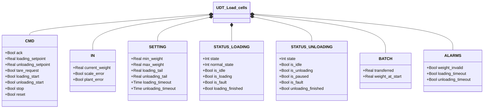
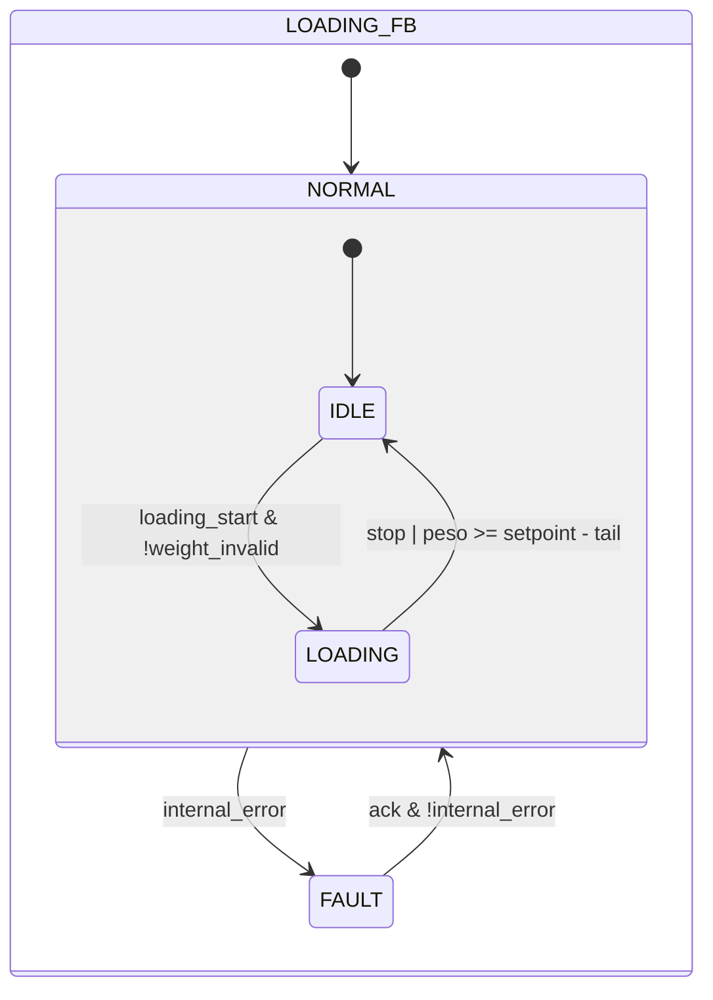
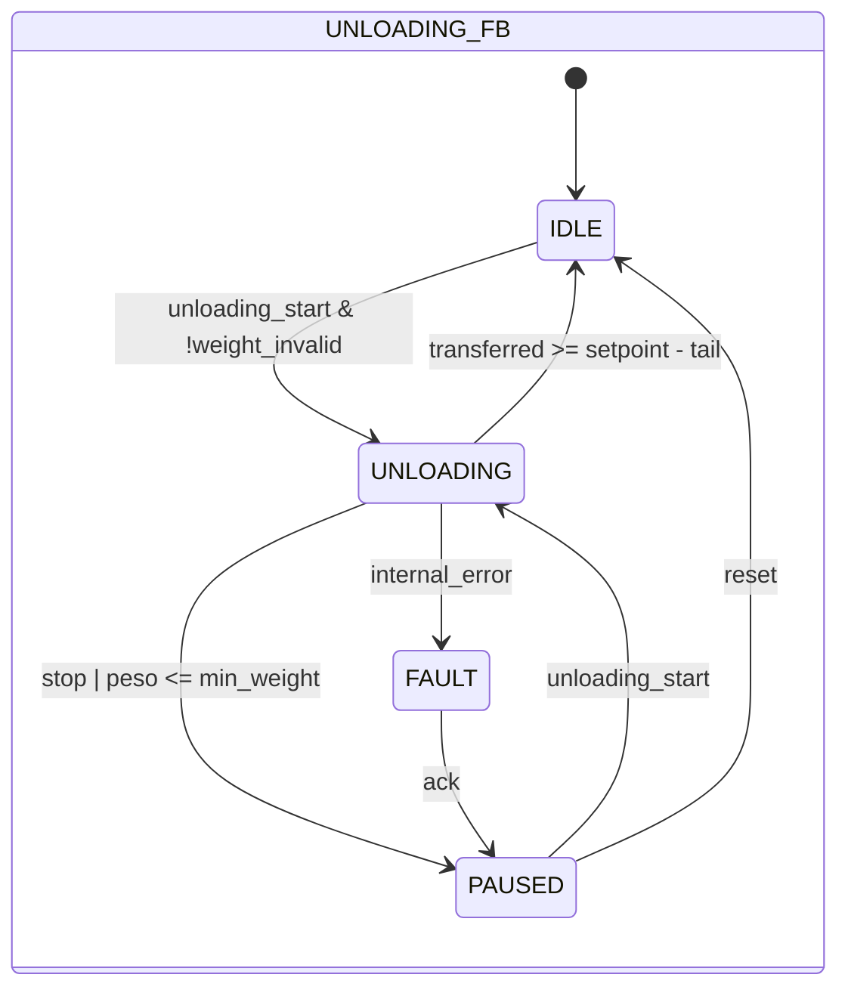

# Ciclo di Carico e Scarico

## Panoramica

**Livello 1.** Non incorpora sotto-istanze — a differenza degli altri moduli Livello 1 di questa libreria (l'Elettrovalvola, atomica), `UDT_Load_cells` è la struttura dati condivisa tra due blocchi funzionali indipendenti — `Loading` e `Unloading` — ciascuno con la propria macchina a stati, memorizzata rispettivamente in `STATUS.LOADING` e `STATUS.UNLOADING` della stessa istanza UDT. `Loading` gestisce il riempimento di un contenitore a peso; `Unloading` gestisce lo svuotamento con possibilità di pausa e ripresa.

Il campo `IN` di questa struttura (`current_weight`, `scale_error`, `plant_error`) è la superficie generica su cui scrive qualsiasi interfaccia trasmettitore collegata — vedere [Celle di Carico](../index.md) per come funziona il disaccoppiamento tra questo blocco e il trasmettitore fisico effettivo.

---

## Blocchi funzionali

| Blocco | Tipo | Ruolo |
|--------|------|-------|
| `Loading` | FB | Gestisce il riempimento a peso fino al setpoint, con rilevamento timeout |
| `Unloading` | FB | Gestisce lo svuotamento con supporto pausa/ripresa |

---

## Segnali I/O

### Comandi (`CMD`)

| Segnale | Tipo | Descrizione |
|---------|------|-------------|
| `CMD.ack` | Bool | Conferma per stato FAULT (Loading o Unloading) |
| `CMD.loading_setpoint` | Real | Peso target di carico [kg] |
| `CMD.unloading_setpoint` | Real | Peso da scaricare nel ciclo [kg] |
| `CMD.tare_request` | Bool | Richiesta tara, letta dall'interfaccia trasmettitore collegata |
| `CMD.loading_start` | Bool | Avvio ciclo di carico |
| `CMD.unloading_start` | Bool | Avvio o ripresa ciclo di scarico |
| `CMD.stop` | Bool | Arresto del ciclo attivo |
| `CMD.reset` | Bool | Ritorno a IDLE da PAUSED (solo Unloading) |

### Ingressi (`IN` — scritti dall'interfaccia trasmettitore)

| Segnale | Tipo | Descrizione |
|---------|------|-------------|
| `IN.current_weight` | Real | Peso corrente [kg] |
| `IN.scale_error` | Bool | Guasto hardware trasmettitore |
| `IN.plant_error` | Bool | Errore di impianto esterno (es. perdita materiale) |

### Stato Loading (`STATUS.LOADING`)

`Loading` è una macchina a stati a due livelli: `state` (livello superiore, FAULT/NORMAL) e `normal_state` (livello operativo, valido solo quando `state = NORMAL`).

| Segnale | Tipo | Descrizione |
|---------|------|-------------|
| `STATUS.LOADING.state` | Int | 0=FAULT, 1=NORMAL |
| `STATUS.LOADING.normal_state` | Int | 1=IDLE, 2=LOADING (valido solo in NORMAL) |
| `STATUS.LOADING.is_idle` | Bool | TRUE in NORMAL/IDLE |
| `STATUS.LOADING.is_loading` | Bool | TRUE in NORMAL/LOADING |
| `STATUS.LOADING.is_fault` | Bool | TRUE in FAULT |
| `STATUS.LOADING.loading_finished` | Bool | Impulso 1-scan all'ingresso in IDLE dopo un carico completato |

### Stato Unloading (`STATUS.UNLOADING`)

A differenza di Loading, `Unloading` usa un singolo campo `state` a quattro valori — non ha un livello FAULT/NORMAL separato dal sotto-stato operativo.

| Segnale | Tipo | Descrizione |
|---------|------|-------------|
| `STATUS.UNLOADING.state` | Int | 0=FAULT, 1=IDLE, 2=UNLOADING, 3=PAUSED |
| `STATUS.UNLOADING.is_idle` | Bool | TRUE in IDLE |
| `STATUS.UNLOADING.is_unloading` | Bool | TRUE durante il convogliamento (UNLOADING) |
| `STATUS.UNLOADING.is_paused` | Bool | TRUE in PAUSED |
| `STATUS.UNLOADING.is_fault` | Bool | TRUE in FAULT |
| `STATUS.UNLOADING.unloading_finished` | Bool | Impulso 1-scan all'ingresso in IDLE dopo scarico completato |

### Batch (`BATCH`)

| Segnale | Tipo | Descrizione |
|---------|------|-------------|
| `BATCH.transferred` | Real | Quantità elaborata nel ciclo corrente [kg] |
| `BATCH.weight_at_start` | Real | Peso acquisito all'ingresso della fase attiva [kg] |

### Allarmi (`ALARMS`)

| Segnale | Tipo | Descrizione |
|---------|------|-------------|
| `ALARMS.weight_invalid` | Bool | Peso fuori scala: `current_weight < min_weight OR current_weight > max_weight` — stessa condizione per Loading e Unloading |
| `ALARMS.loading_timeout` | Bool | Rispecchia `internal_error` di Loading (timeout carico, guasto trasmettitore o errore di impianto) |
| `ALARMS.unloading_timeout` | Bool | Rispecchia `internal_error` di Unloading (timeout scarico, guasto trasmettitore o errore di impianto) |

---

## Funzionamento

### FB Loading

**NORMAL/IDLE** — Attende `CMD.loading_start` con peso valido (`NOT weight_invalid`). All'ingresso in IDLE: `BATCH.transferred := 0`, impulso `loading_finished`.

**NORMAL/LOADING** — Calcola ogni scan: `BATCH.transferred := current_weight − weight_at_start` (clampato a 0). Torna a IDLE quando `CMD.stop OR (current_weight ≥ loading_setpoint − loading_tail)`. `weight_at_start` viene acquisito all'ingresso in LOADING.

**FAULT** — Si entra da NORMAL quando `internal_error := loading_timer.Q OR IN.scale_error OR IN.plant_error`. `CMD.ack AND NOT internal_error` riporta a NORMAL, ripartendo da IDLE.

### FB Unloading

**IDLE** — Attende `CMD.unloading_start` con peso valido. All'ingresso in IDLE: `BATCH.transferred := 0`, impulso `unloading_finished`.

**UNLOADING** — Calcola ogni scan: `BATCH.transferred := weight_at_start − current_weight` (clampato a 0). Priorità delle uscite, in ordine: `internal_error` → FAULT; altrimenti `CMD.stop OR current_weight ≤ min_weight` → PAUSED; altrimenti `transferred ≥ unloading_setpoint − unloading_tail` → IDLE.

Alla ripresa (PAUSED → UNLOADING): `weight_at_start := current_weight + transferred` — l'ancora viene ricalcolata così il contatore `transferred` prosegue senza scatti.

**PAUSED** — `BATCH.transferred` congelato. `CMD.unloading_start` riprende (→ UNLOADING); `CMD.reset` torna a IDLE.

**FAULT** — `internal_error := unloading_timer.Q OR IN.scale_error OR IN.plant_error`. `CMD.ack` passa a PAUSED (non direttamente a IDLE).

---

## Allarmi

| ID | Condizione specifica |
|----|----------------------|
| [`LC-W01`](../index.md#allarmi-delle-celle-di-carico) | Peso fuori scala — verificare celle, cablaggio, trasmettitore |
| [`LC-E01`](../index.md#allarmi-delle-celle-di-carico) | Ciclo di carico durato oltre `loading_timeout`, o guasto trasmettitore/impianto durante LOADING |
| [`LC-E02`](../index.md#allarmi-delle-celle-di-carico) | Ciclo di scarico durato oltre `unloading_timeout`, o guasto trasmettitore/impianto durante UNLOADING |

---

## Parametri

| Parametro | Default | Descrizione |
|-----------|---------|-------------|
| `SETTING.min_weight` | 0.0 | Soglia inferiore peso valido [kg] (usata anche per la transizione UNLOADING → PAUSED) |
| `SETTING.max_weight` | 1000.0 | Soglia superiore peso valido [kg] |
| `SETTING.loading_tail` | — | Anticipazione fine carico rispetto al setpoint [kg] |
| `SETTING.unloading_tail` | — | Anticipazione fine scarico rispetto al setpoint [kg] |
| `SETTING.loading_timeout` | T#10M | Durata massima ciclo LOADING prima di FAULT |
| `SETTING.unloading_timeout` | T#10M | Durata massima ciclo UNLOADING prima di FAULT |

---

## Struttura dati

---

## Macchine a stati

### Loading

| Stato | Descrizione |
|-------|-------------|
| FAULT | `internal_error` attivo; attende `ack` |
| NORMAL/IDLE | In attesa; `transferred=0` all'ingresso |
| NORMAL/LOADING | Carico attivo; `transferred` aggiornato ogni scan |

### Unloading

| Stato | Descrizione |
|-------|-------------|
| FAULT | `internal_error` attivo; `ack` → PAUSED (non IDLE) |
| IDLE | In attesa; `transferred=0` all'ingresso |
| UNLOADING | Scarico attivo; `transferred` aggiornato ogni scan |
| PAUSED | Batch sospeso; `transferred` congelato |
