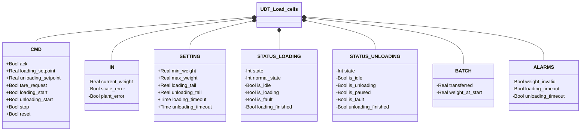
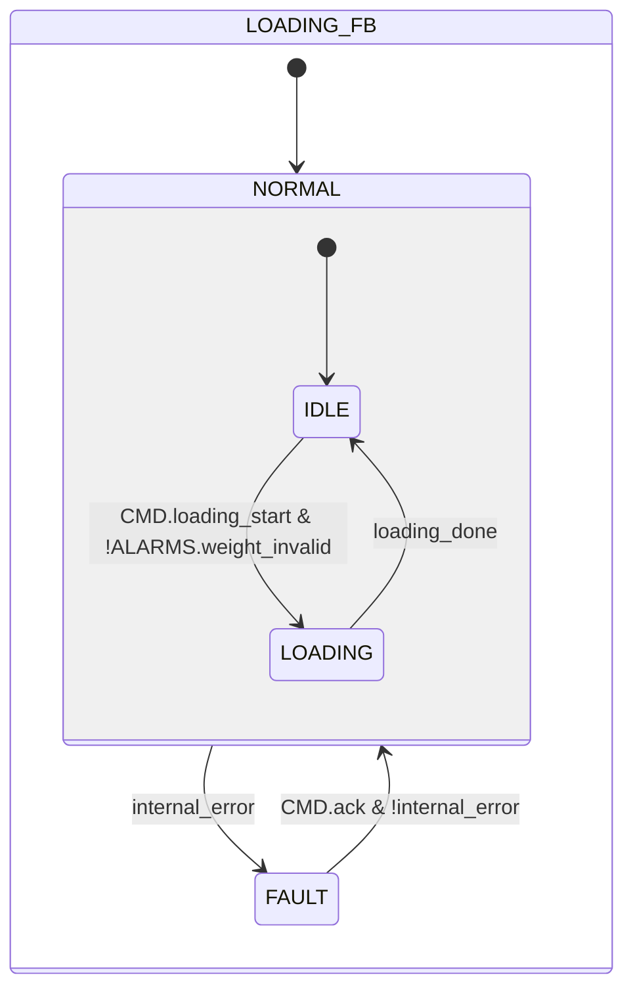
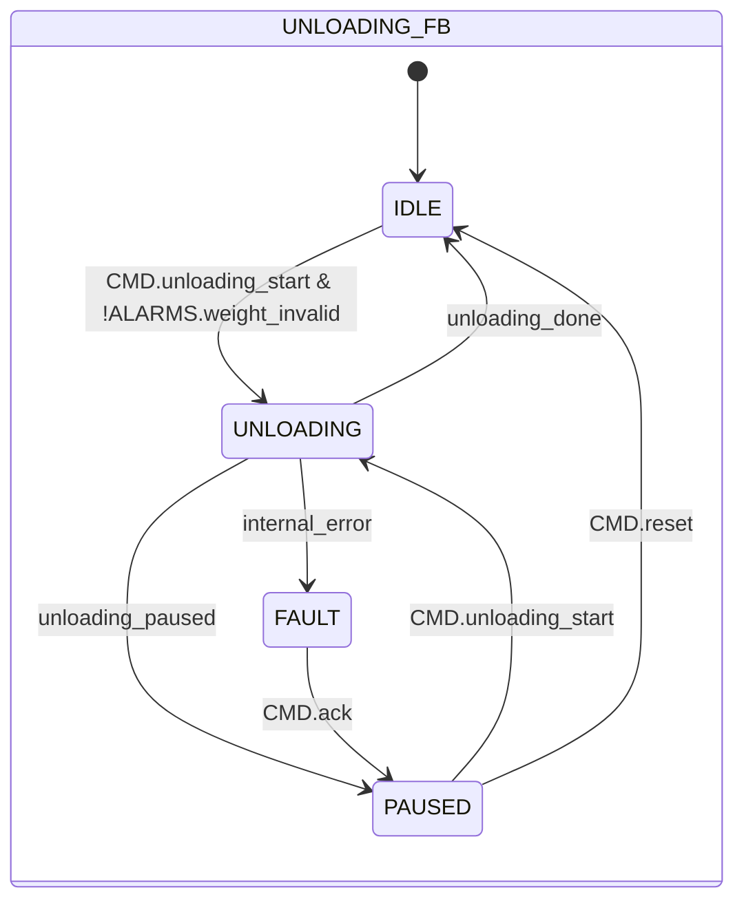

# Ciclo di Carico e Scarico

## Panoramica

**Livello 1.** Non incorpora sotto-istanze — a differenza degli altri moduli Livello 1 di questa libreria (l'Elettrovalvola, atomica), `UDT_Load_cells` è la struttura dati condivisa tra due blocchi funzionali indipendenti — `Loading` e `Unloading` — ciascuno con la propria macchina a stati, memorizzata rispettivamente in `STATUS.LOADING` e `STATUS.UNLOADING` della stessa istanza UDT. `Loading` gestisce il riempimento di un contenitore a peso; `Unloading` gestisce lo svuotamento con possibilità di pausa e ripresa.

Il campo `IN` di questa struttura (`current_weight`, `scale_error`, `plant_error`) è la superficie generica su cui scrive qualsiasi interfaccia trasmettitore collegata — vedere [Celle di Carico](../index.md) per come funziona il disaccoppiamento tra questo blocco e il trasmettitore fisico effettivo.

---

## Interfaccia

### Struttura dati



`+` = scrivibile da DCS/HMI, `-` = sola lettura. `IN` è scritto dall'interfaccia trasmettitore collegata (es. [Interfaccia Pavone DAT 1400](../pavone-dat-1400/index.md)), non da DCS/HMI direttamente.

### Segnali di controllo

| Segnale | Tipo | Direzione | Descrizione |
|---------|------|-----------|-------------|
| `CMD.ack` | Bool | IN | Conferma per stato FAULT (Loading o Unloading) |
| `CMD.loading_setpoint` | Real | IN | Peso di riferimento per il carico [kg] |
| `CMD.unloading_setpoint` | Real | IN | Peso da scaricare nel ciclo [kg] |
| `CMD.tare_request` | Bool | IN | Richiesta tara, letta dall'interfaccia trasmettitore collegata |
| `CMD.loading_start` | Bool | IN | Avvio ciclo di carico |
| `CMD.unloading_start` | Bool | IN | Avvio o ripresa ciclo di scarico |
| `CMD.stop` | Bool | IN | Arresto del ciclo attivo |
| `CMD.reset` | Bool | IN | Ritorno a IDLE da PAUSED (solo Unloading) |
| `IN.current_weight` | Real | IN | Peso corrente [kg] |
| `IN.scale_error` | Bool | IN | Guasto hardware trasmettitore |
| `IN.plant_error` | Bool | IN | Errore di impianto esterno (es. perdita materiale) |
| `STATUS.LOADING.state` | Int | OUT | 0=FAULT, 1=NORMAL |
| `STATUS.LOADING.normal_state` | Int | OUT | 1=IDLE, 2=LOADING (valido solo in NORMAL) |
| `STATUS.LOADING.is_idle` | Bool | OUT | TRUE in NORMAL/IDLE |
| `STATUS.LOADING.is_loading` | Bool | OUT | TRUE in NORMAL/LOADING |
| `STATUS.LOADING.is_fault` | Bool | OUT | TRUE in FAULT |
| `STATUS.LOADING.loading_finished` | Bool | OUT | Impulso 1-scan all'ingresso in IDLE dopo un carico completato |
| `STATUS.UNLOADING.state` | Int | OUT | 0=FAULT, 1=IDLE, 2=UNLOADING, 3=PAUSED |
| `STATUS.UNLOADING.is_idle` | Bool | OUT | TRUE in IDLE |
| `STATUS.UNLOADING.is_unloading` | Bool | OUT | TRUE durante il convogliamento (UNLOADING) |
| `STATUS.UNLOADING.is_paused` | Bool | OUT | TRUE in PAUSED |
| `STATUS.UNLOADING.is_fault` | Bool | OUT | TRUE in FAULT |
| `STATUS.UNLOADING.unloading_finished` | Bool | OUT | Impulso 1-scan all'ingresso in IDLE dopo scarico completato |
| `BATCH.transferred` | Real | OUT | Quantità elaborata nel ciclo corrente [kg] |
| `BATCH.weight_at_start` | Real | OUT | Peso acquisito all'ingresso della fase attiva [kg] |
| `ALARMS.weight_invalid` | Bool | OUT | Peso fuori scala: `current_weight < min_weight OR current_weight > max_weight` — stessa condizione per Loading e Unloading |
| `ALARMS.loading_timeout` | Bool | OUT | Rispecchia `internal_error` di Loading (timeout carico, guasto trasmettitore o errore di impianto) |
| `ALARMS.unloading_timeout` | Bool | OUT | Rispecchia `internal_error` di Unloading (timeout scarico, guasto trasmettitore o errore di impianto) |

### Parametri

| Parametro | Default | Descrizione |
|-----------|---------|-------------|
| `SETTING.min_weight` | 0.0 | Soglia inferiore peso valido [kg] (usata anche per la transizione UNLOADING → PAUSED) |
| `SETTING.max_weight` | 1000.0 | Soglia superiore peso valido [kg] |
| `SETTING.loading_tail` | 0.0 | Anticipazione fine carico rispetto al setpoint [kg] |
| `SETTING.unloading_tail` | 0.0 | Anticipazione fine scarico rispetto al setpoint [kg] |
| `SETTING.loading_timeout` | T#10M | Durata massima ciclo LOADING prima di FAULT |
| `SETTING.unloading_timeout` | T#10M | Durata massima ciclo UNLOADING prima di FAULT |

---

## Comportamento

### Funzionamento

#### FB Loading

Il ciclo riempie il contenitore fino a `loading_setpoint`, con un'anticipazione (`loading_tail`) che ferma il carico un po' prima del target per compensare il materiale ancora in caduta dopo l'interruzione del comando: senza questo margine il peso finale assestato supererebbe il setpoint. `BATCH.transferred` è ricalcolato ogni scan come differenza dal peso acquisito all'ingresso in `LOADING` (`weight_at_start`), clampato a 0 per evitare letture negative dovute a rumore/drift del sensore vicino allo zero.

Un guasto (`internal_error`: timeout, errore trasmettitore o d'impianto) porta sempre a `FAULT`; la conferma (`CMD.ack`) riparte sempre da `IDLE` — un carico interrotto da guasto non viene ripreso a metà, si riavvia da zero.

#### FB Unloading

Il ciclo scarica il contenitore fino a `unloading_setpoint`, con la stessa anticipazione (`unloading_tail`) di Loading: il cutoff arriva un po' prima del target per compensare il materiale ancora in transito dopo l'interruzione del comando.

A differenza di Loading, lo scarico può essere sospeso e ripreso invece che solo avviato/fermato. Due condizioni distinte portano a `PAUSED` invece di terminare il ciclo: l'operatore preme `CMD.stop`, oppure il peso scende fino a `min_weight` — la stessa soglia usata per `weight_invalid`, qui applicata come limite di sicurezza per non continuare a scaricare da una lettura ormai vicina al fondo scala (rischio di lettura inaffidabile o contenitore vuoto).

Alla ripresa (`PAUSED` → `UNLOADING`), l'ancora `weight_at_start` non viene semplicemente riletta dal peso corrente: viene ricalcolata come `current_weight + transferred`, dove `transferred` è il valore congelato durante la pausa. Così il calcolo di `transferred` nel prossimo scan (`weight_at_start − current_weight`) riparte esattamente dal valore congelato, senza un salto visibile all'operatore.

Un guasto (`internal_error`) porta sempre a `FAULT`. Ma la conferma (`CMD.ack`) riporta a `PAUSED`, non a `IDLE` come in Loading: un guasto a metà scarico non deve far perdere il progresso del batch già trasferito. L'operatore decide poi se riprendere lo scarico o abbandonarlo del tutto con `CMD.reset` (torna a `IDLE`).

### Allarmi

- [`LC-W01`](../index.md#allarmi-delle-celle-di-carico) — `weight_invalid`, condiviso da Loading e Unloading; impedisce l'avvio di un nuovo ciclo in entrambi i blocchi. Verificare celle, cablaggio e trasmettitore
- [`LC-E01`](../index.md#allarmi-delle-celle-di-carico) — ciclo di carico durato oltre `loading_timeout`, o guasto trasmettitore/impianto durante LOADING
- [`LC-E02`](../index.md#allarmi-delle-celle-di-carico) — ciclo di scarico durato oltre `unloading_timeout`, o guasto trasmettitore/impianto durante UNLOADING

### Diagrammi di stato

#### Loading



```Pascal
internal_error := loading_timer.Q OR IN.scale_error OR IN.plant_error;
loading_done := CMD.stop OR (IN.current_weight >= CMD.loading_setpoint - SETTING.loading_tail);
```

| Stato | Descrizione |
|-------|-------------|
| NORMAL/IDLE | In attesa; `transferred` azzerato all'ingresso |
| NORMAL/LOADING | Carico attivo; `transferred` ricalcolato ogni scan |
| FAULT | `internal_error` attivo; `CMD.ack` riporta sempre a NORMAL/IDLE |

#### Unloading



```Pascal
internal_error := unloading_timer.Q OR IN.scale_error OR IN.plant_error;
unloading_done := BATCH.transferred >= CMD.unloading_setpoint - SETTING.unloading_tail;
unloading_paused := CMD.stop OR (IN.current_weight <= SETTING.min_weight);
```

| Stato | Descrizione |
|-------|-------------|
| IDLE | In attesa; `transferred` azzerato all'ingresso |
| UNLOADING | Scarico attivo; `transferred` ricalcolato ogni scan |
| PAUSED | Batch sospeso; `transferred` congelato all'ultimo valore calcolato |
| FAULT | `internal_error` attivo; `CMD.ack` riporta a PAUSED, non a IDLE |

### Azioni di ingresso

#### Loading

| Stato raggiunto | Azione all'ingresso |
|------------------|----------------------|
| NORMAL/IDLE | `BATCH.transferred := 0`; `STATUS.LOADING.loading_finished` impulso 1-scan |
| NORMAL/LOADING | `BATCH.weight_at_start := IN.current_weight` (snapshot dell'ancora) |

#### Unloading

| Stato raggiunto | Azione all'ingresso |
|------------------|----------------------|
| IDLE | `BATCH.transferred := 0`; `STATUS.UNLOADING.unloading_finished` impulso 1-scan |
| UNLOADING | `BATCH.weight_at_start := IN.current_weight + BATCH.transferred` (ricalcola l'ancora — copre sia il primo avvio, con `transferred=0`, sia la ripresa da pausa) |

### Timer

#### Loading

| Timer | Stato in cui è attivo | Soglia (parametro) |
|-------|------------------------|---------------------|
| `loading_timer` | NORMAL/LOADING | `SETTING.loading_timeout` |

#### Unloading

| Timer | Stato in cui è attivo | Soglia (parametro) |
|-------|------------------------|---------------------|
| `unloading_timer` | UNLOADING | `SETTING.unloading_timeout` |
