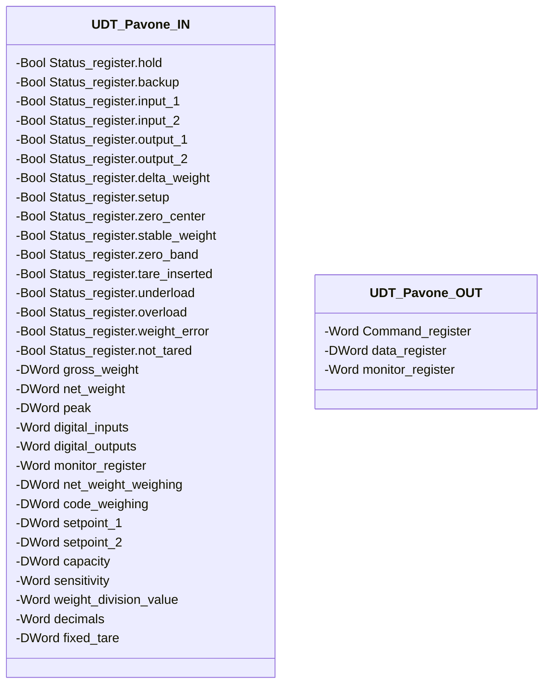

# Interfaccia Pavone DAT 1400

## Panoramica

**FC, senza stato.** `Pavone_DAT_1400` è l'interfaccia verso il trasmettitore di peso Pavone Sistemi DAT 1400: legge `UDT_Pavone_IN` (registri del trasmettitore) e scrive `UDT_Pavone_OUT` (registro comandi), convertendo i dati grezzi nei campi `IN` generici di [`UDT_Load_cells`](../loading-unloading/index.md) tramite il parametro `VAR_IN_OUT scale`. Nessuno stato proprio, nessun `CMD`/`ack` — ricalcola tutto da zero ogni scan.

Questa è, ad oggi, l'unica interfaccia trasmettitore della libreria. Un trasmettitore diverso richiederà una nuova coppia di UDT (`IN`/`OUT`) e un nuovo FC dedicato, scritti secondo lo stesso schema — [`UDT_Load_cells`](../loading-unloading/index.md) e i blocchi `Loading`/`Unloading` non cambiano.

---

## Interfaccia

### Struttura dati



`-` = sola lettura — entrambi gli UDT sono interamente read-only da DCS/HMI, incluso `Command_register`, che pure viene scritto da questo stesso FC ogni scan: l'attributo governa l'accesso esterno DCS/HMI, non le scritture interne del FC che possiede l'istanza.

### Segnali di controllo

Il FC riceve `dat_IN : UDT_Pavone_IN`, restituisce `dat_OUT : UDT_Pavone_OUT`, e riceve in `VAR_IN_OUT` l'istanza `scale : UDT_Load_cells` su cui scrive. Dei molti registri disponibili in `UDT_Pavone_IN`/`UDT_Pavone_OUT`, solo tre vengono letti e uno scritto:

| Segnale | Tipo | Direzione | Descrizione |
|---------|------|-----------|-------------|
| `dat_IN.Status_register.weight_error` | Bool | IN | Copiato in `scale.IN.scale_error` |
| `dat_IN.net_weight` | DWord | IN | Peso netto grezzo, convertito in `scale.IN.current_weight` |
| `dat_IN.decimals` | Word | IN | Numero di decimali del trasmettitore (0–4); seleziona il fattore di scala |
| `dat_OUT.Command_register` | Word | OUT | Scritto a `16#4` mentre `scale.CMD.tare_request` è TRUE, altrimenti `0` |

`UDT_Pavone_IN` espone anche `gross_weight`, `peak`, `digital_inputs`/`digital_outputs`, `net_weight_weighing`, `code_weighing`, `setpoint_1`/`setpoint_2`, `capacity`, `sensitivity`, `weight_division_value`, `fixed_tare`, e gli altri 15 bit di `Status_register` (`hold`, `backup`, `input_1`/`2`, `output_1`/`2`, `delta_weight`, `setup`, `zero_center`, `stable_weight`, `zero_band`, `tare_inserted`, `underload`, `overload`, `not_tared`) — tutti presenti nel tipo ma non letti da questo FC oggi. `UDT_Pavone_OUT.data_register`/`monitor_register` non sono scritti. Sono margine grezzo del trasmettitore, non funzionalità mancante nella documentazione.

---

## Comportamento

### Funzionamento

```Pascal
scale.IN.scale_error := dat_IN.Status_register.weight_error;

CASE dat_IN.decimals OF
  0: magnitude := 1;
  1: magnitude := 0.1;
  2: magnitude := 0.01;
  3: magnitude := 0.001;
  4: magnitude := 0.0001;
END_CASE;

scale.IN.current_weight := DINT_TO_REAL(DWORD_TO_DINT(dat_IN.net_weight)) * magnitude;

IF scale.CMD.tare_request THEN
    dat_OUT.Command_register := 16#4;
ELSE
    dat_OUT.Command_register := 0;
END_IF;
```

`net_weight` arriva come `DWord` — viene reinterpretato come `DINT` (intero con segno) e poi convertito in `Real`, infine scalato per `magnitude` in base a `decimals`. Il comando tara è un valore continuo (`16#4` finché `tare_request` resta TRUE), non un impulso a fronte.
