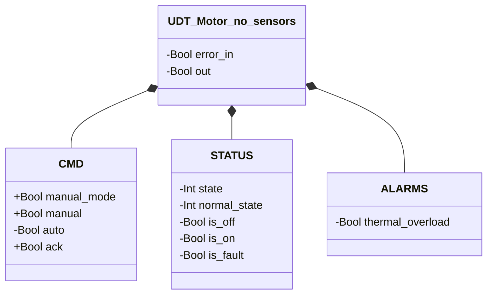
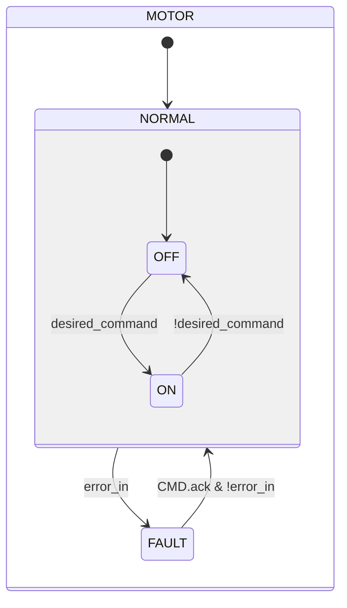

# Motore — Senza Sensori

## Panoramica

**Livello 1.** Il motore senza sensori è un attuatore elettrico puro: non incorpora alcun componente pneumatico né elettrovalvola, e non possiede una struttura `DEVICES` propria — a differenza di ogni altro modulo della libreria, `error_in` e `out` sono campi diretti dell'UDT, non annidati sotto un sottocomponente. Non è "atomico" nel senso stretto dell'Elettrovalvola: porta con sé un proprio livello FAULT con allarme di sovraccarico termico, non solo un comando immediato.

Il suffisso "Senza Sensori" nel nome dell'UDT (`UDT_Motor_no_sensors`) anticipa una futura variante sensorizzata — stesso schema già seguito da Nolvac ("Ciclo a Tempo") e Dispositivi di Accesso ("Anta Cancello — Blocco Elettrico").

---

## Interfaccia

### Struttura dati

`+` = scrivibile da DCS/HMI, `-` = sola lettura.

### Segnali di controllo

| Segnale | Tipo | Direzione | Descrizione |
|---------|------|-----------|-------------|
| `CMD.manual_mode` | Bool | IN | TRUE = comando in modalità manuale |
| `CMD.manual` | Bool | IN | Comando di marcia in modalità manuale |
| `CMD.auto` | Bool | IN | Comando di marcia in modalità automatica |
| `CMD.ack` | Bool | IN | Conferma allarme e ripristino da FAULT |
| `error_in` | Bool | IN | Segnale esterno di guasto (tipicamente contatto ausiliario del relè termico) |
| `out` | Bool | OUT | Comando marcia motore |

---

## Comportamento

### Funzionamento

Il comando desiderato si risolve ad ogni scan (`manual_mode ? manual : auto`). `error_in` porta immediatamente in FAULT indipendentemente dallo stato di marcia corrente; il rientro richiede sia `CMD.ack` che `error_in` non più attivo, e riparte sempre da OFF — non essendoci alcun sensore con cui confermare in sicurezza la ripresa diretta in ON, il blocco preferisce sempre lo stato più sicuro.

### Allarmi

[`MT-E01`](../index.md#allarmi-dei-motori) — `error_in` TRUE, asserito ad ogni scan in cui lo stato è FAULT; si cancella solo con `CMD.ack`.

### Diagramma di stato

| Stato | `out` | Descrizione |
|-------|-------|-------------|
| NORMAL.OFF | FALSE | Motore fermo |
| NORMAL.ON | TRUE | Motore in marcia |
| FAULT | FALSE | Guasto; in attesa di conferma con `error_in` non più attivo |

| Stato | Valore Int |
|---|---|
| NORMAL | 1 |
| NORMAL.OFF | 1 |
| NORMAL.ON | 2 |
| FAULT | 0 |
