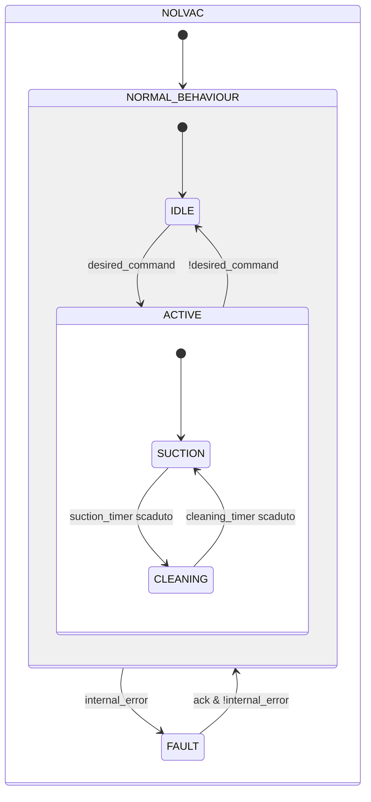

# Nolvac — Unità di Convogliamento Pneumatico

## Panoramica

**Tier 3 — composito.** Il Nolvac è un'unità di convogliamento pneumatico a ciclo aspirazione/pulizia, incorporando una Valvola a Farfalla SS (Tier 2) e due Elettrovalvole (Tier 1). `XY03` attiva il percorso di aspirazione per convogliare il materiale; `XV01` e `XY02` agiscono in combinazione durante la fase di pulizia per rigenerare il filtro interno.

Il ciclo alterna due fasi — **aspirazione** (`suction_time`) e **pulizia** (`cleaning_time`) — e riparte automaticamente finché il comando resta attivo.

---

## Composizione

| Tag | Tipo | Ruolo |
|-----|------|-------|
| `XV01` | Valvola a Farfalla SS (Tier 2) | Apre l'ingresso durante `CLEANING` — vedere [Valvola a Farfalla SS](../valves/butterfly/single_solenoid/index.md) |
| `XY02` | Elettrovalvola (Tier 1) | Aria compressa di retrolavaggio filtro durante `CLEANING` |
| `XY03` | Elettrovalvola (Tier 1) | Depressione di trasporto durante `SUCTION` |

---

## Segnali di controllo

| Segnale | Tipo | Descrizione |
|---------|------|-------------|
| `DEVICES.XV01` | UDT_SS_Valve | Valvola farfalla SS; aperta durante `CLEANING` |
| `DEVICES.XY02` | UDT_Solenoid_valve | Elettrovalvola pulizia; eccitata durante `CLEANING` |
| `DEVICES.XY03` | UDT_Solenoid_valve | Elettrovalvola aspirazione; eccitata durante `SUCTION` |
| `CMD.manual_mode` | Bool | TRUE = modalità manuale HMI |
| `CMD.manual` | Bool | Comando di avvio ciclo in modalità manuale |
| `CMD.auto` | Bool | Comando di avvio ciclo dall'automazione (ReadOnly external) |
| `CMD.ack` | Bool | Conferma allarme e ripristino da FAULT |

---

## Parametri di regolazione

| Parametro | Default | Descrizione |
|-----------|---------|-------------|
| `SETTING.suction_time` | T#30s | Durata della fase di aspirazione |
| `SETTING.cleaning_time` | T#30s | Durata della fase di pulizia filtro |

---

## Stati e output

| Stato | `XV01` | `XY02` | `XY03` | Descrizione |
|-------|--------|--------|--------|-------------|
| IDLE | chiusa | spenta | spenta | Standby, in attesa del comando |
| ACTIVE / SUCTION | chiusa | spenta | eccitata | Aspirazione del materiale |
| ACTIVE / CLEANING | aperta | eccitata | spenta | Pulizia del filtro |
| FAULT | — | spenta | spenta | Guasto; attende conferma operatore |

---

## Diagramma di stato



```Pascal
internal_error := XV01.STATUS.is_fault;
```

La rimozione del comando in qualsiasi momento durante `ACTIVE` riporta immediatamente a `IDLE`, disattivando tutte le uscite.

---

## Allarmi

Nessun allarme proprio — `UDT_Nolvac` non possiede una struttura `ALARMS`. L'unico guasto rilevato è la propagazione diretta di `XV01.STATUS.is_fault`; le elettrovalvole `XY02`/`XY03` non hanno sensori propri e non possono generare un guasto.

Vedere gli [allarmi Valvola a Farfalla SS](../valves/butterfly/single_solenoid/index.md#allarmi) per la causa effettiva quando `internal_error` è TRUE.

---

## Struttura dati


Nessuna classe `ALARMS` — questo UDT non ne possiede una propria. `internal_error` è interno al blocco funzionale.
