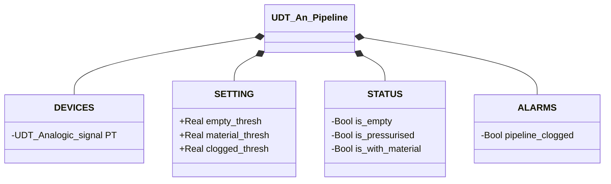

# Pipeline Analogica

## Panoramica

**FC, senza stato.** `An_pipeline` ricava lo stato della pipeline dalla lettura del trasmettitore di pressione analogico (`PT.Scaled_value`). La conversione da conteggio grezzo a valore scalato in unità ingegneristiche avviene a monte, non in questo blocco. La logica è una tabella di consultazione: il valore PT viene confrontato con tre soglie configurabili. Nessun `CMD`, nessun `ack` — non essendoci stato da conservare, non c'è nulla da confermare.

---

## Interfaccia

### Struttura dati



`+` = scrivibile da DCS/HMI, `-` = sola lettura (`ReadOnly := External` nel sorgente).

### Segnali di controllo

| Segnale | Tipo | Direzione | Descrizione |
|---------|------|-----------|-------------|
| `DEVICES.PT.Scaled_value` | Real | IN | Lettura pressione, già scalata in unità ingegneristiche |
| `STATUS.is_empty` | Bool | OUT | TRUE se `PT < empty_thresh` |
| `STATUS.is_pressurised` | Bool | OUT | TRUE se `empty_thresh ≤ PT < material_thresh` |
| `STATUS.is_with_material` | Bool | OUT | TRUE se `material_thresh ≤ PT < clogged_thresh` |
| `ALARMS.pipeline_clogged` | Bool | OUT | TRUE se `PT ≥ clogged_thresh` |

### Parametri

| Parametro | Default | Descrizione |
|-----------|---------|-------------|
| `SETTING.empty_thresh` | 0.1 | Soglia inferiore: sotto → pipeline vuota |
| `SETTING.material_thresh` | 0.4 | Soglia materiale: sopra → presenza materiale |
| `SETTING.clogged_thresh` | 0.8 | Soglia ostruzione: sopra → pressione anomala |

---

## Comportamento

### Funzionamento

```Pascal
STATUS.is_empty := PT.Scaled_value < empty_thresh;
STATUS.is_pressurised := (PT.Scaled_value >= empty_thresh) AND (PT.Scaled_value < material_thresh);
STATUS.is_with_material := (PT.Scaled_value >= material_thresh) AND (PT.Scaled_value < clogged_thresh);

ALARMS.pipeline_clogged := PT.Scaled_value >= clogged_thresh;
```

Le prime tre condizioni sono fasi normali che il processo attraversa continuamente. `pipeline_clogged` non è una quarta fascia dello stesso tipo — rappresenta una condizione fisica anomala che non dovrebbe mai persistere. Non esiste una macchina a stati: la valutazione è puramente combinatoria e ricalcolata da zero ogni scan, senza isteresi.

### Allarmi

- [`PL-E01`](../index.md#allarmi-delle-pipeline) — `PT.Scaled_value ≥ clogged_thresh`
- Non applicabile: `PL-E02` (disallineamento sensori) — un'unica misura continua non ha un secondo valore indipendente con cui essere in contraddizione
