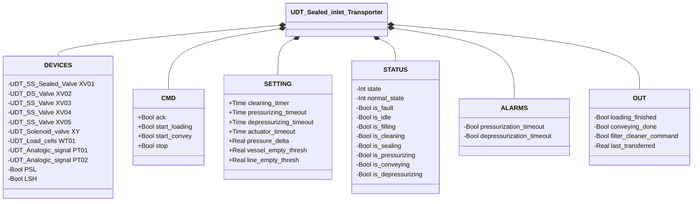
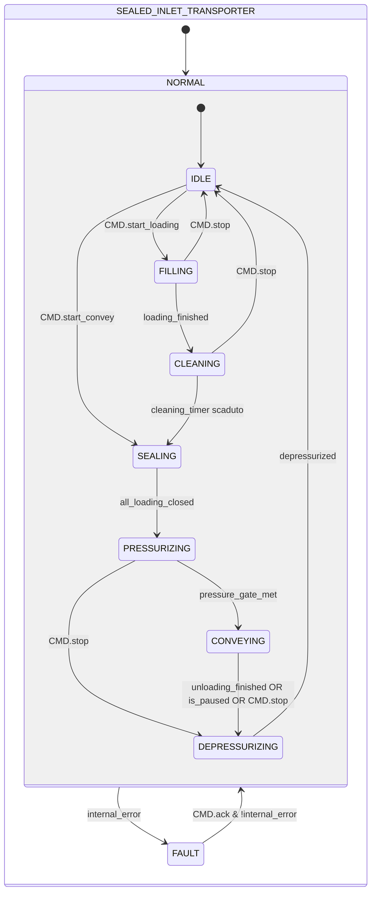

# Propulsore a Ingresso Sigillato (Sealed Inlet Transporter)

## Panoramica

**Livello 4 — composito.** `Sealed_inlet_Transporter` gestisce un ciclo completo di trasporto pneumatico in pressione: carica materiale in un vessel, lo sigilla, lo pressurizza a pressione superiore a quella della linea, convoglia il materiale verso la linea e infine depressurizza il vessel prima di un nuovo ciclo.

Il blocco coordina cinque valvole (`XV01`–`XV05`), un'elettrovalvola di pressurizzazione (`XY`), una bilancia (`WT01`) e due trasmettitori di pressione analogici (`PT01` vessel, `PT02` linea). Un pressostato di linea (`PSL`) verifica la disponibilità di aria compressa per l'attuazione delle valvole e per la pressurizzazione del vessel; un sensore di livello alto (`LSH`) protegge invece da un sovra-riempimento del vessel — due condizioni diverse, non entrambe "di sicurezza" nello stesso senso.

La macchina a stati è a due livelli: `NORMAL`/`FAULT` al livello superiore; `IDLE`→`FILLING`→`CLEANING`→`SEALING`→`PRESSURIZING`→`CONVEYING`→`DEPRESSURIZING` al livello operativo.

`XV01` è oggi vincolato a `UDT_SS_Sealed_Valve`: una futura revisione potrebbe ridurre questo slot a un contratto minimo (comando `auto` + stato di guasto), tramite polimorfismo o un adapter FC dedicato, per renderlo sostituibile con qualunque tipo di valvola d'ingresso.

---

## Interfaccia

### Composizione

| Tag | Tipo | Direzione | Ruolo |
|-----|------|-----------|-------|
| `XV01` | Valvola Sigillata SS (Livello 3) | IN/OUT | Valvola di ingresso; sigillata in riposo |
| `XV02` | Valvola a Farfalla DS (Livello 2) | IN/OUT | Valvola di sfiato (vent); aperta in IDLE, FILLING, FAULT |
| `XV03` | Valvola a Farfalla SS (Livello 2) | IN/OUT | Valvola orifizio; aperta durante FILLING |
| `XV04` | Valvola a Farfalla SS (Livello 2) | IN/OUT | Valvola di scarico; aperta durante PRESSURIZING e CONVEYING |
| `XV05` | Valvola a Farfalla SS (Livello 2) | IN/OUT | Valvola di linea; aperta durante CONVEYING |
| `XY` | Elettrovalvola (Livello 1) | OUT | Elettrovalvola pressurizzazione; eccitata durante PRESSURIZING e CONVEYING |
| `WT01` | Celle di Carico (Livello 1) | IN/OUT | Bilancia; gestita da `Loading` e `Unloading` interni — vedere [Ciclo di Carico e Scarico](../../load-cells/loading-unloading/index.md) |
| `PT01` | [UDT_Analogic_signal](../../io/index.md) | IN | Trasmettitore pressione vessel |
| `PT02` | [UDT_Analogic_signal](../../io/index.md) | IN | Trasmettitore pressione linea |
| `PSL` | Bool | IN | Pressostato aria di linea: TRUE = aria compressa disponibile per attuazione e pressurizzazione |
| `LSH` | Bool | IN | Sensore livello alto: TRUE = vessel pieno (condizione di guasto) |

`XV01`–`XV05` e `WT01` sono IN/OUT: il propulsore scrive il loro `CMD` (auto/ack, e per `WT01` anche stop/reset/loading_start/unloading_start) e rilegge il loro `STATUS`/`ALARMS`/`BATCH` per la propria macchina a stati e `internal_error`. `XY` è OUT-only, come ogni Elettrovalvola comandata senza lettura del proprio stato. `PT01`/`PT02`/`PSL`/`LSH` sono sensori puri, nessun `CMD` da scrivere.

### Struttura dati



`+` = scrivibile da DCS/HMI, `-` = sola lettura.

### Segnali di controllo

| Segnale | Tipo | Direzione | Descrizione |
|---------|------|-----------|-------------|
| `CMD.ack` | Bool | IN | Conferma allarmi; propagato a tutti i sotto-dispositivi |
| `CMD.start_loading` | Bool | IN | Avvia la sequenza di carico (IDLE → FILLING) |
| `CMD.start_convey` | Bool | IN | Avvia la sequenza di convogliamento senza carico (IDLE → SEALING) |
| `CMD.stop` | Bool | IN | Arresto operatore; porta verso DEPRESSURIZING o IDLE |
| `STATUS.state` | Int | OUT | 0=FAULT, 1=NORMAL |
| `STATUS.normal_state` | Int | OUT | 1=IDLE, 2=FILLING, 3=CLEANING, 4=SEALING, 5=PRESSURIZING, 6=CONVEYING, 7=DEPRESSURIZING |
| `STATUS.is_fault` | Bool | OUT | TRUE in FAULT |
| `STATUS.is_idle` | Bool | OUT | TRUE in IDLE |
| `STATUS.is_filling` | Bool | OUT | TRUE in FILLING |
| `STATUS.is_cleaning` | Bool | OUT | TRUE in CLEANING |
| `STATUS.is_sealing` | Bool | OUT | TRUE in SEALING |
| `STATUS.is_pressurizing` | Bool | OUT | TRUE in PRESSURIZING |
| `STATUS.is_conveying` | Bool | OUT | TRUE in CONVEYING |
| `STATUS.is_depressurizing` | Bool | OUT | TRUE in DEPRESSURIZING |
| `OUT.loading_finished` | Bool | OUT | Impulso 1-scan all'ingresso in SEALING da CLEANING (carico completato) |
| `OUT.conveying_done` | Bool | OUT | Impulso 1-scan all'ingresso in IDLE (ciclo terminato) |
| `OUT.filter_cleaner_command` | Bool | OUT | TRUE durante CLEANING — abilita il sistema di pulizia filtro esterno |
| `OUT.last_transferred` | Real | OUT | Quantità convogliata nell'ultimo ciclo CONVEYING [kg] |

### Parametri

| Parametro | Default | Descrizione |
|-----------|---------|-------------|
| `SETTING.cleaning_timer` | T#2M | Durata fase CLEANING |
| `SETTING.pressurizing_timeout` | T#1M | Timeout massimo fase PRESSURIZING |
| `SETTING.depressurizing_timeout` | T#1M | Timeout massimo fase DEPRESSURIZING |
| `SETTING.pressure_delta` | 0.2 | Sovrapressione minima vessel-linea [bar] |
| `SETTING.vessel_empty_thresh` | 0.2 | Soglia PT01 per `depressurized` [bar] |
| `SETTING.line_empty_thresh` | 0.2 | Soglia PT02 per `depressurized` [bar] |
| `SETTING.actuator_timeout` | T#2s | Timeout propagato a tutte le valvole XV01–05 |

---

## Comportamento

### Funzionamento

#### Condizioni derivate (ogni scan)

- **`all_loading_closed`** — XV01, XV02, XV03 tutti confermati chiusi (prerequisito per SEALING → PRESSURIZING)
- **`pressure_gate_met`** — `PT01 ≥ PT02 + pressure_delta` (vessel abbastanza sovrapressurizzato rispetto alla linea)
- **`depressurized`** — `PT01 ≤ vessel_empty_thresh AND PT02 ≤ line_empty_thresh`
- **`internal_error`** — guasto su XV01/02/03/04/05, timeout bilancia, `NOT PSL` (aria di linea assente — nessuna aria disponibile per attuare le valvole o pressurizzare il vessel), `LSH` (livello alto), `ALARMS.pressurization_timeout` o `ALARMS.depressurization_timeout`

Il ciclo trasporta un lotto di materiale dal punto di carico alla linea di processo passando per una fase di pulizia filtro e una fase di pressurizzazione che porta il vessel a una pressione superiore a quella di linea prima di aprire la valvola di collegamento: il materiale fluisce verso la linea per differenza di pressione, non per un'azione meccanica diretta.

Il carico (FILLING) apre l'ingresso (XV01), lo sfiato (XV02) e l'orifizio (XV03) mentre il FB `Loading` riempie il vessel fino al setpoint; il completamento avvia automaticamente la fase di pulizia filtro (CLEANING, temporizzata), che rigenera l'elemento filtrante prima che il vessel venga sigillato. Una volta chiuse tutte le valvole di ingresso (SEALING → PRESSURIZING), `XY` e XV04 pressurizzano il vessel finché non è raggiunta la sovrapressione richiesta rispetto alla linea (`pressure_delta`) — solo allora si apre la valvola di linea (XV05) per il convogliamento (CONVEYING), evitando un riflusso di materiale dalla linea verso il vessel per pressione insufficiente. `CMD.start_convey` permette di saltare l'intera fase di carico/pulizia quando il vessel contiene già materiale da un ciclo precedente, portando direttamente a SEALING.

Il ciclo si conclude scaricando la pressione residua (DEPRESSURIZING, XV02 aperto) prima di tornare in IDLE, pronto per un nuovo carico.

In FAULT, sia lo sfiato (XV02) sia lo scarico (XV04) restano aperti — una condizione passivamente sicura che non richiede aria di attuazione per essere mantenuta, utile visto che un guasto può includere proprio la perdita di aria di linea (`NOT PSL`). La bilancia viene fermata e resettata; `CMD.ack` con l'errore rientrato riporta il propulsore in NORMAL/IDLE.

### Allarmi

- [`TR-E01`](../index.md#allarmi-dei-propulsori) — `ALARMS.pressurization_timeout`, latchato dal timer e cancellato solo da `CMD.ack`; verificare supply aria, XV04, PT01/02
- [`TR-E02`](../index.md#allarmi-dei-propulsori) — `ALARMS.depressurization_timeout`, stesso comportamento di latch; verificare XV02, PT01/02
- [`TR-E03`](../index.md#allarmi-dei-propulsori) — `NOT PSL`, aria di linea assente
- [`TR-E04`](../index.md#allarmi-dei-propulsori) — `LSH`, livello alto nel vessel

Un guasto su una delle valvole interne (`XV01`–`XV05`) o un timeout di Loading/Unloading su `WT01` contribuisce a `internal_error` senza un ID proprio a questo livello — vedere gli [allarmi delle valvole](../../valves/index.md#allarmi-delle-valvole) e gli [allarmi delle celle di carico](../../load-cells/index.md#allarmi-delle-celle-di-carico) per la causa specifica.

### Diagramma di stato



```Pascal
all_loading_closed := XV01.STATUS.is_closed AND XV02.STATUS.is_closed AND XV03.STATUS.is_closed;
pressure_gate_met := PT01.Scaled_value >= PT02.Scaled_value + SETTING.pressure_delta;
depressurized := PT01.Scaled_value <= SETTING.vessel_empty_thresh AND PT02.Scaled_value <= SETTING.line_empty_thresh;
internal_error := XV01.STATUS.is_fault OR XV02.STATUS.is_fault OR XV03.STATUS.is_fault OR XV04.STATUS.is_fault OR XV05.STATUS.is_fault OR WT01.ALARMS.loading_timeout OR WT01.ALARMS.unloading_timeout OR NOT PSL OR LSH OR ALARMS.pressurization_timeout OR ALARMS.depressurization_timeout;
```

`pressurization_timeout`/`depressurization_timeout` are not a second, independent condition on the NORMAL → FAULT edge — both are already OR'd into `internal_error`'s own expression above, so the single `internal_error` guard already covers them.

| Stato | XV01 | XV02 | XV03 | XV04 | XV05 | XY | WT01 | Pulizia filtro |
|-------|------|------|------|------|------|----|------|-----------------|
| IDLE | FALSE | TRUE | FALSE | FALSE | FALSE | FALSE | — | FALSE |
| FILLING | TRUE | TRUE | TRUE | FALSE | FALSE | FALSE | Loading | FALSE |
| CLEANING | FALSE | FALSE | FALSE | FALSE | FALSE | FALSE | — | TRUE |
| SEALING | FALSE | FALSE | FALSE | FALSE | FALSE | FALSE | — | FALSE |
| PRESSURIZING | FALSE | FALSE | FALSE | TRUE | FALSE | TRUE | — | FALSE |
| CONVEYING | FALSE | FALSE | FALSE | TRUE | TRUE | TRUE | Unloading | FALSE |
| DEPRESSURIZING | FALSE | TRUE | FALSE | FALSE | FALSE | FALSE | — | FALSE |
| FAULT | FALSE | TRUE | FALSE | TRUE | FALSE | FALSE | stop+reset | FALSE |

| Stato | Valore Int |
|---|---|
| NORMAL | 1 |
| NORMAL.IDLE | 1 |
| NORMAL.FILLING | 2 |
| NORMAL.CLEANING | 3 |
| NORMAL.SEALING | 4 |
| NORMAL.PRESSURIZING | 5 |
| NORMAL.CONVEYING | 6 |
| NORMAL.DEPRESSURIZING | 7 |
| FAULT | 0 |

### Azioni di ingresso

| Stato raggiunto | Azione all'ingresso |
|------------------|----------------------|
| IDLE | `WT01.CMD.stop`/`CMD.reset` impulsati (ferma un carico a metà, riporta uno scarico in pausa a IDLE); `OUT.conveying_done` impulso 1-scan |
| FILLING | `WT01.CMD.loading_start` impulsato |
| SEALING | `OUT.loading_finished` impulso 1-scan |
| CONVEYING | `WT01.CMD.unloading_start` impulsato |
| DEPRESSURIZING | `WT01.CMD.stop` impulsato |

### Timer

| Timer | Stato in cui è attivo | Soglia (parametro) |
|-------|------------------------|---------------------|
| `filter_cleaning_timer` | NORMAL/CLEANING | `SETTING.cleaning_timer` |
| `pressurizing_timer` | NORMAL/PRESSURIZING | `SETTING.pressurizing_timeout` |
| `depressurizing_timer` | NORMAL/DEPRESSURIZING | `SETTING.depressurizing_timeout` |

XV01–05 e XY hanno il proprio controllore sub-FB sempre in esecuzione; il blocco esterno scrive solo `CMD.auto`.
