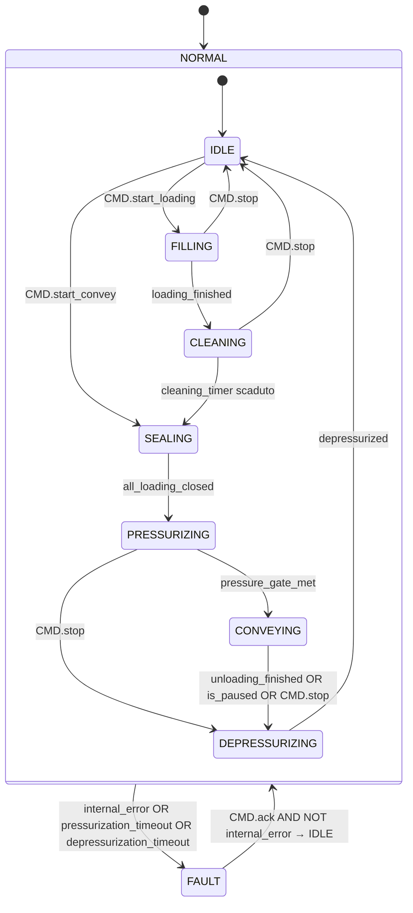

# Propulsore a Ingresso Sigillato (Sealed Inlet Transporter)

## Panoramica

**Livello 4 — composito.** `Sealed_inlet_Transporter` gestisce un ciclo completo di trasporto pneumatico in pressione: carica materiale in un vessel, lo sigilla, lo pressurizza a pressione superiore a quella della linea, convoglia il materiale verso la linea e infine depressurizza il vessel prima di un nuovo ciclo.

Il blocco coordina cinque valvole (`XV01`–`XV05`), un'elettrovalvola di pressurizzazione (`XY`), una bilancia (`WT01`) e due trasmettitori di pressione analogici (`PT01` vessel, `PT02` linea). Due pressostati digitali (`PSL`, `LSH`) garantiscono la sicurezza operativa.

La FSM è a due livelli: `NORMAL`/`FAULT` al livello superiore; `IDLE`→`FILLING`→`CLEANING`→`SEALING`→`PRESSURIZING`→`CONVEYING`→`DEPRESSURIZING` al livello operativo.

---

## Interfaccia

### Composizione

| Tag | Tipo | Direzione | Ruolo |
|-----|------|-----------|-------|
| `XV01` | Valvola Sigillata SS (Livello 3) | IN/OUT | Valvola di ingresso; sigillata in riposo |
| `XV02` | Valvola a Farfalla DS (Livello 2) | IN/OUT | Valvola di sfiato (vent); aperta in IDLE, FILLING, FAULT |
| `XV03` | Valvola a Farfalla SS (Livello 2) | IN/OUT | Valvola orifizio; aperta durante FILLING |
| `XV04` | Valvola a Farfalla SS (Livello 2) | IN/OUT | Valvola di scarico; aperta durante PRESSURIZING e CONVEYING |
| `XV05` | Valvola a Farfalla SS (Livello 2) | IN/OUT | Valvola di linea; aperta durante CONVEYING |
| `XY` | Elettrovalvola (Livello 1) | OUT | Elettrovalvola pressurizzazione; eccitata durante PRESSURIZING e CONVEYING |
| `WT01` | Celle di Carico (Livello 1) | IN/OUT | Bilancia; gestita da `Loading` e `Unloading` interni — vedere [Ciclo di Carico e Scarico](../../load-cells/loading-unloading/index.md) |
| `PT01` | UDT_Analogic_signal | IN | Trasmettitore pressione vessel |
| `PT02` | UDT_Analogic_signal | IN | Trasmettitore pressione linea |
| `PSL` | Bool | IN | Pressostato sicurezza: TRUE = pressione entro limiti |
| `LSH` | Bool | IN | Sensore livello alto: TRUE = vessel pieno (condizione di guasto) |

`XV01`–`XV05` e `WT01` sono IN/OUT: il propulsore scrive il loro `CMD` (auto/ack, e per `WT01` anche stop/reset/loading_start/unloading_start) e rilegge il loro `STATUS`/`ALARMS`/`BATCH` per la propria FSM e `internal_error`. `XY` è OUT-only, come ogni Elettrovalvola comandata senza lettura del proprio stato. `PT01`/`PT02`/`PSL`/`LSH` sono sensori puri, nessun `CMD` da scrivere.

### Struttura dati

`+` = scrivibile da DCS/HMI, `-` = sola lettura (`ReadOnly := External` nel sorgente).

### Segnali di controllo

| Segnale | Tipo | Direzione | Descrizione |
|---------|------|-----------|-------------|
| `CMD.ack` | Bool | IN | Conferma allarmi; propagato a tutti i sotto-dispositivi |
| `CMD.start_loading` | Bool | IN | Avvia la sequenza di carico (IDLE → FILLING) |
| `CMD.start_convey` | Bool | IN | Avvia la sequenza di convogliamento senza carico (IDLE → SEALING) |
| `CMD.stop` | Bool | IN | Arresto operatore; porta verso DEPRESSURIZING o IDLE |
| `STATUS.state` | Int | OUT | 0=FAULT, 1=NORMAL |
| `STATUS.normal_state` | Int | OUT | 10=IDLE, 20=FILLING, 30=CLEANING, 40=SEALING, 50=PRESSURIZING, 60=CONVEYING, 70=DEPRESSURIZING |
| `STATUS.is_fault` | Bool | OUT | TRUE in FAULT |
| `STATUS.is_idle` | Bool | OUT | TRUE in IDLE |
| `STATUS.is_filling` | Bool | OUT | TRUE in FILLING |
| `STATUS.is_cleaning` | Bool | OUT | TRUE in CLEANING |
| `STATUS.is_sealing` | Bool | OUT | TRUE in SEALING |
| `STATUS.is_pressurizing` | Bool | OUT | TRUE in PRESSURIZING |
| `STATUS.is_conveying` | Bool | OUT | TRUE in CONVEYING |
| `STATUS.is_depressurizing` | Bool | OUT | TRUE in DEPRESSURIZING |
| `OUT.loading_finished` | Bool | OUT | Impulso 1-scan all'ingresso in SEALING da CLEANING (carico completato) |
| `OUT.conveying_done` | Bool | OUT | Impulso 1-scan all'ingresso in IDLE (ciclo terminato) |
| `OUT.filter_cleaner_command` | Bool | OUT | TRUE durante CLEANING — abilita il sistema di pulizia filtro esterno |
| `OUT.last_transferred` | Real | OUT | Quantità convogliata nell'ultimo ciclo CONVEYING [kg] |

### Parametri

| Parametro | Default | Descrizione |
|-----------|---------|-------------|
| `SETTING.cleaning_timer` | T#2M | Durata fase CLEANING |
| `SETTING.pressurizing_timeout` | T#1M | Timeout massimo fase PRESSURIZING |
| `SETTING.depressurizing_timeout` | T#1M | Timeout massimo fase DEPRESSURIZING |
| `SETTING.pressure_delta` | 0.2 | Sovrapressione minima vessel-linea [bar] |
| `SETTING.vessel_empty_thresh` | 0.2 | Soglia PT01 per `depressurized` [bar] |
| `SETTING.line_empty_thresh` | 0.2 | Soglia PT02 per `depressurized` [bar] |
| `SETTING.actuator_timeout` | T#2s | Timeout propagato a tutte le valvole XV01–05 |

---

## Comportamento

### Funzionamento

#### Condizioni derivate (ogni scan)

- **`all_loading_closed`** — XV01, XV02, XV03 tutti confermati chiusi (prerequisito per SEALING → PRESSURIZING)
- **`pressure_gate_met`** — `PT01 ≥ PT02 + pressure_delta` (vessel abbastanza sovrapressurizzato rispetto alla linea)
- **`depressurized`** — `PT01 ≤ vessel_empty_thresh AND PT02 ≤ line_empty_thresh`
- **`internal_error`** — guasto su XV01/02/03/04/05, timeout bilancia, `NOT PSL` (pressione di sicurezza persa), `LSH` (livello alto), `ALARMS.pressurization_timeout` o `ALARMS.depressurization_timeout`

#### Sequenza di carico

1. **IDLE** → `CMD.start_loading` → **FILLING**: XV01 (ingresso), XV02 (sfiato), XV03 (orifizio) aperti; il FB `Loading` gestisce la bilancia.
2. **FILLING** → bilancia raggiunge il setpoint (`loading_finished`) → **CLEANING**: filtro di ingresso rigenerato per `cleaning_timer`.
3. **CLEANING** → timer scaduto → **SEALING**: tutte le valvole di ingresso si chiudono.
4. **SEALING** → `all_loading_closed` → **PRESSURIZING**: XY eccitato + XV04 (scarico) aperto per pressurizzare il vessel.
5. **PRESSURIZING** → `pressure_gate_met` → **CONVEYING**: XV05 (linea) aperto; il FB `Unloading` gestisce la bilancia.
6. **CONVEYING** → bilancia svuotata (`unloading_finished`), scarico messo in pausa (`WT01.STATUS.UNLOADING.is_paused`) o `CMD.stop` → **DEPRESSURIZING**: XV02 (sfiato) aperto per scaricare la pressione.
7. **DEPRESSURIZING** → `depressurized` → **IDLE**: `OUT.conveying_done` impulso 1-scan.

#### Sequenza di convogliamento diretto

`CMD.start_convey` in IDLE porta direttamente a SEALING (saltando FILLING e CLEANING) per convogliare materiale già presente nel vessel.

#### Comportamento in FAULT

In FAULT: XV02 (sfiato) **e** XV04 (scarico) aperti per sicurezza passiva; bilancia fermata e resettata. `CMD.ack` con `NOT internal_error` riporta a NORMAL/IDLE.

### Allarmi

- [`TR-E01`](../index.md#allarmi-dei-propulsori) — `ALARMS.pressurization_timeout`, latchato dal timer e cancellato solo da `CMD.ack`; verificare supply aria, XV04, PT01/02
- [`TR-E02`](../index.md#allarmi-dei-propulsori) — `ALARMS.depressurization_timeout`, stesso comportamento di latch; verificare XV02, PT01/02
- [`TR-E03`](../index.md#allarmi-dei-propulsori) — guasto su una valvola interna (`XV01`–`XV05`); vedere gli [allarmi delle valvole](../../valves/index.md#allarmi-delle-valvole)
- [`TR-E04`](../index.md#allarmi-dei-propulsori) — timeout Loading o Unloading su `WT01`; vedere gli [allarmi delle celle di carico](../../load-cells/index.md#allarmi-delle-celle-di-carico)
- [`TR-E05`](../index.md#allarmi-dei-propulsori) — `NOT PSL`, pressione di sicurezza persa
- [`TR-E06`](../index.md#allarmi-dei-propulsori) — `LSH`, livello alto nel vessel

### Diagramma di stato

| Stato | XV01 | XV02 | XV03 | XV04 | XV05 | XY | WT01 | `OUT.filter_cleaner_command` |
|-------|------|------|------|------|------|----|------|--------------------|
| IDLE | — | aperta | — | — | — | — | — | FALSE |
| FILLING | aperta | aperta | aperta | — | — | — | Loading | FALSE |
| CLEANING | — | — | — | — | — | — | — | TRUE |
| SEALING | — | — | — | — | — | — | — | FALSE |
| PRESSURIZING | — | — | — | aperta | — | eccitato | — | FALSE |
| CONVEYING | — | — | — | aperta | aperta | eccitato | Unloading | FALSE |
| DEPRESSURIZING | — | aperta | — | — | — | — | — | FALSE |
| FAULT | — | aperta | — | aperta | — | — | stop+reset | FALSE |

### Timer

| Timer | Stato in cui è attivo | Soglia (parametro) |
|-------|------------------------|---------------------|
| `filter_cleaning_timer` | NORMAL/CLEANING | `SETTING.cleaning_timer` (nome del parametro invariato, non `cleaning_time`) |
| `pressurizing_timer` | NORMAL/PRESSURIZING | `SETTING.pressurizing_timeout` |
| `depressurizing_timer` | NORMAL/DEPRESSURIZING | `SETTING.depressurizing_timeout` |

Nota: la variabile interna `filter_cleaning_timer` e il parametro `SETTING.cleaning_timer` hanno nomi diversi — non confonderli con la fase CLEANING stessa.

Le valvole non elencate per uno stato sono chiuse (CMD.auto = FALSE). XV01–05 e XY hanno il proprio controller sub-FB sempre in esecuzione; il wrapper scrive solo `CMD.auto`.
