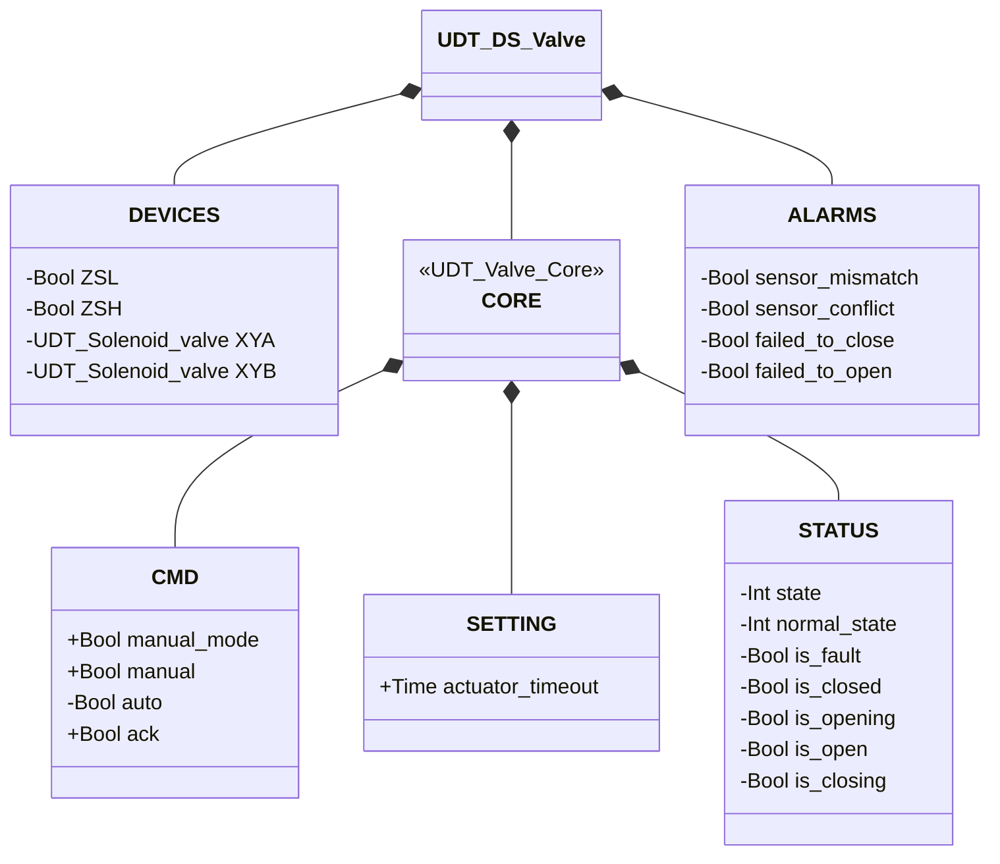
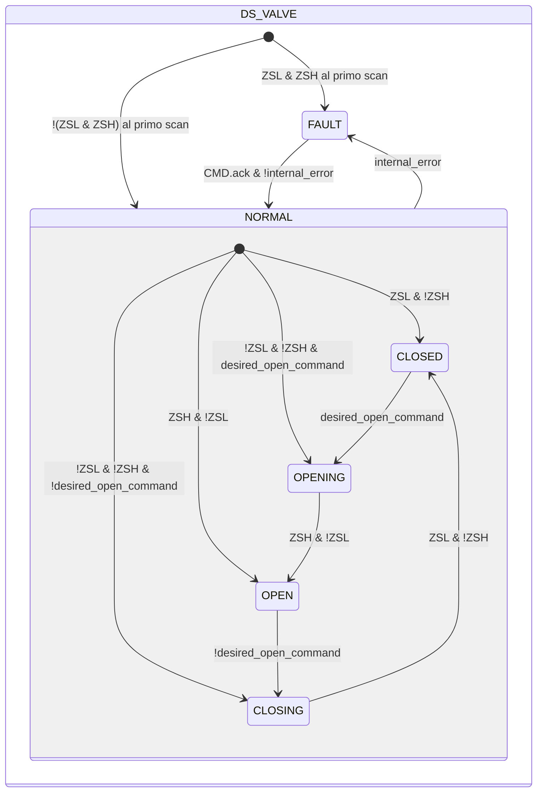

# Valvola a Farfalla — Doppio Solenoide (DS)

## Panoramica

**Livello 2.** `DS_valve` gestisce una valvola a farfalla pneumatica con due solenoidi indipendenti (`XYA` apertura, `XYB` chiusura), incorporando due istanze di Elettrovalvola (Livello 1). Attuatore a doppio effetto (bistabile), retroazione di posizione a doppio finecorsa (`ZSL` chiuso, `ZSH` aperto).

---

## Interfaccia

### Composizione

| Tag | Tipo | Ruolo |
|-----|------|-------|
| `XYA` | Elettrovalvola (Livello 1) | Aziona verso l'apertura |
| `XYB` | Elettrovalvola (Livello 1) | Aziona verso la chiusura |

Un'unica decisione manuale/automatica (`manual_mode`/`manual`/`auto`, risolta in `desired_open_command`) pilota quale delle due elettrovalvole va eccitata — le due istanze non arbitrano mai in autonomia.

### Struttura dati



`+` = scrivibile da DCS/HMI, `-` = sola lettura. `CORE` è il contratto condiviso da tutta la
famiglia valvole — vedi [Valvole — Panoramica](../../index.md#core).

### Segnali di controllo

| Segnale | Tipo | Direzione | Descrizione |
|---------|------|-----------|-------------|
| `DEVICES.ZSL` | Bool | IN | Finecorsa posizione chiusa |
| `DEVICES.ZSH` | Bool | IN | Finecorsa posizione aperta |
| `DEVICES.XYA` | UDT_Solenoid_valve | OUT | Elettrovalvola apertura — comandata, il proprio stato non viene riletto da questo blocco |
| `DEVICES.XYB` | UDT_Solenoid_valve | OUT | Elettrovalvola chiusura — comandata, il proprio stato non viene riletto da questo blocco |
| `CORE.CMD.manual_mode` | Bool | IN | TRUE = modalità manuale HMI |
| `CORE.CMD.manual` | Bool | IN | Comando di apertura in modalità manuale |
| `CORE.CMD.auto` | Bool | IN | Comando di apertura in modalità automatica |
| `CORE.CMD.ack` | Bool | IN | Conferma allarmi e ripristino da FAULT |

### Parametri

| Parametro | Default | Descrizione |
|-----------|---------|-------------|
| `CORE.SETTING.actuator_timeout` | T#2s | Vedi la convenzione in [Valvole — Panoramica](../../index.md) |

---

## Comportamento

### Funzionamento

`XYA`/`XYB` sono eccitati solo durante il movimento (`OPENING`/`CLOSING`) — l'attuatore bistabile non richiede eccitazione di mantenimento in `CLOSED`/`OPEN`, mantiene la posizione anche a entrambi i solenoidi diseccitati (nessun ritorno a molla).

Al primo ciclo PLC, il blocco legge `ZSL`/`ZSH` per lo stato iniziale, con la stessa logica di `SS_valve` — incluso il caso in cui nessuno dei due sia attivo (valvola a metà corsa), risolto in `OPENING`/`CLOSING` secondo `desired_open_command` anziché in FAULT.

Il comando desiderato è risolto ad ogni scan, stesso schema di [Elettrovalvola](../../solenoid/index.md):

```
desired_open_command := manual_mode ? manual : auto
```

### Allarmi

- [`XV-E01`](../../index.md#allarmi-delle-valvole) — stato stabile corrente non confermato dal finecorsa atteso
- [`XV-E02`](../../index.md#allarmi-delle-valvole) — `ZSL AND ZSH` contemporaneamente TRUE
- [`XV-E03`](../../index.md#allarmi-delle-valvole) — `CLOSING` non completato entro `actuator_timeout`
- [`XV-E04`](../../index.md#allarmi-delle-valvole) — `OPENING` non completato entro `actuator_timeout`

### Diagramma di stato



```Pascal
internal_error := ALARMS.sensor_mismatch OR ALARMS.sensor_conflict OR ALARMS.failed_to_close OR ALARMS.failed_to_open;
```

| Stato | `XYA` | `XYB` | Descrizione |
|-------|-------|-------|-------------|
| CLOSED | FALSE | FALSE | Disco chiuso; nessuna eccitazione necessaria (bistabile) |
| OPENING | TRUE | FALSE | `XYA` spinge il disco verso apertura |
| OPEN | FALSE | FALSE | Disco aperto; nessuna eccitazione necessaria |
| CLOSING | FALSE | TRUE | `XYB` riporta il disco in chiusura |
| FAULT | FALSE | FALSE | Guasto; disco bistabile mantiene l'ultima posizione fisica |

| Stato | Valore Int |
|---|---|
| NORMAL.CLOSED | 1 |
| NORMAL.OPENING | 2 |
| NORMAL.OPEN | 3 |
| NORMAL.CLOSING | 4 |
| FAULT | 0 |

### Timer

| Timer | Stato in cui è attivo | Soglia (parametro) |
|-------|------------------------|---------------------|
| `movement_timer` | `OPENING` o `CLOSING` (in `NORMAL`) | `SETTING.actuator_timeout` |
